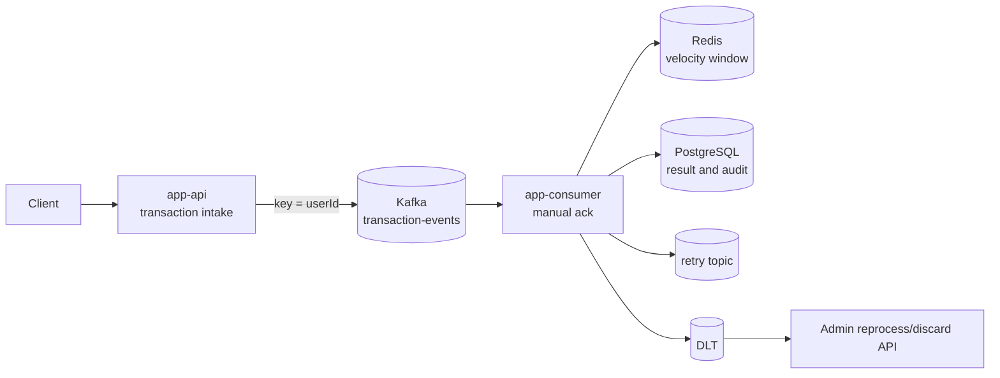

# API는 빨랐는데 탐지는 늦을 수 있다

## 문제

이 시스템에서 가장 먼저 분리해야 했던 것은 “거래 이벤트를 받았다”와 “이상거래 탐지가 끝났다”였다. API가 빠르게 응답해도 Consumer가 밀리면 실제 탐지는 늦어진다. 반대로 Consumer 처리까지 동기 요청에 묶으면 Redis 조회나 Rule Engine 지연이 API latency로 그대로 번진다.

이 시스템에서 보고 싶은 것은 단순한 CRUD 처리 시간이 아니라 거래 접수 지연, Consumer Lag, detection latency, DLT, 재처리 가능성이다. 그래서 처음부터 API latency와 이상거래 detection latency를 다른 신호로 다루는 구조가 필요했다.

## 초기 설계

처음에는 Spring Boot API가 거래 이벤트를 받고 Consumer Worker가 Kafka에서 이벤트를 읽는 구조로 나눴다. `app-api`는 요청 검증, 접수 기록, Kafka 발행까지 책임지고, `app-consumer`는 manual ack, Rule Engine, Redis sliding window, PostgreSQL 저장, Retry/DLT를 맡는다.

Kafka는 단순 큐가 아니라 재처리 가능한 이벤트 로그로 보았다. Consumer가 잠시 멈추거나 장애가 나도 topic에 남은 이벤트와 offset을 기준으로 backlog, lag, 재처리 흐름을 설명할 수 있어야 했다.

## 실제로 막힌 지점

비동기 구조를 선택하면 API 응답에서 탐지 결과를 즉시 줄 수 없다. `202 Accepted`나 접수 응답은 이벤트가 들어왔다는 의미이지 탐지가 끝났다는 의미가 아니다. 이 차이를 문서와 지표에서 분리하지 않으면 API가 정상이라도 탐지가 지연되는 상황을 놓칠 수 있다.

또 하나의 결정은 Kafka partition key였다. 처음에는 `eventId`를 key로 쓰면 중복 추적이 쉬워 보였다. 하지만 이상거래 탐지는 사용자별 최근 거래 순서가 중요하다. `eventId`는 이벤트마다 달라 같은 사용자의 거래가 여러 partition으로 흩어질 수 있다. 그래서 기본 key를 `userId`로 바꿨다.

이 선택에도 비용이 있다. 같은 사용자의 이벤트 순서를 유지하는 데는 유리하지만, 특정 사용자나 테스트 데이터가 몰리면 hot partition이 생길 수 있다. 그래서 `userId` key는 “완벽한 분산”이 아니라 “사용자별 순서를 더 중요하게 본 선택”으로 문서화했다.

## 트러블슈팅에서 남긴 판단

`docs/11-troubleshooting-log.md`에서 `eventId` partition key 후보는 추적이 쉽지만 사용자별 순서를 깨뜨릴 수 있는 선택으로 정리했다. 반대로 `userId` key는 hot partition 위험을 만든다. 이 trade-off는 숨기지 않고 load test와 troubleshooting 대상에 남겼다.

API/Consumer 분리도 같은 맥락이다. API latency가 낮아도 Consumer Lag이 증가하면 이상거래 탐지는 지연된다. 그래서 health signal은 API p95 하나로 끝나지 않고 Consumer Lag, detection latency, DLT count, duplicate result count까지 함께 본다.

## 확인한 증거

설계 문서는 `docs/02-architecture-decision.md`, topic/key 정책은 `docs/03-kafka-topic-design.md`, 운영 신호는 `docs/08-observability.md`에 나눠 기록했다. 이후 load/failure 문서에서는 API latency만 보지 않고 Consumer Lag, detection latency, DLT count, duplicate result count를 같이 보도록 정리했다.

## 바꾼 설계

API와 Consumer를 실행 단위로 분리하고, 공통 schema만 `app-common`에 둔다. Consumer는 API 요청 DTO에 의존하지 않고 Kafka event message를 소비한다. PostgreSQL은 탐지 결과와 audit의 기준 저장소로 두고, Redis는 최근 거래 패턴 계산용 단기 상태로만 사용한다.

## 검증

대표 검증은 `make final-check`로 묶었다. 이 명령은 Gradle build/test, Docker Compose config, shell script syntax, V2 data/evaluation guardrail을 확인한다. 다만 production 수준의 탐지 성능이나 latency를 보장하는 명령은 아니다. 비동기 처리 상태는 별도의 lag, detection latency, DLT evidence로 확인해야 한다.

## 남은 한계

이 구조는 사용자별 순서를 단일 Kafka cluster와 `userId` key 안에서 다룬다. 실제 금융사 수준의 ordering guarantee, multi-region ordering, 지역 간 장애 조정은 훨씬 복잡하며 이 프로젝트 범위 밖이다. 또한 비동기 탐지 구조이므로 “접수 성공”과 “탐지 완료” 사이의 시간을 계속 별도 metric으로 봐야 한다.
