# eventId, traceId, userId를 같은 식별자로 쓰지 않은 이유

## 하나의 ID로 모든 문제를 풀 수 없었다

Kafka 이벤트가 재시도되거나 Consumer가 재시작되면 같은 거래 이벤트가 두 번 이상 처리될 수 있다. 이때 `eventId`, `traceId`, `userId`를 대충 하나의 “추적 ID”처럼 쓰면 문제가 생긴다. 중복 방어, 요청 추적, partition ordering, Redis window 기준이 서로 다른 질문인데 같은 식별자로 뭉개지기 때문이다.

처음에는 하나의 ID로 요청 추적과 중복 방어를 모두 해결할 수 있을 것처럼 보였다. 하지만 같은 거래 이벤트가 네트워크 재시도나 Consumer 재처리로 다시 들어올 수 있고, 이때 필요한 질문은 서로 다르다. “이 이벤트가 이미 결과로 저장됐는가?”는 `eventId`가 답해야 하고, “API 요청부터 Consumer 처리까지 어떤 흐름을 탔는가?”는 `traceId`가 답해야 한다. “같은 사용자의 최근 거래 흐름을 어떤 순서로 볼 것인가?”는 `userId` 기준이 더 자연스럽다.

하나의 ID로 이 질문들을 모두 처리하면 중복 방어, 흐름 추적, 사용자별 ordering, Redis window 기준이 섞인다. 그래서 식별자를 많이 만든 것이 아니라, 서로 다른 운영 질문에 답하기 위해 역할을 분리했다.

## eventId, traceId, userId의 역할 분리

거래 이벤트에는 `eventId`, `traceId`, `userId`, `eventTime`, `receivedAt`, `schemaVersion`을 포함했다. `eventId`는 idempotency 기준이고, `traceId`는 API, Kafka, Consumer, DB 로그를 연결하는 기준이다. `userId`는 Kafka partition key이면서 Redis sliding window의 사용자 단위 key가 된다.

| ID | 사용 위치 | 목적 | metric label 사용 여부 | 이유 |
|---|---|---|---|---|
| `eventId` | DB, idempotency, DLT | 중복 방어와 audit 기준 | X | 이벤트마다 달라 high-cardinality가 됨 |
| `traceId` | log, request flow | API에서 Consumer까지 흐름 추적 | X | request 단위 값이라 metric 폭증 위험이 큼 |
| `userId` | Kafka key, Redis window | 사용자별 ordering과 velocity window 기준 | X | privacy와 cardinality를 함께 고려해야 함 |

예를 들어 같은 `eventId`가 두 번 들어오면 Consumer는 같은 거래 이벤트가 재처리된 것으로 보고 `fraud_detection_results.event_id` unique 기준으로 결과가 중복 생성되지 않아야 한다. 반면 같은 요청 흐름을 추적할 때는 `traceId`가 API 로그, Kafka publish 로그, Consumer 로그, DB 저장 로그를 연결한다. `userId`는 Kafka partition key와 Redis sliding window key로 사용해 사용자별 거래 순서와 최근 거래 패턴을 계산하는 기준이 된다.

반대로 `accountId`처럼 더 민감한 식별자는 추적이 편하다는 이유로 로그나 metric에 그대로 노출하지 않는다. 이 프로젝트에서는 식별자를 “많이 남기는 것”보다 “목적별로 제한해서 남기는 것”을 기준으로 두었다.

```mermaid
erDiagram
    TRANSACTION_EVENT_MESSAGE {
        string schemaVersion
        string eventId
        string traceId
        string userId
        string accountId
        decimal amount
        string currency
        datetime eventTime
        datetime receivedAt
    }
    EVENT_PROCESSING_LOG {
        string eventId
        string topic
        int partitionNo
        long offsetNo
        string status
    }
    FRAUD_DETECTION_RESULT {
        string eventId
        string userId
        string riskLevel
        int riskScore
        boolean degraded
        string ruleVersion
    }
    DEAD_LETTER_EVENT {
        string eventId
        string topic
        int partitionNo
        long offsetNo
        string status
    }
    TRANSACTION_EVENT_MESSAGE ||--o| EVENT_PROCESSING_LOG : processed_as
    TRANSACTION_EVENT_MESSAGE ||--o| FRAUD_DETECTION_RESULT : detected_as
    TRANSACTION_EVENT_MESSAGE ||--o| DEAD_LETTER_EVENT : failed_as
```

## metric label에 고유 ID를 넣지 않은 이유

식별자를 많이 저장하면 추적은 쉬워지지만 개인정보 경계가 약해진다. 특히 `accountId`, `deviceId`, 원문 PaySim identifier 같은 값은 로그와 metric tag에 그대로 들어가면 안 된다. `eventId`와 `traceId`도 high-cardinality 값이므로 metric tag로 쓰기보다 로그와 DB 추적 기준으로 제한해야 했다.

metric label은 집계 가능한 낮은 cardinality 값에 적합하다. 예를 들어 `status=SUCCESS|FAILED`, `degraded=true|false`처럼 값의 종류가 제한된 label은 대시보드에서 집계하기 쉽다. 반대로 `fraud_detection_total{eventId="..."}`처럼 이벤트마다 달라지는 값을 label로 넣으면 이벤트 수만큼 time series가 늘어날 수 있다.

그래서 고유 식별자는 metric label이 아니라 structured log와 PostgreSQL 조회 기준으로 제한했다. metric은 상태, 결과 유형, degraded 여부처럼 값의 범위가 제한된 신호를 집계하고, 특정 이벤트를 추적해야 할 때는 `traceId`나 `eventId`로 로그와 DB를 조회하는 방식이 더 적절하다.

## PaySim identifier를 그대로 쓰지 않은 이유

PaySim V2에서도 같은 기준을 적용했다. `nameOrig`, `nameDest`는 synthetic dataset의 값이지만 계정처럼 보이는 identifier이므로 raw 값을 저장소에 넣지 않고 HMAC 기반 hash identifier로 바꿨다.

PaySim은 실제 금융사 거래 데이터가 아니지만 `nameOrig`, `nameDest`는 계정처럼 보이는 identifier다. synthetic dataset이라고 해서 이런 값을 저장소, 로그, metric, 블로그 evidence에 그대로 남기는 습관을 만들고 싶지 않았다. 실제 서비스에서는 계정 식별자, 기기 식별자, 외부 거래 ID가 더 민감한 경계가 되기 때문이다.

그래서 raw identifier를 그대로 커밋하거나 운영 로그에 남기는 대신, replay와 검증에 필요한 범위에서 hash identifier로 다뤘다. 이는 완전한 개인정보 보호 체계를 구현했다는 의미가 아니라, 이번 프로젝트 범위에서 raw data와 식별자 노출을 줄이기 위한 guardrail이다.

## data model에 남긴 중복 방어 기준

`docs/04-data-model.md`에는 `fraud_detection_results.event_id` unique, `event_processing_logs(topic, partition_no, offset_no)` unique 같은 중복 방어 기준을 기록했다. `docs/14-security-and-privacy.md`에는 민감 식별자 logging 제한과 raw/full PaySim data 미커밋 정책을 정리했다.

두 unique 기준은 같은 문제를 막는 것이 아니다. `fraud_detection_results.event_id` unique는 같은 거래 이벤트가 재처리되더라도 탐지 결과 row가 중복 생성되지 않도록 막는다. 반면 `event_processing_logs(topic, partition_no, offset_no)` unique는 같은 Kafka record에 대한 처리 로그가 중복 기록되는 것을 막는다.

즉 `eventId`는 도메인 이벤트 기준의 중복 방어이고, `topic, partition, offset`은 Kafka record 기준의 처리 이력 방어다. Kafka offset은 최종 정합성의 기준이라기보다 어떤 record를 처리했는지 설명하기 위한 audit 기준으로 사용했다.

## 최종적으로 남긴 audit/data model 기준

PostgreSQL을 탐지 결과와 audit log의 기준 저장소로 두었다. Kafka는 이벤트 전달과 replay backbone이고, Redis는 단기 계산 상태다. 같은 `eventId`가 다시 들어오더라도 `FraudResult`가 중복 생성되지 않도록 DB constraint와 application idempotency를 함께 둔다.

운영자가 특정 이벤트를 조사할 때는 먼저 `eventId`로 fraud result와 DLT 여부를 확인할 수 있다. 요청 흐름이 필요하면 `traceId`로 API 수신, Kafka publish, Consumer 처리, DB 저장 로그를 연결한다. 사용자별 짧은 시간 거래 패턴은 `userId` 기준의 Redis window나 결과 집계로 확인한다.

이처럼 ID를 분리하면 조사 목적에 따라 조회 경로도 분리된다. metric 대시보드는 고유 ID가 아니라 집계된 상태 신호를 보고, 개별 이벤트 조사는 structured log와 PostgreSQL audit data로 내려가는 구조가 된다.

## 중복 이벤트와 version 추적 검증

테스트와 문서 evidence는 중복 `eventId`, 중복 source offset, DLT 재처리 idempotency를 중심으로 정리했다. V2 이후에는 detection result에 `ruleVersion`을 저장해 같은 결과 row가 어떤 rule baseline으로 만들어졌는지도 추적할 수 있게 했다. 다만 고유 ID는 metric label이 아니라 DB/log 추적 기준으로만 사용한다.

## 아직 강화해야 하는 개인정보 경계

민감정보 마스킹, 암호화, key rotation, 감사 로그 접근 통제는 더 강화할 수 있다. 현재 문서는 raw data와 token을 커밋하지 않는 guardrail, 민감 identifier를 로그에 노출하지 않는 기준, 로컬/개발용 admin 보호의 한계를 명확히 나누는 데 집중한다.
