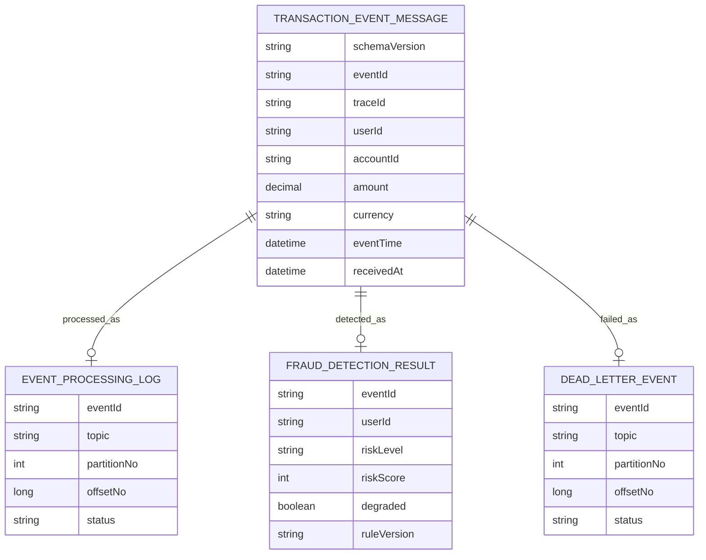

# 이벤트 스키마와 감사 저장 모델

## 문제

Kafka 이벤트가 재시도되거나 Consumer가 재시작되면 같은 거래 이벤트가 두 번 이상 처리될 수 있다. 이때 무엇을 같은 이벤트로 볼 것인지, API에서 시작된 흐름을 Consumer와 DB 결과까지 어떻게 추적할 것인지가 먼저 정해져야 했다.

## 초기 설계

거래 이벤트에는 `eventId`, `traceId`, `userId`, `eventTime`, `receivedAt`, `schemaVersion`을 포함했다. `eventId`는 idempotency 기준이고, `traceId`는 API, Kafka, Consumer, DB 로그를 연결하는 기준이다. `userId`는 Kafka partition key이면서 Redis sliding window의 사용자 단위 key가 된다.

## 실제로 막힌 지점

식별자를 많이 저장하면 추적은 쉬워지지만 개인정보 경계가 약해진다. 특히 `accountId`, `deviceId`, 원문 PaySim identifier 같은 값은 로그와 metric tag에 그대로 들어가면 안 된다. `eventId`와 `traceId`도 high-cardinality 값이므로 metric tag로 쓰기보다 로그와 DB 추적 기준으로 제한해야 했다.

## 확인한 증거

`docs/04-data-model.md`에는 `fraud_detection_results.event_id` unique, `event_processing_logs(topic, partition_no, offset_no)` unique 같은 중복 방어 기준을 기록했다. `docs/14-security-and-privacy.md`에는 민감 식별자 logging 제한과 raw/full PaySim data 미커밋 정책을 정리했다.

## 바꾼 설계

PostgreSQL을 탐지 결과와 audit log의 기준 저장소로 두었다. Kafka는 이벤트 전달과 replay backbone이고, Redis는 단기 계산 상태다. 같은 `eventId`가 다시 들어오더라도 `FraudResult`가 중복 생성되지 않도록 DB constraint와 application idempotency를 함께 둔다.

## 검증

테스트와 문서 evidence는 중복 `eventId`, 중복 source offset, DLT 재처리 idempotency를 중심으로 정리했다. V2 이후에는 detection result에 `ruleVersion`을 저장해 같은 결과 row가 어떤 rule baseline으로 만들어졌는지도 추적할 수 있게 했다.

## 남은 한계

민감정보 마스킹, 암호화, key rotation, 감사 로그 접근 통제는 더 강화할 수 있다. 현재 문서는 raw data와 token을 커밋하지 않는 guardrail, 민감 identifier를 로그에 노출하지 않는 기준, 로컬/개발용 admin 보호의 한계를 명확히 나누는 데 집중한다.
