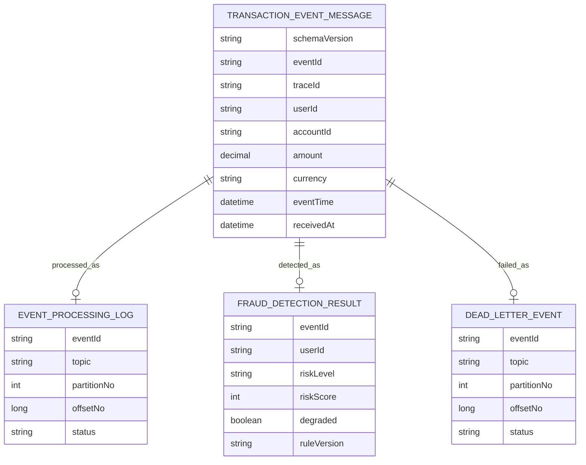

# eventId, traceId, userId를 같은 식별자로 쓰지 않은 이유

## 하나의 ID로 모든 문제를 풀 수 없었다

Kafka 이벤트가 재시도되거나 Consumer가 재시작되면 같은 거래 이벤트가 두 번 이상 처리될 수 있다. 이때 `eventId`, `traceId`, `userId`를 대충 하나의 “추적 ID”처럼 쓰면 문제가 생긴다. 중복 방어, 요청 추적, partition ordering, Redis window 기준이 서로 다른 질문인데 같은 식별자로 뭉개지기 때문이다.

## eventId, traceId, userId의 역할 분리

거래 이벤트에는 `eventId`, `traceId`, `userId`, `eventTime`, `receivedAt`, `schemaVersion`을 포함했다. `eventId`는 idempotency 기준이고, `traceId`는 API, Kafka, Consumer, DB 로그를 연결하는 기준이다. `userId`는 Kafka partition key이면서 Redis sliding window의 사용자 단위 key가 된다.

| ID | 사용 위치 | 목적 | metric label 사용 여부 | 이유 |
|---|---|---|---|---|
| `eventId` | DB, idempotency, DLT | 중복 방어와 audit 기준 | X | 이벤트마다 달라 high-cardinality가 됨 |
| `traceId` | log, request flow | API에서 Consumer까지 흐름 추적 | X | request 단위 값이라 metric 폭증 위험이 큼 |
| `userId` | Kafka key, Redis window | 사용자별 ordering과 velocity window 기준 | X | privacy와 cardinality를 함께 고려해야 함 |

## metric label에 고유 ID를 넣지 않은 이유

식별자를 많이 저장하면 추적은 쉬워지지만 개인정보 경계가 약해진다. 특히 `accountId`, `deviceId`, 원문 PaySim identifier 같은 값은 로그와 metric tag에 그대로 들어가면 안 된다. `eventId`와 `traceId`도 high-cardinality 값이므로 metric tag로 쓰기보다 로그와 DB 추적 기준으로 제한해야 했다.

또 다른 함정은 `eventId`를 partition key로 쓰고 싶은 유혹이었다. 중복 이벤트 추적에는 좋지만 사용자별 ordering에는 맞지 않는다. 그래서 `eventId`는 idempotency와 audit 기준, `traceId`는 request flow 연결 기준, `userId`는 partition key와 Redis window 기준으로 역할을 분리했다.

## PaySim identifier를 그대로 쓰지 않은 이유

metric tag에 `eventId`, `traceId`, `userId`를 넣지 않은 이유는 단순한 취향이 아니다. Prometheus cardinality가 폭증하면 관측 시스템 자체가 불안정해질 수 있다. 그래서 metric은 bounded tag만 사용하고, 고유 식별자는 structured log와 PostgreSQL 조회로 추적한다.

PaySim V2에서도 같은 기준을 적용했다. `nameOrig`, `nameDest`는 synthetic dataset의 값이지만 계정처럼 보이는 identifier이므로 raw 값을 저장소에 넣지 않고 HMAC 기반 hash identifier로 바꿨다.

## data model에 남긴 중복 방어 기준

`docs/04-data-model.md`에는 `fraud_detection_results.event_id` unique, `event_processing_logs(topic, partition_no, offset_no)` unique 같은 중복 방어 기준을 기록했다. `docs/14-security-and-privacy.md`에는 민감 식별자 logging 제한과 raw/full PaySim data 미커밋 정책을 정리했다.

## 최종적으로 남긴 audit/data model 기준

PostgreSQL을 탐지 결과와 audit log의 기준 저장소로 두었다. Kafka는 이벤트 전달과 replay backbone이고, Redis는 단기 계산 상태다. 같은 `eventId`가 다시 들어오더라도 `FraudResult`가 중복 생성되지 않도록 DB constraint와 application idempotency를 함께 둔다.

## 중복 이벤트와 version 추적 검증

테스트와 문서 evidence는 중복 `eventId`, 중복 source offset, DLT 재처리 idempotency를 중심으로 정리했다. V2 이후에는 detection result에 `ruleVersion`을 저장해 같은 결과 row가 어떤 rule baseline으로 만들어졌는지도 추적할 수 있게 했다. 다만 고유 ID는 metric label이 아니라 DB/log 추적 기준으로만 사용한다.

## 아직 강화해야 하는 개인정보 경계

민감정보 마스킹, 암호화, key rotation, 감사 로그 접근 통제는 더 강화할 수 있다. 현재 문서는 raw data와 token을 커밋하지 않는 guardrail, 민감 identifier를 로그에 노출하지 않는 기준, 로컬/개발용 admin 보호의 한계를 명확히 나누는 데 집중한다.
