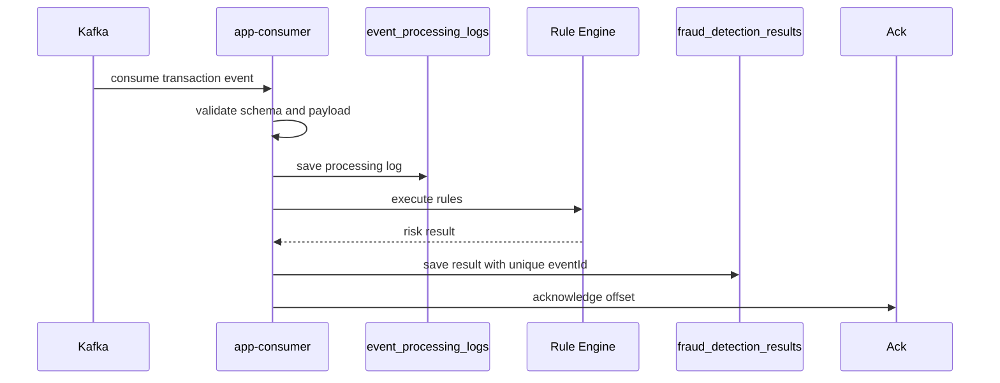

# Consumer manual ack와 재처리 가능성

## 문제

Kafka Consumer에서 offset을 언제 commit할지 정하지 않으면 장애 상황을 설명하기 어렵다. DB 저장 전에 offset이 commit되면 Consumer가 재시작되어도 Kafka는 이미 처리된 메시지로 볼 수 있고, 실제 탐지 결과는 남지 않을 수 있다.

## 초기 설계

Consumer는 `enable-auto-commit=false`와 manual ack를 기본으로 둔다. 메시지를 읽은 뒤 validation, processing log 저장, Rule Engine 실행, fraud result 저장이 성공한 다음 offset을 ack한다.

## 실제로 막힌 지점

어려운 부분은 ack 시점, DB transaction, exception handling 순서였다. 예외를 잡고도 ack를 해버리면 unprocessed event가 사라진 것처럼 보일 수 있다. 반대로 성공한 이벤트를 재시작 후 다시 읽을 수 있으므로 같은 `eventId`를 idempotent하게 처리해야 했다.

## 확인한 증거

`docs/07-consistency-and-reprocessing.md`와 `docs/18-runbook.md`에는 offset commit과 재처리 기준을 기록했다. 데이터 모델에서는 `event_processing_logs`의 `(topic, partition_no, offset_no)` unique constraint와 `fraud_detection_results.event_id` unique constraint가 최종 중복 방어선이다.

## 바꾼 설계

Consumer는 Kafka delivery를 business-level exactly-once로 주장하지 않는다. 대신 PostgreSQL unique constraint와 중복 처리 skip을 결합한 idempotent processing으로 설명한다. 같은 Kafka message가 다시 소비될 수 있다는 전제를 문서와 테스트 기준에 명시했다.

## 검증

Consumer restart, duplicate replay, DLT reprocess 테스트와 runbook에서 같은 `eventId`가 중복 `FraudResult`를 만들지 않는지 확인하도록 했다. V2 이후 evaluator에서도 missing result와 duplicate result를 별도 해석 대상으로 분리했다.

## 남은 한계

이 설계는 exactly-once processing이 아니다. Kafka transaction, outbox pattern, downstream publish atomicity까지 포함한 더 강한 보장은 future work다. 현재 목표는 “장애 후에도 설명 가능한 재처리”와 “중복 결과를 만들지 않는 저장”이다.
