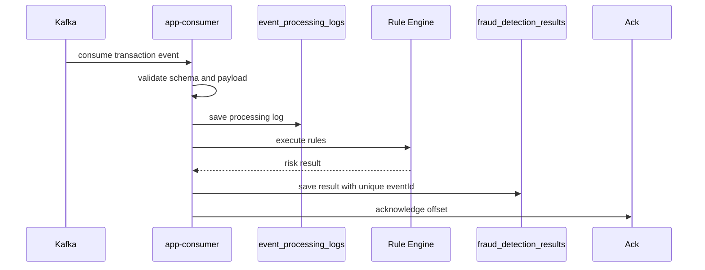

# DB 저장 전에 ack하면 무엇이 사라지는가

## ack는 처리 완료 신호가 아니다

Kafka Consumer에서 가장 위험한 실수는 메시지를 읽었다는 이유만으로 offset을 commit하는 것이다. API 서버라면 실패 응답을 반환하면 되지만, Consumer는 ack 시점이 잘못되면 처리되지 않은 이벤트가 사라진 것처럼 보일 수 있다. 그래서 이 프로젝트에서는 auto commit을 버리고 DB 저장과 fraud result 생성 이후에만 ack하는 구조로 바꿨다.

Consumer가 Kafka record를 poll했다는 사실은 아직 탐지 결과가 저장됐다는 의미가 아니다. 예를 들어 record를 읽은 뒤 Redis 조회나 PostgreSQL 저장 전에 Consumer가 종료되면, 이벤트는 메모리 안에서만 처리되다가 결과 없이 끝날 수 있다. 이때 auto commit으로 offset이 이미 갱신되어 있으면 Consumer가 재시작되어도 같은 record를 다시 읽지 않을 수 있다.

그래서 이 프로젝트에서는 ack 기준을 “메시지를 읽었다”가 아니라 “fraud result와 processing log를 저장했다”로 두었다. Consumer는 poll 이후 Rule Engine 실행, Redis window 조회, PostgreSQL 저장, 처리 로그 기록까지 끝난 뒤에만 ack한다.

## manual ack를 기본값으로 둔 이유

Consumer는 `enable-auto-commit=false`와 manual ack를 기본으로 둔다. 메시지를 읽은 뒤 validation, processing log 저장, Rule Engine 실행, fraud result 저장이 성공한 다음 offset을 ack한다.

최종 처리 순서는 단순히 “consume 후 ack”가 아니었다.

```text
Kafka record 수신
-> schema validation
-> eventId 기준 idempotency 확인
-> Rule Engine 실행
-> Redis sliding window 조회
-> PostgreSQL fraud result 저장
-> event_processing_log 저장
-> ack
```

이 중간에서 일시적 오류가 발생하면 retry topic으로 분리하고, 반복 실패하거나 처리할 수 없는 이벤트는 DLT로 보낸다. retry나 DLT로 보냈다는 사실도 처리 결과의 일부이므로 원본 topic, partition, offset, `eventId`, `traceId`, 실패 사유를 함께 남겨야 한다.



## 실패 케이스 1: DB 저장 전에 ack하면?

어려운 부분은 ack 시점, DB transaction, exception handling 순서였다. 예외를 잡고도 ack를 해버리면 unprocessed event가 사라진 것처럼 보일 수 있다. 반대로 DB 저장은 성공했지만 ack 직전에 Consumer가 죽으면 같은 offset이 다시 소비될 수 있다.

여기서 “사라진다”는 표현은 Kafka topic에서 메시지가 즉시 삭제된다는 뜻이 아니다. 더 정확히는 Consumer Group의 committed offset이 앞으로 이동했는데 PostgreSQL에는 결과와 처리 로그가 남지 않는 상태를 의미한다. 이 경우 운영자는 해당 이벤트가 성공했는지, 실패했는지, 재처리 대상인지 설명하기 어렵다.

따라서 DB 저장 전 ack의 문제는 단순 메시지 유실이 아니라 fraud result, audit trail, 재처리 근거가 비는 문제다. 이 프로젝트에서 ack 시점을 늦춘 이유도 처리 결과를 설명할 수 있는 최소 근거를 남기기 위해서였다.

이 두 상황은 서로 반대 방향의 위험이다. 하나는 유실처럼 보이고, 다른 하나는 중복처럼 보인다. 이 프로젝트는 중복 가능성을 받아들이고 idempotent processing으로 막는 쪽을 선택했다.

특히 DB 저장은 성공했지만 ack 직전에 Consumer가 종료되는 경우를 정상적인 재소비 가능성으로 보았다. 그래서 ack 재시도 자체보다 같은 `eventId`와 source offset이 다시 들어와도 결과가 중복 생성되지 않는지를 기준으로 검증했다.

## 실패 케이스 2: DB 저장 후 ack 전에 죽으면?

`docs/11-troubleshooting-log.md`에는 auto commit을 쓰면 DB 저장 실패와 무관하게 offset이 commit될 수 있다고 정리했다. 그래서 manual ack를 선택했다. 다만 manual ack도 완벽하지 않다. DB 저장 성공 후 ack 직전에 죽으면 재소비가 발생한다.

이 재소비는 `(topic, partition_no, offset_no)` unique constraint와 `fraud_detection_results.event_id` unique constraint로 방어한다. `existsByEventId()`는 빠른 중복 확인일 뿐이고, 최종 방어선은 PostgreSQL unique constraint다.

manual ack를 사용한다고 해서 모든 실패에서 ack를 하지 않는 것은 아니다. 실패한 record를 그대로 두면 같은 이벤트가 계속 재소비되어 Consumer를 막을 수 있다. 그래서 일시적 실패는 retry topic으로 보내고, 처리 불가능한 실패는 DLT로 분리한다.

다만 retry/DLT로 보냈다는 사실과 실패 사유가 저장되기 전에 원본 record를 ack하면 안 된다. retry 또는 DLT publish와 실패 로그 저장이 성공했을 때만 원본 record를 ack할 수 있다. 이때 ack는 이벤트를 버렸다는 뜻이 아니라, 원본 topic에서의 처리 경로를 retry/DLT로 전환했다는 의미가 된다. retry/DLT publish 자체가 실패했다면 원본 record를 ack하지 않아야 한다.

## 최종 방어선을 application이 아니라 DB constraint에 둔 이유

`docs/07-consistency-and-reprocessing.md`와 `docs/18-runbook.md`에는 offset commit과 재처리 기준을 기록했다. 데이터 모델에서는 `event_processing_logs`의 `(topic, partition_no, offset_no)` unique constraint와 `fraud_detection_results.event_id` unique constraint가 최종 중복 방어선이다.

재처리 구조에서는 같은 이벤트가 다시 들어오는 것을 정상 상황으로 봐야 한다. Kafka 재소비, retry topic, DLT reprocess 모두 같은 `eventId`를 다시 Consumer로 보낼 수 있다. 따라서 Consumer는 “다시 들어오면 실패”가 아니라 “다시 들어와도 결과가 중복 생성되지 않음”을 기준으로 설계해야 한다.

이를 위해 `fraud_detection_results.event_id` unique는 같은 도메인 이벤트의 탐지 결과가 중복 생성되는 것을 막고, `event_processing_logs(topic, partition_no, offset_no)` unique는 같은 Kafka record 처리 이력이 중복 기록되는 것을 막는다. Kafka offset은 처리 위치와 이력 설명에 필요하지만, 최종 결과 중복 방어는 `eventId` 기준 unique constraint가 담당한다.

## exactly-once라고 말하지 않은 이유

Consumer는 Kafka delivery를 business-level exactly-once로 주장하지 않는다. 대신 PostgreSQL unique constraint와 중복 처리 skip을 결합한 idempotent processing으로 설명한다. 같은 Kafka message가 다시 소비될 수 있다는 전제를 문서와 테스트 기준에 명시했다. 처리 로그만 있고 fraud result가 없는 중간 상태도 ack하지 않으면 재소비로 복구할 수 있는 상태로 본다.

## 재소비와 재처리에서 확인한 것

Consumer restart, duplicate replay, DLT reprocess 테스트와 runbook에서 같은 `eventId`가 중복 `FraudResult`를 만들지 않는지 확인하도록 했다. V2 이후 evaluator에서도 missing result와 duplicate result를 별도 해석 대상으로 분리했다.

## 더 강한 보장으로 남겨 둔 것

이 설계는 exactly-once processing이 아니다. Kafka transaction, outbox pattern, downstream publish atomicity까지 포함한 더 강한 보장은 future work다. 현재 목표는 “장애 후에도 설명 가능한 재처리”와 “중복 결과를 만들지 않는 저장”이다.

manual ack는 처리 완료 시점을 Consumer가 제어할 수 있게 해주지만, 그 자체로 exactly-once를 보장하지는 않는다. Consumer crash, DB timeout, retry publish 실패처럼 ack 전후의 경계에서 여전히 실패 지점이 생긴다. 그래서 이 프로젝트에서는 manual ack 하나에 의존하지 않고, ack 시점 지연, retry/DLT 분리, PostgreSQL unique constraint, processing log를 함께 사용했다. 목표는 한 번도 실패하지 않는 Consumer가 아니라, 실패 후에도 어떤 이벤트가 어디까지 처리됐는지 설명할 수 있는 Consumer였다.
