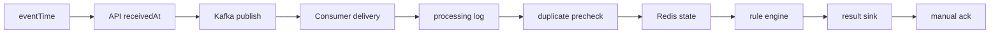

# Lag 하나를 아홉 개의 처리 경계로 분해하기

Consumer Lag이 올랐다. 무엇이 느린가?

처음에는 Kafka dashboard를 보면 답을 얻을 수 있을 것 같았다. 그러나 Lag은 원인이 아니라 “들어온 만큼 아직 처리하지 못했다”는 결과다. API, Kafka 전달, Redis, rule, result sink 중 어디가 시간을 쓰는지는 별도 경계가 필요했다.

## 관측 지도를 먼저 그렸다

이 흐름에서 하나의 “전체 latency”만 기록하면 원인 후보가 다시 합쳐진다. `FraudConsumerMetrics`와 intake metrics는 다음 경계를 각각 histogram으로 노출한다.

| 경계 | 메트릭이 답하는 질문 |
|---|---|
| API intake service | 요청 접수 orchestration은 얼마나 걸렸는가 |
| Kafka publish wait | broker ack를 기다린 시간은 얼마인가 |
| producer-to-consumer | Kafka CreateTime 뒤 Consumer 시작까지 얼마나 걸렸는가 |
| processing log | topic/partition/offset 기록에 든 시간은 얼마인가 |
| result precheck | `eventId` 중복 확인 비용은 얼마인가 |
| Redis state | window 갱신과 조회는 얼마나 걸렸는가 |
| rule processing | pure rule 계산은 얼마나 걸렸는가 |
| result sink | fraud result 저장은 얼마나 걸렸는가 |
| Consumer service | listener가 한 delivery를 다루는 전체 시간은 얼마인가 |

여기에 total/partition Lag, ingress/Consumer rates, Redis window count·amount, too-late/degraded/DLT counter를 같이 둔다.

## 식별자는 로그에, 분포는 metric에

문제를 추적하려면 `traceId`, `eventId`, topic, partition, offset이 필요하다. 하지만 이를 Prometheus label로 넣으면 이벤트 수만큼 time series가 늘어난다.

그래서 역할을 나눴다.

- 구조화 로그: 단일 이벤트 추적용 ID와 Kafka 위치
- PostgreSQL processing log: durable audit와 중복 위치 방어
- metric label: `rule`, `status`, `stream mode`처럼 bounded cardinality만 사용
- dashboard: 집계된 rate, quantile, Lag, counter

“모든 것을 metric으로 검색 가능하게” 만드는 대신 metric 시스템이 감당할 수 있는 차원을 유지했다.

## Phase 0의 150건은 성능 결과가 아니다

관측 배선을 검증하기 위해 5 EPS로 150건을 보냈다. receipt, Kafka publish, Consumer delivery, processing log, fraud result가 모두 150건에 도달하고 final Lag이 0이 되는지 확인했다.

이 실행이 증명한 것은 다음뿐이다.

- 각 stage counter가 실제 흐름에 연결되어 있다.
- timestamp 경계가 음수가 아닌 값으로 기록된다.
- Prometheus가 API와 Consumer를 scrape한다.
- Grafana dashboard가 versioned provisioning으로 로드된다.

5 EPS baseline을 “처리 성능”이라고 쓰지 않은 것이 첫 번째 관측 원칙이었다.

## 느린 이벤트 한 건과 지속 병목을 구분한다

Consumer에는 stage별 시간을 포함한 `SLOW_EVENT` 로그가 있다. API에도 receipt persistence, Kafka publish wait, status update를 분리한 slow intake 진단이 있다.

Phase 1 discovery에서 506ms slow intake 한 건이 발견됐고 그중 Kafka publish wait가 413ms였다. 하지만 전체 구간의 publish wait p95와 Hikari pending은 건강했다. 한 번의 느린 로그를 지속 병목으로 확대 해석하지 않았다.

반대로 300 EPS 구간에서 Lag이 모든 partition에 걸쳐 계속 증가했고 listener thread는 하나였다. 이때는 단일 outlier가 아니라 rate와 Lag의 시간 패턴이 원인을 지지했다.

## Grafana 패널의 질문 순서

대시보드는 장식이 아니라 조사 순서를 반영한다.

1. ingress와 Consumer rate가 벌어졌는가?
2. total Lag이 일시 spike인가, 계속 증가하는가?
3. partition별로 고른가, 하나만 높은가?
4. Redis·rule·sink 중 어떤 p95/p99가 함께 움직였는가?
5. event age가 시스템 진입 전부터 높았는가?
6. too-late, degraded, DLT, duplicate guard가 늘었는가?
7. drain 뒤 DB 세 경계의 count가 일치하는가?

이 순서는 Phase 1에서는 concurrency 문제를, Phase 2에서는 O(window size) Redis read path를, Phase 3에서는 P2 hot partition을 각각 다른 원인으로 분리하는 데 쓰였다.

## 지표 이름보다 의미가 중요했다

`fraud.kafka.producer.to.consumer.delay`는 broker 내부 체류 시간만 재는 값이 아니다. Kafka record timestamp부터 listener 시작까지다. `fraud.event.ingress.age`도 source network latency가 아니라 `eventTime`부터 `receivedAt`까지다.

측정 경계를 이름보다 넓게 주장하면 정밀한 숫자가 오히려 잘못된 결론을 강화한다. V3 dashboard와 evidence에는 다음 해석 제한을 함께 남겼다.

- histogram bucket 범위를 넘는 큰 event age는 DB timestamp quantile을 기준으로 삼는다.
- Prometheus scrape 간격보다 짧은 Lag spike는 최대값이 누락될 수 있다.
- local Docker resource 경쟁은 production capacity를 대표하지 않는다.
- live와 replay가 물리 자원을 공유하면 latency 차이를 state contamination으로 단정하지 않는다.

## 관측의 완료 기준

관측성은 panel 수가 아니라 반증 가능성으로 판단했다. “DB가 병목일 것이다”라는 가설을 Hikari pending 0과 낮은 sink latency로 기각할 수 있고, “Kafka 전체가 밀렸다”는 표현을 partition Lag으로 P2만의 문제라고 좁힐 수 있어야 했다.

그때부터 dashboard는 상태 화면이 아니라 실험 도구가 되었다.
