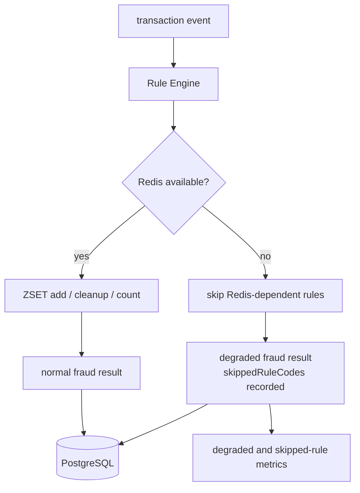

# Redis가 죽으면 탐지를 멈출 것인가

## Redis 장애를 전체 실패로 볼 수 없었던 이유

Redis는 빠른 이상거래 탐지에 유용하지만, 최종 정합성 기준으로 두기에는 위험하다. Redis가 내려간 순간 모든 탐지를 실패로 처리하면 Consumer backlog가 커지고, 반대로 실패를 무시하면 어떤 rule이 실행되지 않았는지 설명할 수 없다. 그래서 Redis 장애를 “성공”도 “전체 실패”도 아닌 degraded mode로 기록했다.

Redis는 이 프로젝트에서 최종 결과 저장소가 아니라 사용자별 최근 거래 패턴을 빠르게 계산하기 위한 단기 상태 저장소다. 예를 들어 특정 사용자의 최근 N분 거래 횟수, 금액 합계, 고빈도 거래 여부 같은 velocity rule은 Redis sliding window를 통해 계산한다.

따라서 Redis가 실패하면 해당 rule의 입력을 만들 수 없지만, Kafka 이벤트를 소비하거나 PostgreSQL에 결과와 audit log를 남기는 것 자체가 항상 불가능해지는 것은 아니다. 이 차이 때문에 Redis 장애를 전체 탐지 실패로만 보지 않고 degraded 상태로 분리했다.

## ZSET sliding window를 선택한 이유

Redis는 source of truth가 아니라 short-term state store로 둔다. 사용자별 velocity rule은 ZSET을 사용한다.

```text
key = fraud:velocity:{userId}
score = eventTime epoch millis
value = eventId
```

이벤트를 추가하고, window 밖의 이벤트를 제거한 뒤, 남은 이벤트 수를 threshold와 비교한다. 처음에는 `INCR + TTL` 같은 fixed-window counter가 단순해 보였지만, window 경계에서 최근 거래 수가 왜곡될 수 있다. 그래서 `eventTime`을 score로 쓰는 ZSET sliding window를 선택했다.

개념적으로는 사용자별 window key를 두고 최근 거래만 남기는 방식이다. 예를 들어 `fraud:window:{userId}` 같은 key에 거래 시각과 금액을 기록하고, window 범위를 벗어난 값은 제거하거나 TTL로 만료시킨다. Consumer는 이 값을 바탕으로 최근 거래 횟수나 금액 합계를 계산해 Rule Engine에 전달한다.

이 구조는 DB를 매번 조회하는 것보다 빠르게 최근 패턴을 계산할 수 있다는 장점이 있다. 대신 Redis에 의존하는 rule은 Redis 장애나 timeout이 발생했을 때 실행되지 못할 수 있으므로, 결과에 `degraded` 여부와 skipped rule 정보를 남겨야 한다.



## 전체 실패와 정상 처리 사이에서 고른 기준

처음에는 Redis 장애를 예외로 처리하면 단순할 것처럼 보였다. 하지만 Redis가 잠시 불안정할 때 모든 이벤트를 DLT로 보내면 Consumer backlog와 운영 부담이 커진다. 반대로 Redis 실패를 무시하고 정상 처리처럼 저장하면 어떤 rule이 실행되지 않았는지 알 수 없다.

이 글에서 degraded는 success와 다르다. success는 필요한 rule이 정상 실행되고 결과가 저장된 상태다. failure는 이벤트 자체를 처리하지 못해 retry나 DLT로 분리해야 하는 상태다. degraded는 이벤트는 처리했지만 Redis 장애처럼 일부 rule 입력을 만들 수 없어 탐지 품질이 낮아진 상태다.

degraded를 success처럼 숨기면 운영자는 어떤 rule이 실행되지 않았는지 알 수 없다. 반대로 degraded를 모두 failure로 처리하면 Redis 장애 동안 Consumer backlog가 불필요하게 커질 수 있다. 그래서 결과는 저장하되, `degraded=true`와 skipped rule 정보를 함께 남기는 쪽을 선택했다.

또 Redis write는 하나의 명령으로 끝나지 않는다. Hash metadata 저장, ZSET 추가, cleanup, TTL 갱신, window 조회가 이어진다. 중간 실패가 나면 ZSET에는 eventId가 있지만 amount metadata가 없는 불완전 상태가 남을 수 있다.

## ZSET 보조 상태를 오염시키지 않는 방법

ZSET member는 `eventId`, score는 `eventTime` epoch millis로 둔다. 같은 eventId가 다시 들어오면 ZSET count가 중복 증가하는 일을 완화할 수 있다. amount 합산은 Hash metadata를 보고 계산하되, metadata가 없는 eventId는 count와 sum에서 제외한다. Redis transaction이나 Lua까지 넣으면 범위가 커지므로 future hardening으로 남겼다.

이미 `fraud_detection_results`에 같은 `eventId`가 있으면 Redis window를 다시 갱신하지 않는다. duplicate replay가 Redis 보조 상태를 오염시키는 일을 피하기 위한 fast path다. 최종 중복 방어는 여전히 PostgreSQL unique constraint다.

## Redis down drill에서 확인한 것

Redis 관련 문서는 `docs/06-redis-sliding-window.md`, 장애 대응은 `docs/10-failure-scenarios.md`와 `docs/18-runbook.md`에 정리했다. 관측 지표는 Redis command latency, degraded count, skipped rule count를 중심으로 둔다.


Redis down drill에서는 Redis를 중단한 상태에서 부하를 넣고, API 요청 자체는 실패시키지 않으면서 `fraud_redis_window_degraded_total`, `fraud_detection_degraded_total`, `fraud_rule_skipped_total`이 증가하는지 확인했다. 이 테스트의 목적은 Redis 장애를 정상 처리로 숨기는 것이 아니라, 실행되지 못한 rule과 degraded 결과를 관측 가능한 metric으로 남기는 것이었다. `RAPID_TRANSACTION_COUNT`, `WINDOW_AMOUNT_SUM`처럼 Redis window에 의존하는 rule이 함께 skip되면 skipped count는 이벤트 수보다 크게 보일 수 있다.


Prometheus에서도 `fraud_redis_window_degraded_total`이 증가하는 것을 확인했다. 최종 정합성 기준은 PostgreSQL에 두고, Redis는 탐지 품질 저하를 설명하는 보조 컴포넌트로 다뤘다.

## 최종 선택: degraded result로 남기기

Redis가 실패하면 Redis 의존 rule을 skipped로 기록하고, 나머지 rule은 실행한다. 결과에는 `degraded=true`와 `skippedRuleCodes`를 남긴다. 이렇게 하면 이벤트 처리 흐름은 유지하면서도 탐지 품질이 제한됐다는 사실을 DB와 metric으로 추적할 수 있다.

Redis 장애 시에도 PostgreSQL에는 결과의 성격을 구분할 수 있는 정보가 남아야 한다. 단순히 `riskLevel=LOW`처럼 저장하면 정상적으로 모든 rule을 실행한 결과인지, Redis rule이 skipped된 축소 결과인지 구분할 수 없다.

그래서 탐지 결과에는 degraded 여부를 남기고, 처리 로그에는 Redis timeout, connection failure, skipped rule 같은 원인을 남기는 기준이 필요했다. PostgreSQL은 Redis 상태를 대체하는 저장소가 아니라, 어떤 조건에서 어떤 결과가 만들어졌는지 설명하기 위한 최종 audit 기준이 된다.

Redis 장애는 개별 이벤트 payload가 잘못된 것이 아니라 보조 인프라가 일시적으로 사용할 수 없는 상황에 가깝다. 이때 모든 이벤트를 retry로 보내면 Redis가 복구될 때까지 retry topic과 Consumer backlog가 급격히 늘 수 있다.

그렇다고 Redis rule을 실행하지 못한 결과를 정상 탐지처럼 저장하면 안 된다. degraded mode는 처리를 계속하기 위한 선택이 아니라, 처리 결과의 품질 저하를 드러내기 위한 선택이다. 반면 schema 오류, 필수 필드 누락, PostgreSQL 저장 실패처럼 결과 자체를 만들 수 없는 경우는 retry 또는 DLT로 분리해야 한다.

Redis를 사용한 이유는 최근 거래 window를 빠르게 계산하기 위해서다. 하지만 Redis는 TTL, eviction, 장애, 재시작, 메모리 사용량 같은 운영 조건의 영향을 받기 때문에 최종 정합성 기준으로 두기 어렵다. 반면 PostgreSQL은 transaction, unique constraint, 영속 저장, audit query에 유리하다. 그래서 Redis는 Rule Engine에 필요한 단기 입력을 만드는 보조 상태로 두고, fraud result와 audit log의 기준은 PostgreSQL에 두었다.

## degraded mode를 검증한 기준

Redis down drill과 Redis integration test는 degraded result, skipped rule, 관련 metric을 확인하는 방향으로 정리했다. load/failure 테스트에서는 Redis down 시 API error rate만 보지 않고 degraded mode count도 함께 본다.

## 이 설계가 해결하지 못하는 것

Redis 장애 기간 동안 탐지 품질은 제한된다. 이 설계는 탐지 누락을 없애는 것이 아니라 “어떤 rule이 실행되지 않았는지 숨기지 않는” 방향이다. 운영 alert, Grafana dashboard, Redis 장애 지속 시간별 영향 분석은 더 고도화할 수 있다.

degraded mode는 Redis 장애를 해결하는 기능이 아니다. Redis 의존 rule이 실행되지 않았다는 사실을 숨기지 않고 결과에 남기는 방식이다. 따라서 degraded 결과가 계속 쌓이면 이것도 장애 신호로 봐야 한다.

실제 운영에서는 degraded 비율, Redis error count, Consumer Lag, DLT count를 함께 봐야 한다. 이번 글에서는 그 출발점으로 Redis 장애를 정상 결과처럼 숨기지 않고, `degraded` flag와 skipped rule 기록으로 남기는 기준을 세웠다.
