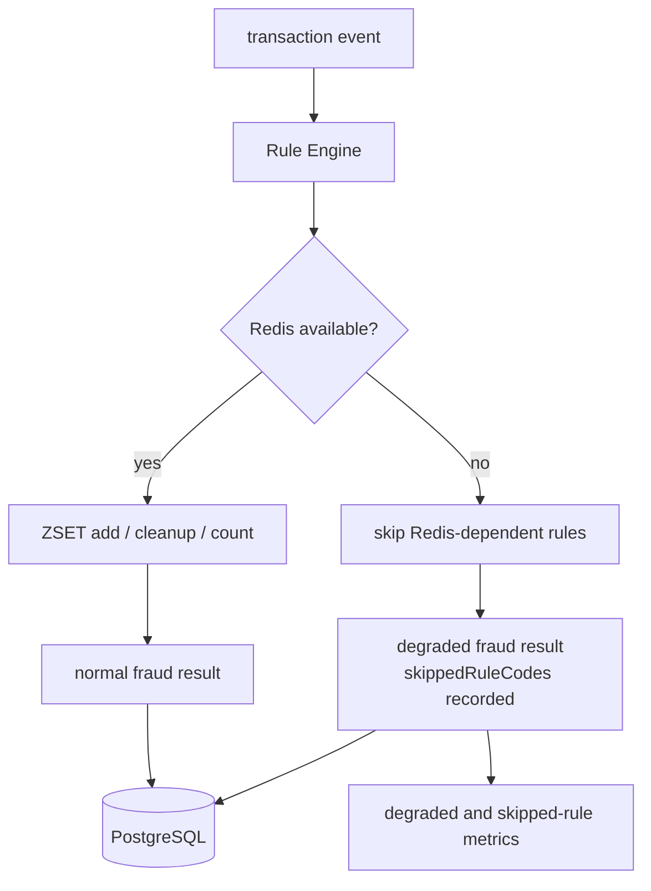

# Redis sliding window와 degraded mode

## 문제

사용자별 최근 거래 횟수나 금액 패턴은 빠르게 계산해야 하지만, Redis가 장애 날 수 있다. Redis 장애를 전체 탐지 실패로 볼지, Redis 의존 rule만 건너뛰고 degraded 결과로 남길지 결정해야 했다.

## 초기 설계

Redis는 source of truth가 아니라 short-term state store로 둔다. 사용자별 velocity rule은 ZSET을 사용한다.

```text
key = fraud:velocity:{userId}
score = eventTime epoch millis
value = eventId
```

이벤트를 추가하고, window 밖의 이벤트를 제거한 뒤, 남은 이벤트 수를 threshold와 비교한다. fixed-window `INCR + TTL`보다 경계 시점 왜곡을 설명하기 쉽기 때문에 sliding window를 선택했다.



## 실제로 막힌 지점

처음에는 Redis 장애를 예외로 처리하면 단순할 것처럼 보였다. 하지만 Redis가 잠시 불안정할 때 모든 이벤트를 DLT로 보내면 Consumer backlog와 운영 부담이 커진다. 반대로 Redis 실패를 무시하고 정상 처리처럼 저장하면 어떤 rule이 실행되지 않았는지 알 수 없다.

## 확인한 증거

Redis 관련 문서는 `docs/06-redis-sliding-window.md`, 장애 대응은 `docs/10-failure-scenarios.md`와 `docs/18-runbook.md`에 정리했다. 관측 지표는 Redis command latency, degraded count, skipped rule count를 중심으로 둔다.

## 바꾼 설계

Redis가 실패하면 Redis 의존 rule을 skipped로 기록하고, 나머지 rule은 실행한다. 결과에는 `degraded=true`와 `skippedRuleCodes`를 남긴다. 이렇게 하면 이벤트 처리 흐름은 유지하면서도 탐지 품질이 제한됐다는 사실을 DB와 metric으로 추적할 수 있다.

## 검증

Redis down drill과 Redis integration test는 degraded result, skipped rule, 관련 metric을 확인하는 방향으로 정리했다. load/failure 테스트에서는 Redis down 시 API error rate만 보지 않고 degraded mode count도 함께 본다.

## 남은 한계

Redis 장애 기간 동안 탐지 품질은 제한된다. 이 설계는 탐지 누락을 없애는 것이 아니라 “어떤 rule이 실행되지 않았는지 숨기지 않는” 방향이다. 운영 alert, Grafana dashboard, Redis 장애 지속 시간별 영향 분석은 더 고도화할 수 있다.
