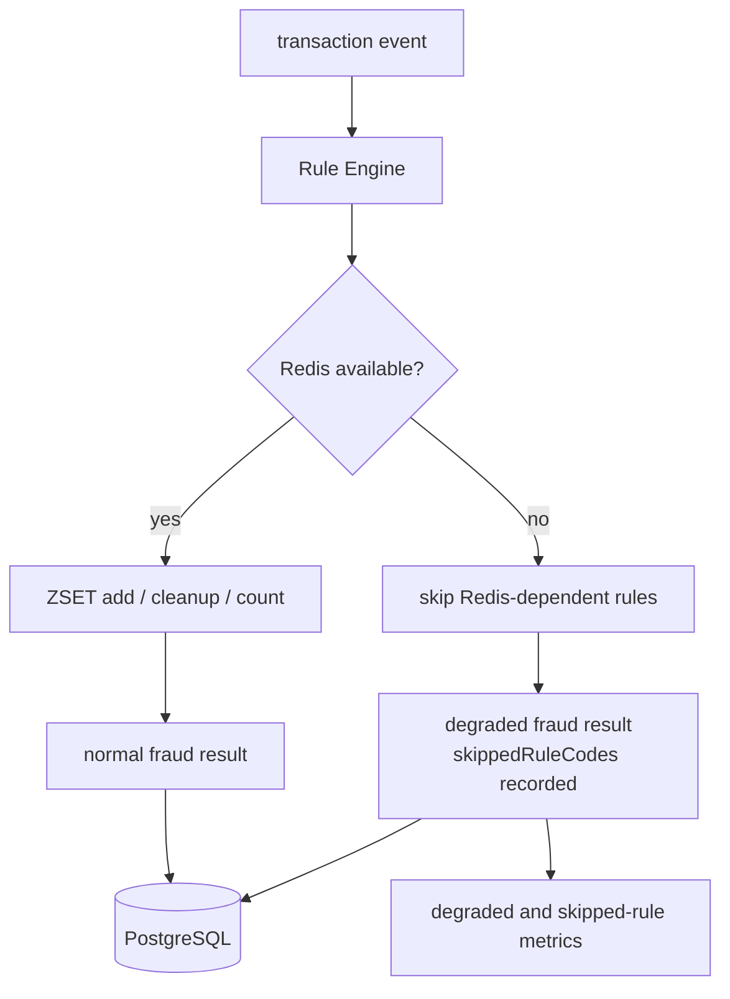
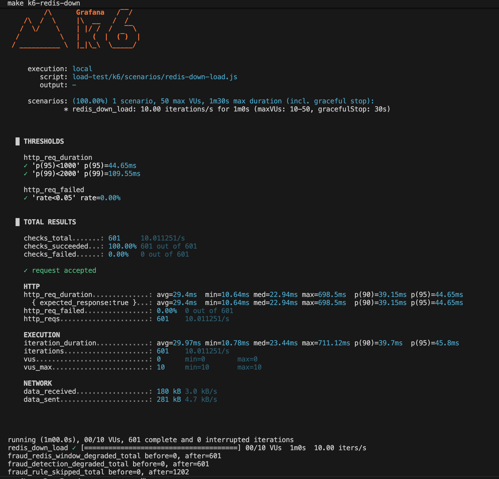
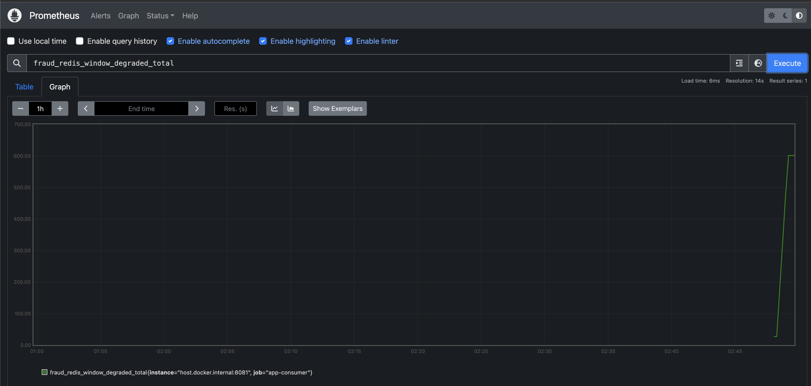

# Redis가 죽으면 탐지를 멈출 것인가

## 문제

Redis는 빠른 이상거래 탐지에 유용하지만, 최종 정합성 기준으로 두기에는 위험하다. Redis가 내려간 순간 모든 탐지를 실패로 처리하면 Consumer backlog가 커지고, 반대로 실패를 무시하면 어떤 rule이 실행되지 않았는지 설명할 수 없다. 그래서 Redis 장애를 “성공”도 “전체 실패”도 아닌 degraded mode로 기록했다.

## 초기 설계

Redis는 source of truth가 아니라 short-term state store로 둔다. 사용자별 velocity rule은 ZSET을 사용한다.

```text
key = fraud:velocity:{userId}
score = eventTime epoch millis
value = eventId
```

이벤트를 추가하고, window 밖의 이벤트를 제거한 뒤, 남은 이벤트 수를 threshold와 비교한다. 처음에는 `INCR + TTL` 같은 fixed-window counter가 단순해 보였지만, window 경계에서 최근 거래 수가 왜곡될 수 있다. 그래서 `eventTime`을 score로 쓰는 ZSET sliding window를 선택했다.



## 실제로 막힌 지점

처음에는 Redis 장애를 예외로 처리하면 단순할 것처럼 보였다. 하지만 Redis가 잠시 불안정할 때 모든 이벤트를 DLT로 보내면 Consumer backlog와 운영 부담이 커진다. 반대로 Redis 실패를 무시하고 정상 처리처럼 저장하면 어떤 rule이 실행되지 않았는지 알 수 없다.

또 Redis write는 하나의 명령으로 끝나지 않는다. Hash metadata 저장, ZSET 추가, cleanup, TTL 갱신, window 조회가 이어진다. 중간 실패가 나면 ZSET에는 eventId가 있지만 amount metadata가 없는 불완전 상태가 남을 수 있다.

## 트러블슈팅에서 남긴 판단

ZSET member는 `eventId`, score는 `eventTime` epoch millis로 둔다. 같은 eventId가 다시 들어오면 ZSET count가 중복 증가하는 일을 완화할 수 있다. amount 합산은 Hash metadata를 보고 계산하되, metadata가 없는 eventId는 count와 sum에서 제외한다. Redis transaction이나 Lua까지 넣으면 범위가 커지므로 future hardening으로 남겼다.

이미 `fraud_detection_results`에 같은 `eventId`가 있으면 Redis window를 다시 갱신하지 않는다. duplicate replay가 Redis 보조 상태를 오염시키는 일을 피하기 위한 fast path다. 최종 중복 방어는 여전히 PostgreSQL unique constraint다.

## 확인한 증거

Redis 관련 문서는 `docs/06-redis-sliding-window.md`, 장애 대응은 `docs/10-failure-scenarios.md`와 `docs/18-runbook.md`에 정리했다. 관측 지표는 Redis command latency, degraded count, skipped rule count를 중심으로 둔다.



Redis down drill에서는 Redis를 중단한 상태에서 부하를 넣고, API 요청 자체는 실패시키지 않으면서 `fraud_redis_window_degraded_total`, `fraud_detection_degraded_total`, `fraud_rule_skipped_total`이 증가하는지 확인했다. 이 테스트의 목적은 Redis 장애를 정상 처리로 숨기는 것이 아니라, 실행되지 못한 rule과 degraded 결과를 관측 가능한 metric으로 남기는 것이었다. `RAPID_TRANSACTION_COUNT`, `WINDOW_AMOUNT_SUM`처럼 Redis window에 의존하는 rule이 함께 skip되면 skipped count는 이벤트 수보다 크게 보일 수 있다.



Prometheus에서도 `fraud_redis_window_degraded_total`이 증가하는 것을 확인했다. 최종 정합성 기준은 PostgreSQL에 두고, Redis는 탐지 품질 저하를 설명하는 보조 컴포넌트로 다뤘다.

## 바꾼 설계

Redis가 실패하면 Redis 의존 rule을 skipped로 기록하고, 나머지 rule은 실행한다. 결과에는 `degraded=true`와 `skippedRuleCodes`를 남긴다. 이렇게 하면 이벤트 처리 흐름은 유지하면서도 탐지 품질이 제한됐다는 사실을 DB와 metric으로 추적할 수 있다.

## 검증

Redis down drill과 Redis integration test는 degraded result, skipped rule, 관련 metric을 확인하는 방향으로 정리했다. load/failure 테스트에서는 Redis down 시 API error rate만 보지 않고 degraded mode count도 함께 본다.

## 남은 한계

Redis 장애 기간 동안 탐지 품질은 제한된다. 이 설계는 탐지 누락을 없애는 것이 아니라 “어떤 rule이 실행되지 않았는지 숨기지 않는” 방향이다. 운영 alert, Grafana dashboard, Redis 장애 지속 시간별 영향 분석은 더 고도화할 수 있다.
