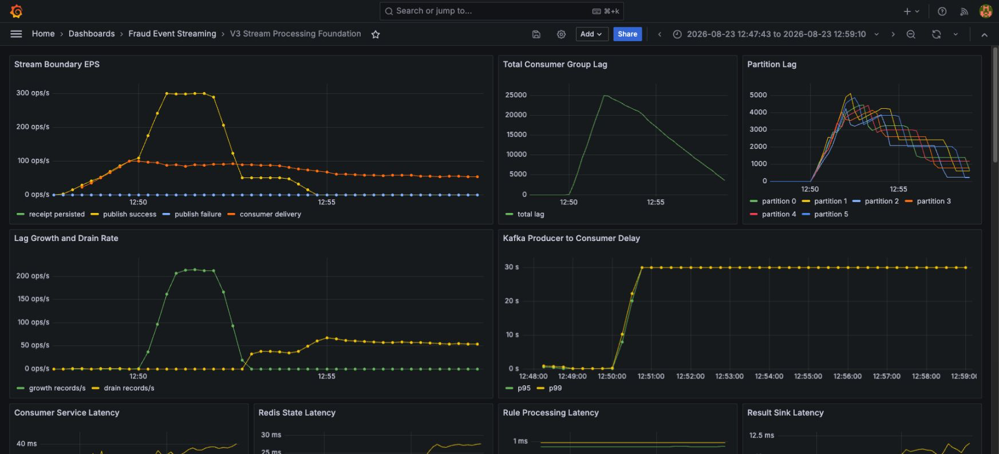
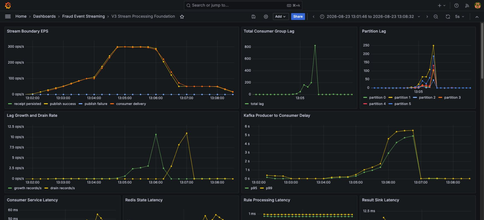

# 300 EPS에서 생긴 17,857건의 Lag을 추적한 기록

이 글은 목표 TPS를 선언하는 글이 아니다. 입력률을 단계적으로 올리고, Lag이 자라기 시작한 지점에서 병목 가설을 하나씩 지운 기록이다.

## 실험 질문

로컬 Docker 환경의 HTTP intake 경로에서 다음을 알고 싶었다.

1. 어느 구간까지 Lag이 지속적으로 자라지 않는가?
2. overload가 끝나면 backlog가 얼마나 빨리 줄어드는가?
3. API, Kafka publish, DB connection, Consumer 중 어느 경계가 먼저 제한되는가?

처리 가능하다고 희망하는 숫자를 먼저 정하지 않고, capacity discovery → knee confirmation → recovery → same-load retest 순서로 실행했다.

## 200 EPS까지는 조용했다

첫 accepted discovery run은 22,500건을 발행했다. 최대 target 200 EPS, HTTP failure 0, final Lag 0, receipt/result/processing-log 각 22,500건이었다.

이 결과는 200 EPS 구간이 해당 실행에서 clean하게 끝났다는 뜻이다. 아직 knee를 찾았다는 뜻은 아니었다.

## 300 EPS에서 API와 Consumer가 갈라졌다

`phase1-recovery-before-concurrency1-20260821-003`은 51,000건, 최대 300 EPS workload였다.

| 관측값 | 결과 |
|---|---:|
| HTTP failure | 0 |
| API transaction p99 | 10.30 ms |
| Kafka publish wait p99 | 2.20 ms |
| Hikari pending max | 0 |
| Consumer service p99 | 13.29 ms |
| overload 종료 시 Lag | 15,720 |
| peak Lag | 17,857 |
| recovery time | 170 s |
| final receipt/result/log | 51,000 / 51,000 / 51,000 |

API는 요청을 계속 받았고 Kafka publish wait도 지속적으로 높지 않았다. DB connection pool 대기도 없었다. 그런데 Lag은 300 EPS stage에서 증가했다.

partition별 Lag도 모두 0이 아닌 상태였다. 특정 hot key보다 Consumer 전체의 병렬성이 부족하다는 쪽이 더 강한 후보였다.

## 잘못 짚을 수 있었던 세 가지

### “PostgreSQL insert가 느렸을 것이다”

가능한 가설이지만 Hikari pending이 0이고 API·Consumer의 stage latency가 해당 주장을 지지하지 않았다. 이 실행만으로 PostgreSQL을 튜닝할 근거는 없었다.

### “Kafka broker가 느렸다”

Lag은 Kafka에 보이지만 publish wait p99는 2.20ms였다. Kafka가 backlog를 보관한 위치라는 사실과 broker가 병목이라는 결론은 다르다.

### “k6가 target을 못 만들었다”

HTTP failure와 dropped iteration이 없고 workload stage를 수행했다. load generator saturation도 우선순위에서 내려갔다.

## topology를 확인하니 한 thread가 여섯 partition을 들고 있었다

topic partition은 6개인데 listener concurrency 기본값은 1이었다. 한 Consumer thread가 P0~P5를 모두 처리하고 있었다.

repository 기본값을 무조건 6으로 바꾸지는 않았다. 환경 변수 `FRAUD_CONSUMER_CONCURRENCY=6`으로 로컬 실험 topology에 맞추고 동일 workload를 다시 실행했다. partition 수에 맞춘 병렬성의 효과를 분리하기 위해서다.

## 같은 51,000건으로 다시 측정했다

| Metric | concurrency 1 | concurrency 6 |
|---|---:|---:|
| max target EPS | 300 | 300 |
| emitted | 51,000 | 51,000 |
| peak Lag | 17,857 | 86 |
| overload 종료 시 Lag | 15,720 | 19 |
| final Lag | 0 | 0 |
| final receipt/result/log | 51k / 51k / 51k | 51k / 51k / 51k |
| Consumer service p99 | 13.29 ms | 25.87 ms |
| Hikari pending max | 0 | 0 |

각 Consumer가 partition 하나씩 맡았고 sustained backlog가 사라졌다. peak Lag 86은 이전의 17,857과 다른 패턴이었다.

### concurrency 1: 입력과 처리가 벌어진 구간

300 EPS 입력은 유지되지만 Consumer delivery가 따라가지 못하면서 전체 Lag과 여섯 partition의 Lag이 함께 증가한다. 이후 입력률이 낮아지자 backlog가 drain되기 시작한다.

### concurrency 6: 같은 부하에서 억제된 backlog

같은 workload를 partition 수와 맞춘 concurrency 6으로 실행한 화면이다. 작은 scrape-sampled spike는 남지만, 이전처럼 지속적으로 증가하는 backlog는 나타나지 않았다.

after-run의 “first zero”가 overload 종료 후 139초로 기록됐지만 이를 139초짜리 큰 drain이라고 해석하지 않았다. recovery 시작 시 Lag이 19, peak가 86뿐이어서 scrape 사이에 나타난 작은 spike의 첫 0 시점을 잡은 값에 가깝다.

## 개선과 비용을 같이 읽기

concurrency를 여섯 배로 올리자 처리량은 좋아졌지만 Consumer service p99는 13.29ms에서 25.87ms로 늘었다. 병렬 Consumer가 Redis와 DB를 동시에 더 많이 사용하므로 개별 처리 latency가 반드시 줄어드는 것은 아니다.

처리량 개선은 “각 요청이 더 빨라졌다”가 아니라 “partition 작업을 병렬로 수행해 입력률을 따라갔다”로 설명해야 한다.

또한 concurrency 6은 six-partition topology에 맞춘 값이다. 8로 높이면 두 Consumer는 idle이 된다. partition 수가 병렬성 상한을 만든다.

## 결론의 정확한 범위

이 실험으로 말할 수 있는 결론은 다음과 같다.

> 기록된 로컬 HTTP workload에서 concurrency 1은 300 EPS stage 동안 지속 backlog를 만들었고, 같은 six-partition 환경에서 concurrency 6은 동일한 51,000건 workload를 peak Lag 86, final Lag 0으로 완료했다.

“시스템 최대 처리량은 300 EPS”도 아니고 “300 EPS만 처리한다”도 아니다. 300 EPS까지 검증했고 그보다 높은 knee는 측정하지 않았다.

성능 결과에서 가장 중요한 숫자는 최고 TPS 하나가 아니라, 입력률·Lag 증가·drain·처리 완료 count가 함께 만든 곡선이었다.
