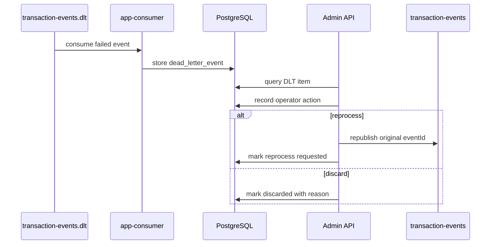

# DLT 재처리 API와 운영자 조작 보호

## 문제

DLT는 실패 메시지를 밀어 넣는 끝 지점이 아니다. 운영자가 실패 원인을 확인하고, 재처리하거나, 폐기하고, 그 조작을 나중에 설명할 수 있어야 하는 영역이다.

## 초기 설계

`transaction-events.dlt`에 들어온 이벤트는 DB에 metadata로 저장하고 admin API로 조회한다. 운영자는 재처리 또는 폐기를 명시적으로 요청한다. 재처리는 원본 `eventId`를 보존해야 하며, 같은 이벤트가 중복 `FraudResult`를 만들면 안 된다.

## 실제로 막힌 지점

재처리 API만 만들면 운영 흐름이 완성된 것처럼 보이지만, 실제로는 무제한 재처리와 폐기 감사 누락이 더 위험했다. 같은 이벤트를 계속 재처리하면 topic과 DLT를 오가며 원인 파악이 어려워질 수 있다. 폐기 작업은 더 조심해야 한다. 이유와 조작자를 남기지 않으면 나중에 왜 이벤트가 처리되지 않았는지 설명할 수 없다.

## 확인한 증거

`docs/05-api-design.md`, `docs/07-consistency-and-reprocessing.md`, `docs/18-runbook.md`에 DLT 조회, 재처리, 폐기 흐름을 기록했다. Phase 14에서는 admin token 최소 보호, audit log, max reprocess attempts 정책을 추가했다.

## 바꾼 설계

DLT 조작은 상태 전이로 본다. 재처리와 폐기는 operator action으로 감사 로그를 남기고, 재처리 횟수에는 상한을 둔다. admin API는 초기 단계라 완전한 인증/인가 체계가 아니라 최소 token 보호로 제한하고, production RBAC/JWT는 future work로 분리했다.

## 검증

상태 전이 테스트, admin 401 테스트, DLT audit log 테스트, max attempts 테스트를 evidence로 둔다. 재처리에서 원본 `eventId`를 보존하고, PostgreSQL unique constraint가 중복 결과를 막는지도 핵심 확인 기준이다.

## 남은 한계

현재 admin 보호는 로컬/개발용 최소 보호다. 운영 환경이라면 RBAC, JWT, audit query API, rate limit, 조작 승인 절차가 필요하다. 자동 재처리 정책도 잘못 만들면 실패를 숨길 수 있으므로 별도 설계가 필요하다.
