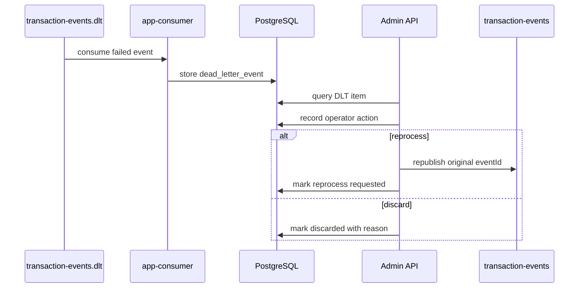
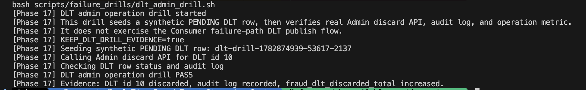
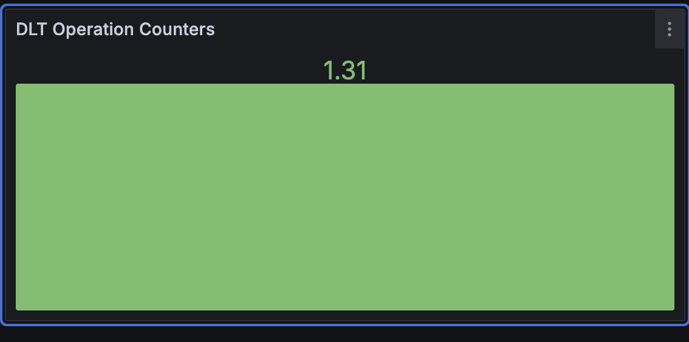

# 재처리는 복구 기능이면서 운영자 조작 위험이다

## DLT는 실패 메시지 보관함이 아니라 운영자 조작 영역이다

DLT 재처리는 “실패한 메시지를 다시 넣는 기능”으로 끝나지 않는다. 같은 이벤트를 반복 재처리하면 Kafka 부하와 중복 처리 위험이 생기고, 폐기 사유가 남지 않으면 나중에 왜 이벤트를 포기했는지 설명할 수 없다. 그래서 DLT는 실패 저장소가 아니라 운영자 조작을 감사해야 하는 영역으로 봤다.

## DLT 상태 전이 모델

`transaction-events.dlt`에 들어온 이벤트는 DB에 metadata로 저장하고 admin API로 조회한다. 운영자는 재처리 또는 폐기를 명시적으로 요청한다. 재처리는 원본 `eventId`를 보존해야 하며, 같은 이벤트가 중복 `FraudResult`를 만들면 안 된다.

## 재처리 API만 만들면 부족했던 이유

재처리 API만 만들면 운영 흐름이 완성된 것처럼 보이지만, 실제로는 무제한 재처리와 폐기 감사 누락이 더 위험했다. 같은 이벤트를 계속 재처리하면 topic과 DLT를 오가며 원인 파악이 어려워질 수 있다. 폐기 작업은 더 조심해야 한다. 이유와 조작자를 남기지 않으면 나중에 왜 이벤트가 처리되지 않았는지 설명할 수 없다.

또 모든 실패를 DLT로 보내는 것도 맞지 않았다. DB 장애는 DLT 저장 자체도 실패할 가능성이 높다. 이런 경우에는 ack하지 않고 Kafka 재소비를 유도하는 편이 더 안전하다. 반면 payload나 처리 로직 문제처럼 같은 실패가 반복될 가능성이 큰 경우는 DLT로 격리한다.

## 무제한 재처리와 자동 discard를 막은 이유

DLT 상태는 `PENDING`, `REPROCESS_FAILED`처럼 다시 조작 가능한 상태와 `REPROCESSED`, `DISCARDED` 같은 종료 상태를 구분한다. 종료 상태를 다시 재처리하려 하면 `409 DLT_STATE_CONFLICT`로 막는다. 같은 DLT row에 대한 동시 조작은 row lock으로 직렬화해 중복 publish 가능성을 줄인다.

max reprocess attempts는 자동 discard와 연결하지 않았다. 재처리 횟수가 상한에 도달하면 재처리를 막지만, 폐기는 운영자가 원인을 확인한 뒤 discard reason을 남겨야 한다. 자동 discard는 복구 후보를 너무 빨리 종료 상태로 바꿀 수 있기 때문이다.

## discard/reprocess를 audit log로 남긴 방법

`docs/05-api-design.md`, `docs/07-consistency-and-reprocessing.md`, `docs/18-runbook.md`에 DLT 조회, 재처리, 폐기 흐름을 기록했다. Phase 14에서는 admin token 최소 보호, audit log, max reprocess attempts 정책을 추가했다.

DLT drill은 Grafana의 빈 패널을 채우기 위한 fake counter가 아니라, synthetic PENDING DLT row에 대해 실제 Admin discard API를 호출하고 audit log와 `fraud_dlt_discarded_total` 증가를 검증하는 운영자 조작 evidence로 구성했다. 이 drill은 Consumer failure-path DLT publish flow를 검증하는 것이 아니라, 이미 DLT에 격리된 이벤트를 운영자가 폐기했을 때 상태 전이와 감사 기록이 남는지 확인하는 Admin operation drill이다.

DLT Operation Counters는 DLT backlog 수가 아니라 최근 dashboard time range 내 DLT publish/reprocess/discard operation counter 증가량을 보여준다. `failure-drill-dlt` 실행 후에는 Admin discard 성공 bucket이 증가하는지 확인했다.

## admin 보호를 어디까지 구현했는가

DLT 조작은 상태 전이로 본다. 재처리와 폐기는 operator action으로 감사 로그를 남기고, 재처리 횟수에는 상한을 둔다. admin API는 초기 단계라 완전한 인증/인가 체계가 아니라 최소 token 보호로 제한하고, production RBAC/JWT는 future work로 분리했다.

## 운영자 조작 흐름에서 확인한 것

상태 전이 테스트, admin 401 테스트, DLT audit log 테스트, max attempts 테스트를 evidence로 둔다. 재처리에서 원본 `eventId`를 보존하고, PostgreSQL unique constraint가 중복 결과를 막는지도 핵심 확인 기준이다.

## production 운영 장치로 남겨 둔 것

현재 admin 보호는 로컬/개발용 최소 보호다. 운영 환경이라면 RBAC, JWT, audit query API, rate limit, 조작 승인 절차가 필요하다. 자동 재처리 정책도 잘못 만들면 실패를 숨길 수 있으므로 별도 설계가 필요하다.
