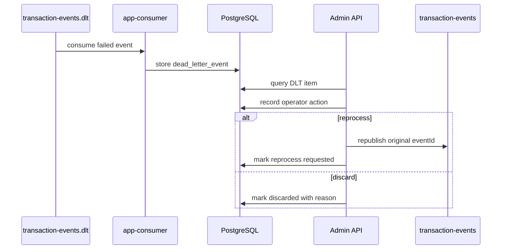

# 재처리는 복구 기능이면서 운영자 조작 위험이다

## DLT는 실패 메시지 보관함이 아니라 운영자 조작 영역이다

DLT 재처리는 “실패한 메시지를 다시 넣는 기능”으로 끝나지 않는다. 같은 이벤트를 반복 재처리하면 Kafka 부하와 중복 처리 위험이 생기고, 폐기 사유가 남지 않으면 나중에 왜 이벤트를 포기했는지 설명할 수 없다. 그래서 DLT는 실패 저장소가 아니라 운영자 조작을 감사해야 하는 영역으로 봤다.

DLT에 들어간 이벤트는 자동 처리 흐름에서 벗어난 이벤트다. 이 이벤트를 다시 원본 처리 흐름으로 돌릴지, 운영자가 확인할 때까지 보류할지, 더 이상 처리하지 않고 폐기할지는 단순 기능 호출이 아니라 운영 판단에 가깝다.

특히 reprocess는 같은 이벤트를 다시 Consumer로 보내 시스템 상태를 바꿀 수 있고, discard는 해당 이벤트를 더 이상 처리하지 않겠다는 결정이다. 그래서 DLT action은 일반 조회 API보다 더 강한 감사 기준이 필요했다.

## DLT 상태 전이 모델

`transaction-events.dlt`에 들어온 이벤트는 DB에 metadata로 저장하고 admin API로 조회한다. 운영자는 재처리 또는 폐기를 명시적으로 요청한다. 재처리는 원본 `eventId`를 보존해야 하며, 같은 이벤트가 중복 `FraudResult`를 만들면 안 된다.

retry topic과 DLT는 같은 실패 저장소가 아니다. retry topic은 일시적 오류가 복구될 가능성이 있다고 보고 다시 처리하기 위한 경로다. 예를 들어 일시적인 timeout이나 의존성 지연처럼 재시도 후 성공할 수 있는 실패가 여기에 가깝다.

반면 DLT는 반복 실패했거나 자동으로 처리하기 어려운 이벤트를 운영자가 확인하기 위한 경로다. DLT에 들어갔다는 것은 이벤트를 버렸다는 뜻이 아니라, 자동 처리 흐름에서 운영 판단이 필요한 상태로 넘어갔다는 뜻이다.

## 재처리 API만 만들면 부족했던 이유

재처리 API만 만들면 운영 흐름이 완성된 것처럼 보이지만, 실제로는 무제한 재처리와 폐기 감사 누락이 더 위험했다. 같은 이벤트를 계속 재처리하면 topic과 DLT를 오가며 원인 파악이 어려워질 수 있다. 폐기 작업은 더 조심해야 한다. 이유와 조작자를 남기지 않으면 나중에 왜 이벤트가 처리되지 않았는지 설명할 수 없다.

reprocess 흐름도 단순히 “DLT 메시지를 다시 publish”하는 것으로 끝나면 안 된다. 운영자가 DLT event를 조회하면 먼저 현재 status가 재처리 가능한 상태인지 확인해야 한다. 이미 reprocessed 또는 discarded 상태인 이벤트를 다시 처리하면 중복 조작이 될 수 있기 때문이다.

재처리를 실행할 때는 operator, action time, reason, `eventId`, `traceId`, 원본 topic, partition, offset을 함께 남긴다. 이후 retry 또는 reprocess topic으로 이벤트를 다시 발행하고, DLT status를 재처리 완료 또는 재처리 요청 상태로 바꾼다. 이 상태 전이가 있어야 중복 클릭이나 API 재시도 상황에서도 같은 DLT action이 반복 실행되는 것을 막을 수 있다.

또 모든 실패를 DLT로 보내는 것도 맞지 않았다. DB 장애는 DLT 저장 자체도 실패할 가능성이 높다. 이런 경우에는 ack하지 않고 Kafka 재소비를 유도하는 편이 더 안전하다. 반면 payload나 처리 로직 문제처럼 같은 실패가 반복될 가능성이 큰 경우는 DLT로 격리한다.

## 무제한 재처리와 자동 discard를 막은 이유

DLT 상태는 `PENDING`, `REPROCESS_FAILED`처럼 다시 조작 가능한 상태와 `REPROCESSED`, `DISCARDED` 같은 종료 상태를 구분한다. 종료 상태를 다시 재처리하려 하면 `409 DLT_STATE_CONFLICT`로 막는다. 같은 DLT row에 대한 동시 조작은 row lock으로 직렬화해 중복 publish 가능성을 줄인다.

max reprocess attempts는 자동 discard와 연결하지 않았다. 재처리 횟수가 상한에 도달하면 재처리를 막지만, 폐기는 운영자가 원인을 확인한 뒤 discard reason을 남겨야 한다. 자동 discard는 복구 후보를 너무 빨리 종료 상태로 바꿀 수 있기 때문이다.

discard는 단순 삭제가 아니다. 해당 이벤트를 더 이상 자동 처리하지 않겠다는 운영 결정이다. 따라서 discard 사유가 없으면 나중에 “왜 이 이벤트는 fraud result로 이어지지 않았는가?”라는 질문에 답할 수 없다.

그래서 discarded 이벤트는 목록에서 조용히 사라지는 것이 아니라 상태로 남아야 한다. 최소한 `eventId`, `traceId`, source topic, partition, offset, operator, action time, discard reason은 audit 기준으로 남겨야 한다. 단, payload 원문을 불필요하게 노출하지 않는 경계도 함께 필요하다.

## discard/reprocess를 audit log로 남긴 방법

`docs/05-api-design.md`, `docs/07-consistency-and-reprocessing.md`, `docs/18-runbook.md`에 DLT 조회, 재처리, 폐기 흐름을 기록했다. Phase 14에서는 admin token 최소 보호, audit log, max reprocess attempts 정책을 추가했다.

DLT drill은 Grafana의 빈 패널을 채우기 위한 fake counter가 아니라, synthetic PENDING DLT row에 대해 실제 Admin discard API를 호출하고 audit log와 `fraud_dlt_discarded_total` 증가를 검증하는 운영자 조작 evidence로 구성했다. 이 drill은 Consumer failure-path DLT publish flow를 검증하는 것이 아니라, 이미 DLT에 격리된 이벤트를 운영자가 폐기했을 때 상태 전이와 감사 기록이 남는지 확인하는 Admin operation drill이다.

DLT Operation Counters는 DLT backlog 수가 아니라 최근 dashboard time range 내 DLT publish/reprocess/discard operation counter 증가량을 보여준다. `failure-drill-dlt` 실행 후에는 Admin discard 성공 bucket이 증가하는지 확인했다.

DLT reprocess는 같은 `eventId`를 다시 Consumer로 보내는 흐름이 될 수 있다. 따라서 재처리 API가 성공했다고 해서 fraud result가 새로 하나 더 생기면 안 된다. 같은 도메인 이벤트의 결과 중복은 `fraud_detection_results.event_id` unique 기준으로 막아야 한다.

반면 `event_processing_logs(topic, partition_no, offset_no)` unique는 같은 Kafka record 처리 이력이 중복 기록되는 것을 막는다. DLT action audit은 여기에 더해 운영자가 언제 어떤 이유로 reprocess 또는 discard를 수행했는지 남기는 기준이다. 즉 결과 중복 방어, record 처리 이력, 운영자 조작 감사는 서로 다른 목적을 가진다.

## admin 보호를 어디까지 구현했는가

DLT 조작은 상태 전이로 본다. 재처리와 폐기는 operator action으로 감사 로그를 남기고, 재처리 횟수에는 상한을 둔다. admin API는 초기 단계라 완전한 인증/인가 체계가 아니라 최소 token 보호로 제한하고, production RBAC/JWT는 future work로 분리했다.

DLT admin API는 일반 사용자 API와 같은 기준으로 다루기 어렵다. reprocess와 discard는 시스템 상태와 감사 이력을 바꾸는 action이므로 관리자 권한, 상태 전이 검증, reason 필수 입력이 필요하다. 또한 같은 버튼을 두 번 누르거나 클라이언트가 timeout 후 재시도하는 상황을 고려해 status check나 idempotency key 같은 중복 action 방어가 필요하다.

대량 reprocess는 Kafka와 Consumer에 부하를 줄 수 있으므로 batch size 제한이나 rate limit도 필요하다. 이번 범위에서는 모든 운영 안전장치를 완성했다고 주장하기보다, DLT action을 audit 대상과 상태 전이 문제로 분리해 문서화하는 데 집중한다.

## 운영자 조작 흐름에서 확인한 것

상태 전이 테스트, admin 401 테스트, DLT audit log 테스트, max attempts 테스트를 evidence로 둔다. 재처리에서 원본 `eventId`를 보존하고, PostgreSQL unique constraint가 중복 결과를 막는지도 핵심 확인 기준이다.

## production 운영 장치로 남겨 둔 것

현재 admin 보호는 로컬/개발용 최소 보호다. 운영 환경이라면 RBAC, JWT, audit query API, rate limit, 조작 승인 절차가 필요하다. 자동 재처리 정책도 잘못 만들면 실패를 숨길 수 있으므로 별도 설계가 필요하다.

DLT가 있다고 해서 장애가 자동으로 복구되는 것은 아니다. 잘못된 payload, schema mismatch, rule bug처럼 원인이 남아 있으면 reprocess를 눌러도 같은 실패가 반복될 수 있다.

그래서 DLT는 복구 버튼이 아니라 실패 이벤트를 설명 가능한 상태로 보관하는 장치에 가깝다. 원인 확인, 수정 여부 판단, reprocess 또는 discard 선택, action reason 기록까지 포함되어야 운영자가 나중에 같은 이벤트를 왜 다시 처리했는지 설명할 수 있다.
