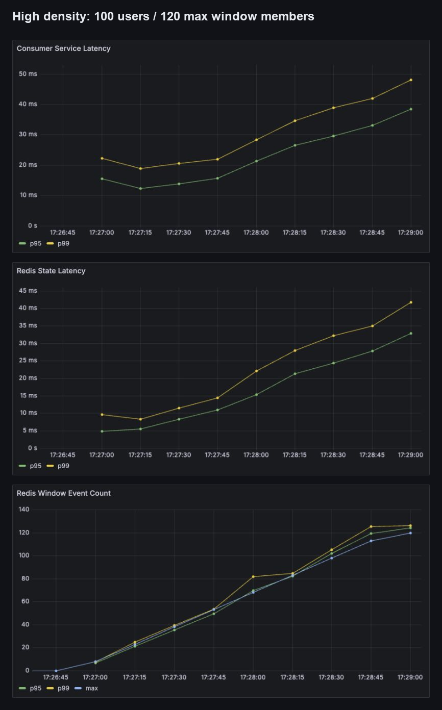

# Redis 메모리보다 먼저 HGET 횟수가 문제였다

Redis sliding window의 비용을 묻자 처음 떠오른 가설은 메모리였다. 사용자별 이벤트가 많아지면 ZSET이 커지고 메모리가 늘어날 것이라고 예상하기 쉽다.

Phase 2의 결과는 다른 곳을 먼저 가리켰다.

## 현재 window가 하는 일

사용자 상태는 두 종류의 key로 나뉜다.

```text
fraud:tx:{namespace}:user:{userId}:events  -> ZSET(score=eventTime, member=eventId)
fraud:tx:{namespace}:event:{eventId}      -> HASH(amount, currency, eventTime, userId)
```

이벤트 하나를 처리할 때 현재 구현은 다음 순서를 따른다.

1. event metadata hash를 저장한다.
2. 사용자 ZSET에 `eventId`를 추가한다.
3. window 밖 member를 score로 제거한다.
4. ZSET과 hash에 TTL을 설정한다.
5. `ZRANGEBYSCORE`로 유효 eventId를 읽는다.
6. 각 eventId마다 metadata hash에서 amount를 `HGET`한다.
7. count와 amount sum을 rule engine에 전달한다.

ZSET member를 eventId로 둔 덕분에 같은 이벤트가 재전달돼도 member 수가 늘지 않는다. 반면 amount 합계를 구할 때 window member 수만큼 hash lookup을 반복하는 O(window size) read path가 생긴다.

## 변수 하나: 사용자 수

두 workload는 EPS, duration, event amount, total count, random seed, Consumer concurrency를 같게 유지했다.

| 조건 | Baseline | High density |
|---|---:|---:|
| target EPS | 100 | 100 |
| duration | 120 s | 120 s |
| events | 12,000 | 12,000 |
| users | 1,000 | 100 |
| expected events/user/window | 12 | 120 |
| expected amount/user/window | 3,000,000 KRW | 30,000,000 KRW |

120초는 설정된 5분 window보다 짧다. 따라서 사용자별로 누적되는 개수는 PaySim의 한 시간 `step`에서 추론한 값이 아니라 workload가 만든 synthetic runtime density다.

## 숫자가 가리킨 경로

| Metric | Baseline | High density |
|---|---:|---:|
| max ZCARD | 12 | 120 |
| HGET/event | 6.5 | 60.5 |
| selected Redis commands/event | 12.5 | 66.5 |
| Redis state p95 | 6.20 ms | 32.84 ms |
| Consumer service p95 | 13.18 ms | 38.47 ms |
| Redis final memory delta | 6.54 MB | 5.74 MB |
| peak/final Lag | 0 / 0 | 1 / 0 |
| final receipt/result/log | 12k / 12k / 12k | 12k / 12k / 12k |

window max가 열 배가 되자 HGET/event는 약 아홉 배가 되었고 Redis와 Consumer p95가 함께 올라갔다. 반면 clean Redis memory delta는 high-density 쪽이 더 작았다.



위 화면은 high-density run의 시간 흐름이다. 아래쪽 window event count가 누적될수록 Redis state p95와 Consumer service p95가 같은 방향으로 상승한다. 단일 종료 시점 수치뿐 아니라 상태 크기와 latency가 함께 움직인 패턴을 확인할 수 있다.

## 메모리 결과가 예상과 반대였던 이유

두 실행 모두 event hash는 12,000개다. Baseline은 사용자 ZSET 1,000개, high density는 100개를 만든다. per-user member가 많아져도 전체 event metadata 개수는 같고 ZSET key 수는 오히려 줄었다.

따라서 이 실험은 “상태 밀도가 커지면 Redis 메모리가 줄어든다”를 증명하지 않는다. instance 전체 memory에는 key overhead, allocator, TTL 중인 metadata가 함께 들어간다. 확실하게 관측된 것은 window member가 늘면서 lookup 명령 수와 latency가 증가한 방향이다.

초기 memory 비교는 서로 다른 logical DB를 같은 Redis instance에서 사용해 폐기했다. accepted run은 전용 clean Redis container를 각각 사용했다. 메모리처럼 instance 단위인 지표는 namespace나 logical DB만 나눠서는 실험이 격리되지 않는다.

## 아직 최적화하지 않은 이유

가능한 후보는 많다.

- pipeline이나 batch hash read
- Lua script로 update/read 집약
- hash 구조 재설계
- rolling aggregate state
- event metadata와 window member 결합

그러나 Phase 2의 목적은 최적화가 아니라 비용 곡선을 확보하는 것이었다. 병목 증거 없이 data structure를 바꾸면 correctness와 late-event semantics까지 동시에 흔들릴 수 있다.

현재 baseline의 의미는 명확하다.

```text
window member 증가
  -> metadata HGET 증가
  -> Redis state latency 증가
  -> Consumer service latency 증가
```

후속 최적화는 이 same-load baseline과 비교해야 한다.

## Redis 장애와 상태 압력은 다른 문제다

Redis timeout은 `REDIS_UNAVAILABLE` 상태로 전환하고 velocity rule을 skipped 처리한다. Phase 2는 Redis가 정상인 상태에서 window가 커질 때의 비용을 측정했다.

둘을 같은 “Redis 문제”로 묶으면 대응이 달라진다.

- unavailable: degraded result와 skipped rule이 핵심
- high state cost: ops/event, state p95, Consumer rate가 핵심
- too-late: infrastructure 장애가 아니라 freshness policy가 핵심

그래서 metric도 degraded, too-late, state latency, window count를 분리했다.

## 남긴 결론

이 구현에서 사용자별 5분 window가 12개에서 120개로 커졌을 때, memory보다 metadata lookup 수가 더 분명한 병목 후보였다. final Lag은 0이었으므로 100 EPS 처리 실패를 주장할 수는 없지만, 더 높은 density나 EPS로 갈 때 먼저 개선할 지점을 찾았다.
