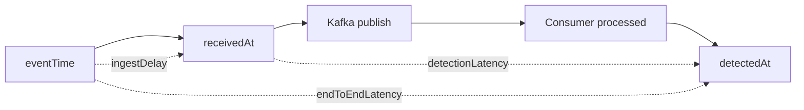
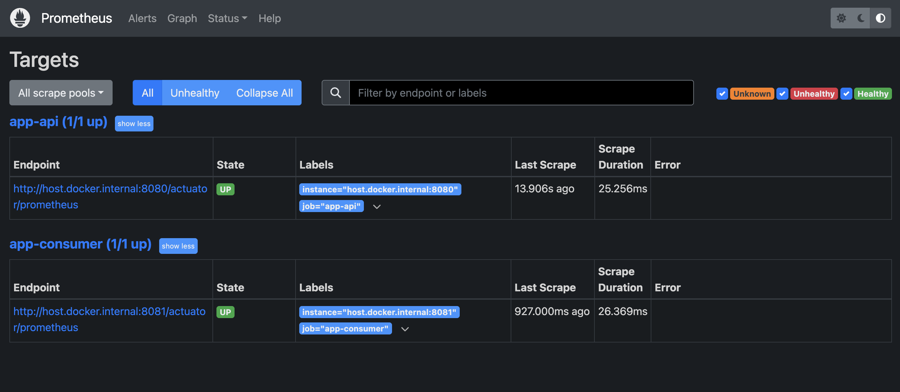
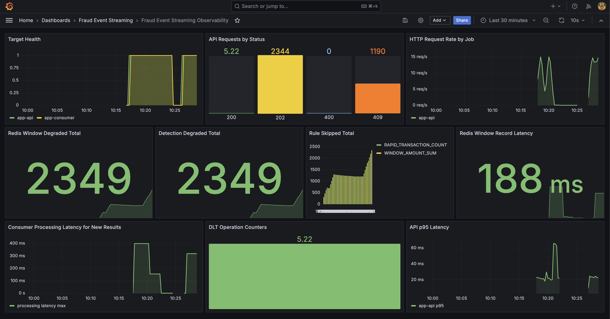
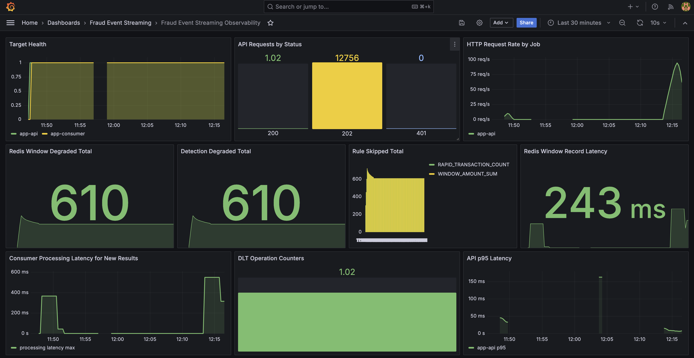
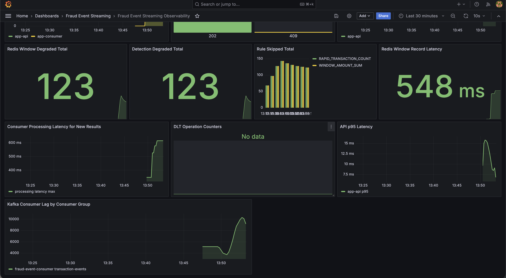
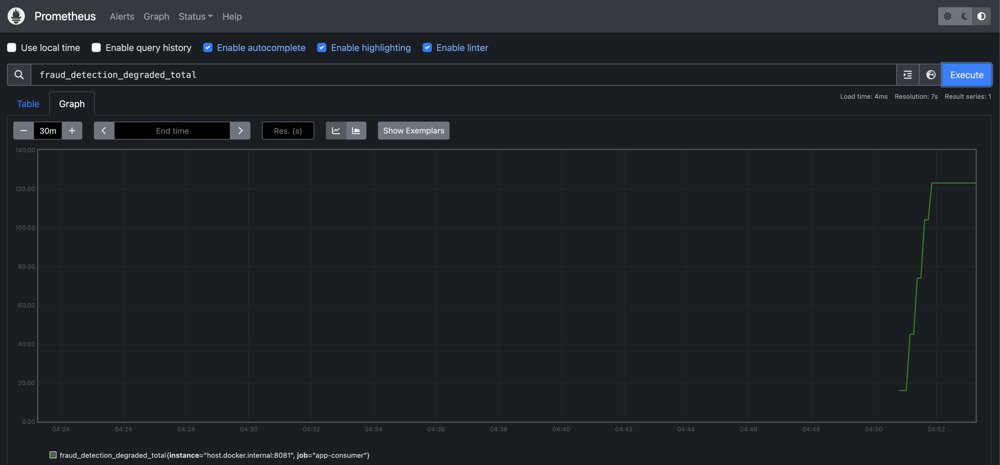

# API p95가 정상인데 탐지가 밀리는 상황

## API p95가 낮아도 안심할 수 없는 이유

API p95가 안정적이어도 Consumer backlog가 쌓일 수 있다. 사용자는 거래 접수 응답을 빠르게 받지만, 이상거래 결과는 뒤늦게 저장될 수 있다. 그래서 이 프로젝트에서는 API latency를 “접수 계층의 신호”로 제한하고, Consumer Lag과 detection latency를 별도 SLI로 보려고 했다.

API latency는 사용자의 요청이 API 서버에서 검증되고 Kafka에 발행되어 접수 응답을 받기까지의 시간에 가깝다. 반면 detection latency는 그 이벤트가 Consumer에 의해 실제로 처리되고 `fraud_detection_result`로 저장되기까지의 시간이다.

따라서 API가 빠르게 `202 Accepted` 성격의 응답을 반환하더라도, Consumer가 Kafka backlog를 따라가지 못하면 탐지 결과 저장은 늦어질 수 있다. 이 경우 API p95만 보면 접수 계층은 정상으로 보이지만, 탐지 계층의 지연은 보이지 않는다.

## API latency와 detection latency는 다른 계층의 신호다

API는 request count, API latency, error rate, Kafka publish success/failure를 본다. Consumer는 consumed event count, processing latency, detection latency, Consumer Lag, retry/DLT count, Redis degraded count를 본다. `traceId`와 `eventId`는 로그와 DB에서 흐름을 연결하는 기준으로 둔다.

개념적으로는 타임라인을 이렇게 나눠 볼 수 있다.

```text
T0: API가 거래 이벤트를 수신하고 Kafka에 publish
T1: Client가 접수 응답을 받음
T2: Consumer가 Kafka record를 읽음
T3: Rule Engine 실행 후 PostgreSQL에 탐지 결과 저장
```

API latency는 주로 T0부터 T1까지의 접수 지연을 설명한다. detection latency는 T0부터 T3까지, 또는 이벤트 수신 시각부터 결과 저장 시각까지의 탐지 완료 지연을 설명한다. 이 두 시간을 섞으면 “API는 빨랐지만 탐지는 늦은 상황”을 설명하기 어렵다.

## Consumer processing latency와 Kafka Consumer Lag의 차이

처음에는 API latency가 낮으면 전체 시스템이 정상이라고 해석하기 쉽다. 하지만 Kafka backlog가 쌓이면 API는 계속 빠르게 응답하면서도 탐지는 뒤에서 밀린다. 이때 필요한 질문은 “API가 빨랐는가”가 아니라 “Consumer가 얼마나 늦게 탐지했는가”다.

Consumer Lag은 Kafka partition의 latest offset과 Consumer Group이 commit한 offset 사이의 차이로 볼 수 있다. Lag이 증가한다는 것은 이벤트가 사라졌다는 뜻이 아니라, Consumer가 아직 처리하지 못한 backlog가 남아 있다는 뜻에 가깝다.

즉 Producer와 API가 정상적으로 이벤트를 넣고 있어도 Consumer 처리 속도가 따라가지 못하면 Lag은 증가한다. 그래서 Consumer Lag은 API p95와 별개의 탐지 계층 신호로 봐야 한다.

Phase 12/13 k6 script는 API latency와 request failure를 직접 측정할 수 있었지만, Consumer Lag dashboard까지 자동 evidence로 연결되지는 않았다. Phase 17에서는 Prometheus scrape foundation 위에 Grafana datasource/dashboard provisioning을 추가해 local Docker Compose 환경에서 API/Consumer request metric과 Redis degraded/skipped metric을 확인할 수 있게 했다. 이후 local Docker Compose에 `kafka-exporter`를 붙여 consumer group/topic 기준 Kafka Consumer Lag도 같은 dashboard에서 확인할 수 있게 했다.



## Grafana에서 같이 봐야 하는 패널

`docs/08-observability.md`와 `docs/15-slo-and-operational-readiness.md`에 API 지표와 Consumer 지표를 분리했다. Phase 17에서는 local Grafana dashboard와 Prometheus alert rule 후보를 추가했다. load/failure 문서에서는 Consumer Lag max, recovery time, detection latency, DLT count, Redis degraded count를 함께 보도록 정리하고, local dashboard에서는 `kafka_consumergroup_lag` 기반 Consumer Lag panel을 둔다.



먼저 Prometheus가 `app-api`와 `app-consumer`의 `/actuator/prometheus` endpoint를 정상적으로 scrape하고 있는지 확인했다. Grafana dashboard는 이 scrape foundation 위에서 동작하므로, Target Health가 `UP`인지 확인하는 것이 관측 구성의 첫 번째 기준이었다.



Phase 17에서는 Prometheus scrape foundation 위에 Grafana datasource/dashboard provisioning을 추가해 local Docker Compose 환경에서 API status, HTTP request rate, API p95 latency, Redis degraded/skipped rule, Consumer processing latency, DLT operation counter를 확인할 수 있게 했다. Kafka Consumer Lag은 `kafka-exporter`가 노출하는 `kafka_consumergroup_lag`를 Prometheus가 scrape하고, Grafana가 consumer group/topic 기준으로 보여준다.

## API p95만으로는 탐지 지연을 설명할 수 없다



API p95는 요청을 얼마나 빨리 accepted 했는지를 보여준다. 하지만 이 시스템은 API 요청 처리와 Consumer 탐지 처리가 분리된 비동기 구조다. API 서버의 target health와 p95 latency만 보면 정상처럼 보일 수 있지만, 실제 fraud detection 결과 확정은 Consumer processing latency, degraded count, skipped rule, DLT operation counter 같은 비동기 처리 지표에 영향을 받는다.

DLT가 없거나 API 요청이 `202 Accepted`로 누적되더라도 그것만으로 탐지 파이프라인 전체가 정상이라고 판단하지 않는다. API latency, Consumer processing latency, Kafka Consumer Lag, degraded count는 각각 다른 계층의 상태를 보여주는 신호다.

Consumer Lag이 커지면 사용자는 거래 접수 응답을 이미 받았지만 이상거래 결과는 늦게 저장될 수 있다. 운영자가 API health와 p95만 보면 이 지연을 놓칠 수 있다.

Lag이 계속 쌓이는 상황에서는 detection latency, retry count, DLT count도 함께 확인해야 한다. Lag 자체가 곧 장애라고 단정할 수는 없지만, 탐지 결과가 뒤늦게 저장되거나 오래된 이벤트가 뒤늦게 처리되는 상황으로 이어질 수 있기 때문이다.

## Kafka Consumer Lag으로 backlog 확인하기



Consumer processing latency는 애플리케이션 내부에서 이벤트 하나를 처리하는 데 걸리는 시간이다. 반면 Kafka Consumer Lag은 consumer group이 topic의 latest offset을 얼마나 따라가지 못하고 있는지를 보여주는 backlog 지표다. 두 지표는 비슷해 보일 수 있지만 서로 다른 문제를 설명한다. Consumer processing latency가 높으면 개별 이벤트 처리가 느린 것이고, Kafka Consumer Lag이 높으면 처리 대기 이벤트가 쌓이고 있다는 뜻이다.

이 캡처에서는 `fraud-event-consumer` consumer group의 `transaction-events` lag이 약 5,000에서 10,000 이상까지 증가했고, 같은 구간에서 Detection Degraded Total, Redis Window Record Latency, Consumer Processing Latency도 함께 증가했다. API p95 latency는 요청을 얼마나 빨리 accepted 했는지를 보여주지만, Kafka Consumer Lag은 accepted 이후의 비동기 탐지 파이프라인이 얼마나 밀리고 있는지를 보여준다. 따라서 API p95가 낮아도 Kafka Consumer Lag이 증가하면 fraud detection 결과 확정은 늦어질 수 있다.

## Prometheus 원본 메트릭으로 degraded 증가 재확인



Grafana는 운영자가 보기 좋은 대시보드이고, Prometheus raw metric은 실제 수집된 원본 지표다. `fraud_detection_degraded_total`을 직접 조회해 k6 실행 이후 degraded count가 계단식으로 증가하고 최종적으로 약 123 수준까지 누적되는 것을 확인했다.

이 지표는 완전 실패를 의미하지 않는다. Redis window 기록 지연 또는 degraded path가 사용되어 rule evaluation이 정상 품질로 수행되지 못한 이벤트 수를 보여주는 운영 신호다. degraded count 증가와 Consumer Lag 증가는 각각 품질 저하와 backlog 가능성을 설명하므로, API latency와 함께 해석해야 한다.

이 상황을 보려면 지표가 답하는 질문을 나눠야 한다. API latency는 “접수 계층이 느린가?”를 보고, Kafka publish error나 intake failure는 “접수 자체가 실패하는가?”를 본다. Consumer Lag은 “Consumer가 backlog를 따라가지 못하는가?”를 보고, detection latency는 “접수 후 결과 저장까지 얼마나 걸리는가?”를 본다.

여기에 DLT count는 처리 불가능하거나 반복 실패한 이벤트가 늘고 있는지, duplicate result count는 재처리 중 결과가 중복 반영되지 않았는지 확인하는 신호다. Redis degraded count가 있다면 Redis 의존 rule이 얼마나 skipped 되었는지도 함께 봐야 한다.

## metric tag에 고유 ID를 넣지 않은 이유

metric에는 `eventId`, `traceId`, `userId` 같은 고유 식별자를 넣지 않는다. 개별 이벤트 추적은 log와 DB에서 하고, metric은 추세와 alert를 위한 bounded dimension으로 제한한다. 특히 Consumer Lag과 detection latency는 전체 흐름의 지연을 보는 지표이지 특정 사용자를 metric label로 추적하는 장치가 아니다.

## 비동기 탐지 상태를 분리해서 보는 방식

API latency는 접수 계층의 건강 신호로 제한한다. 비동기 탐지 상태는 Consumer Lag과 detection latency를 통해 본다. 지표 tag에는 `eventId`, `userId` 같은 high-cardinality 값을 넣지 않고, trace는 로그와 DB 조회로 연결한다.

문제가 발생했을 때는 먼저 API latency와 error rate로 접수 계층이 느린지 확인한다. 그다음 Kafka Consumer Lag으로 backlog가 쌓이는지 보고, detection latency나 결과 저장 시각을 통해 탐지 완료가 늦어지는지 확인한다.

이후 retry count, DLT count, degraded count를 확인하고, 마지막으로 PostgreSQL에서 `fraud_detection_result`와 `event_processing_log`가 기대한 기준으로 생성되는지 본다. 이 순서는 자동화된 운영 절차라기보다, “API는 정상인데 탐지가 밀리는 상황”을 설명하기 위한 분석 기준이다.

## dashboard와 raw metric으로 확인한 것

Prometheus/Grafana 후보 지표와 k6 시나리오를 문서화했다. Kafka Consumer Lag panel은 local exporter 기반으로 연결했고, dashboard와 Prometheus raw metric screenshot을 evidence로 첨부했다. lag spike가 일시적인지 지속적인 capacity 부족인지 판단하려면 같은 지표를 부하 상황과 Consumer 재시작 흐름에서 반복 확인해야 한다.

## 이 대시보드가 아직 말하지 못하는 것

SLO threshold와 alert rule은 더 정교해질 수 있다. 특히 lag spike가 일시적인지, 지속적인 capacity 부족인지, Redis/DB 장애로 인한 처리 지연인지 구분하는 alert threshold와 운영 대응은 future work다.

Consumer Lag이 낮다고 해서 항상 탐지 지연이 없는 것은 아니다. Consumer가 record를 빠르게 읽어도 Rule Engine 지연, Redis timeout, PostgreSQL 저장 지연이 있으면 detection latency는 높아질 수 있다. 반대로 detection latency가 높을 때도 원인은 Consumer backlog, 외부 의존성 지연, DB 저장 지연, retry 흐름으로 나뉠 수 있다.

그래서 단일 지표로 결론 내리기보다 lag, latency, DLT, degraded, DB 결과를 함께 봐야 한다. 이 글의 목표는 완성된 SRE 체계를 주장하는 것이 아니라 API 접수 신호와 탐지 완료 신호를 분리해 보는 기준을 세우는 것이다.
