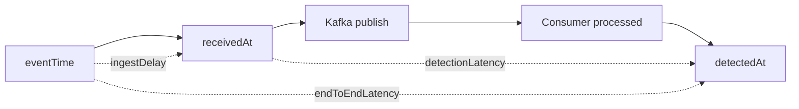

# API p95가 정상인데 탐지가 밀리는 상황

## 문제

API p95가 안정적이어도 Consumer backlog가 쌓일 수 있다. 사용자는 거래 접수 응답을 빠르게 받지만, 이상거래 결과는 뒤늦게 저장될 수 있다. 그래서 이 프로젝트에서는 API latency를 “접수 계층의 신호”로 제한하고, Consumer Lag과 detection latency를 별도 SLI로 보려고 했다.

## 초기 설계

API는 request count, API latency, error rate, Kafka publish success/failure를 본다. Consumer는 consumed event count, processing latency, detection latency, Consumer Lag, retry/DLT count, Redis degraded count를 본다. `traceId`와 `eventId`는 로그와 DB에서 흐름을 연결하는 기준으로 둔다.

## 실제로 막힌 지점

처음에는 API latency가 낮으면 전체 시스템이 정상이라고 해석하기 쉽다. 하지만 Kafka backlog가 쌓이면 API는 계속 빠르게 응답하면서도 탐지는 뒤에서 밀린다. 이때 필요한 질문은 “API가 빨랐는가”가 아니라 “Consumer가 얼마나 늦게 탐지했는가”다.

Phase 12/13 k6 script는 API latency와 request failure를 직접 측정할 수 있었지만, Consumer Lag dashboard까지 자동 evidence로 연결되지는 않았다. Phase 17에서는 Prometheus scrape foundation 위에 Grafana datasource/dashboard provisioning을 추가해 local Docker Compose 환경에서 API/Consumer request metric과 Redis degraded/skipped metric을 확인할 수 있게 했다. Kafka Consumer Lag은 실제 lag metric 노출 또는 exporter 연동이 필요하므로 future work로 분리했다.

## 확인한 증거

`docs/08-observability.md`와 `docs/15-slo-and-operational-readiness.md`에 API 지표와 Consumer 지표를 분리했다. Phase 17에서는 local Grafana dashboard와 Prometheus alert rule 후보를 추가했다. load/failure 문서에서는 Consumer Lag max, recovery time, detection latency, DLT count, Redis degraded count를 함께 보도록 정리하되, 실제 Consumer Lag Grafana panel은 metric 노출 전까지 만들지 않는다.

## 트러블슈팅에서 남긴 판단

metric에는 `eventId`, `traceId`, `userId` 같은 고유 식별자를 넣지 않는다. 개별 이벤트 추적은 log와 DB에서 하고, metric은 추세와 alert를 위한 bounded dimension으로 제한한다. 특히 Consumer Lag과 detection latency는 전체 흐름의 지연을 보는 지표이지 특정 사용자를 metric label로 추적하는 장치가 아니다.

## 바꾼 설계

API latency는 접수 계층의 건강 신호로 제한한다. 비동기 탐지 상태는 Consumer Lag과 detection latency를 통해 본다. 지표 tag에는 `eventId`, `userId` 같은 high-cardinality 값을 넣지 않고, trace는 로그와 DB 조회로 연결한다.

## 검증

Prometheus/Grafana 후보 지표와 k6 시나리오를 문서화했다. 실제 dashboard screenshot은 아직 이미지로 첨부하지 않았으므로 `blog/image-plan.md`에서는 capture candidate로만 다룬다.

## 남은 한계

SLO threshold와 alert rule은 더 정교해질 수 있다. 특히 lag spike가 일시적인지, 지속적인 capacity 부족인지, Redis/DB 장애로 인한 처리 지연인지 구분하는 dashboard와 alert는 future work다.
