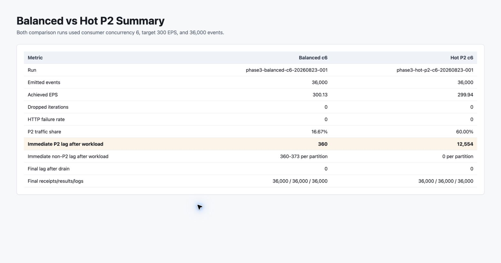
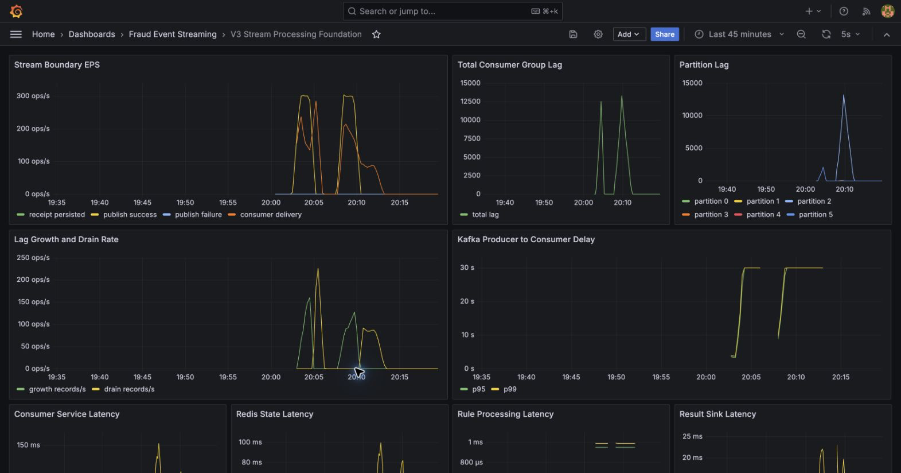

# Consumer를 여덟 개 띄워도 한 partition은 빨라지지 않는다

Phase 1에서 concurrency를 1에서 6으로 늘리자 300 EPS의 sustained backlog가 사라졌다. 여기서 “Consumer를 더 늘리면 계속 빨라진다”는 결론을 내리면 중요한 조건 하나를 놓친다.

Kafka 병렬성은 partition 분포에 묶여 있다.

## 두 개의 트래픽 지도를 만들었다

일반적인 랜덤 userId 생성만으로는 원하는 partition skew가 정확히 나오지 않는다. Phase 3 driver는 Kafka Murmur2 hashing을 미리 계산해 각 partition에 매핑되는 synthetic userId pool을 만들었다.

### 지도 A: Balanced

P0~P5에 각각 약 16.67%를 보낸다.

### 지도 B: Hot P2

P2에 60%, 나머지 다섯 partition에는 각각 8%를 보낸다.

두 workload 모두 600명의 unique user와 사용자당 60건을 사용했다. 특정 한 사용자의 큰 Redis state가 아니라 partition traffic concentration을 보기 위한 구분이다.

## 36,000건의 비교

accepted comparison은 concurrency 6, target 300 EPS, event count 36,000으로 같았다.

| Metric | Balanced c6 | Hot P2 c6 |
|---|---:|---:|
| achieved EPS | 300.13 | 299.94 |
| HTTP failures | 0 | 0 |
| dropped iterations | 0 | 0 |
| P2 share | 16.67% | 60.00% |
| workload 직후 P2 Lag | 360 | 12,554 |
| workload 직후 non-P2 Lag | partition당 360~373 | 모두 0 |
| final Lag | 0 | 0 |
| final receipt/result/log | 36k / 36k / 36k | 36k / 36k / 36k |

Balanced에서는 여섯 Consumer가 비슷한 몫을 처리했다. Hot P2에서는 다섯 Consumer가 먼저 할 일을 끝냈지만 P2 담당 Consumer만 backlog를 들고 있었다.



event count와 achieved EPS는 거의 같지만 P2 비중이 16.67%에서 60%로 바뀌자 workload 직후 P2 Lag이 360에서 12,554로 커졌다. 다른 partition의 Lag은 이미 0이어서 전체 Consumer 부족과 다른 모양을 보였다.



partition Lag 패널에서 P2 선만 크게 상승한다. total Lag만 봤다면 놓쳤을 트래픽 분포의 영향이다.

전체 ingress는 거의 300 EPS로 같았지만 “한 partition이 받아야 하는 EPS”가 달라진 것이다.

```text
Balanced: 300 / 6 ≈ 50 EPS per partition
Hot P2:   300 × 0.60 ≈ 180 EPS on P2
```

## concurrency 8의 두 자리는 비어 있었다

partition이 6개인 consumer group에서 concurrency를 8로 설정해도 동시에 일할 수 있는 Consumer는 최대 6개다. assignment evidence에는 두 idle Consumer가 남았다.

```text
usable parallelism <= partition count
```

더 중요한 점은 hot P2 하나를 두 Consumer가 나눠 처리할 수 없다는 것이다. 같은 group에서 partition 하나는 한 시점에 Consumer 하나에게만 할당된다. concurrency 증가는 균등한 backlog에는 효과가 있지만 단일 hot partition의 ceiling을 없애지 못한다.

## key 선택을 다시 평가했다

`eventId`를 key로 쓰면 분포가 더 고르게 나올 가능성이 높다. 하지만 같은 사용자의 이벤트가 여러 partition에서 병렬 처리되어 event-time window 상태의 순서가 더 어려워진다.

`userId` 선택은 그대로 유지했다.

| 선택 | 얻는 것 | 감수하는 것 |
|---|---|---|
| `userId` key | 같은 사용자에 대한 partition-local order | heavy user/group이 만든 skew |
| `eventId` key | 상대적으로 균등한 분산 | 사용자 상태 처리 순서 상실 |

이 프로젝트의 rule은 사용자별 최근 거래를 보기 때문에 ordering을 우선했다. 대신 partition별 incoming rate와 Lag을 dashboard의 핵심 신호로 올렸다.

## hot user와 hot partition을 구분한 이유

한 사용자가 60%의 트래픽을 만들었다면 두 현상이 동시에 발생한다.

1. 해당 userId가 매핑된 partition이 뜨거워진다.
2. 해당 사용자의 Redis window도 커진다.

그 상태에서는 Kafka ceiling인지 Redis state cost인지 분리하기 어렵다. Phase 3 workload는 600명의 user를 P2 affinity pool에 분산해 두 번째 효과를 줄였다. Phase 2는 반대로 user cardinality를 줄여 state density를 관찰했다.

비슷해 보이는 “쏠림”을 별도 실험으로 분리한 이유다.

## 운영 신호로 번역하면

total Lag만 보면 Hot P2도 “Consumer 전체가 느리다”로 보인다. partition 기준으로 보면 대응이 달라진다.

- 모든 partition Lag 증가: consumer concurrency나 공통 downstream 경계 점검
- 한 partition Lag 증가: key distribution과 해당 partition rate 점검
- concurrency > partition count: idle Consumer 확인
- 특정 user state latency 동반 증가: hot-user와 state pressure 가능성 점검

scale out 버튼을 누르기 전에 partition distribution을 보는 습관이 이 실험의 결과였다.

## 증명한 범위

Hot P2 run은 final Lag 0까지 drain되었다. 즉 영구 처리 불능이 아니라 workload 동안 partition-local backlog가 생긴 상황이다. 또한 300 EPS와 로컬 six-partition topology에 한정된 결과다.

이 결과는 `userId` key가 나쁘다는 증거가 아니라, ordering을 선택할 때 skew의 비용을 함께 측정해야 한다는 증거다.
