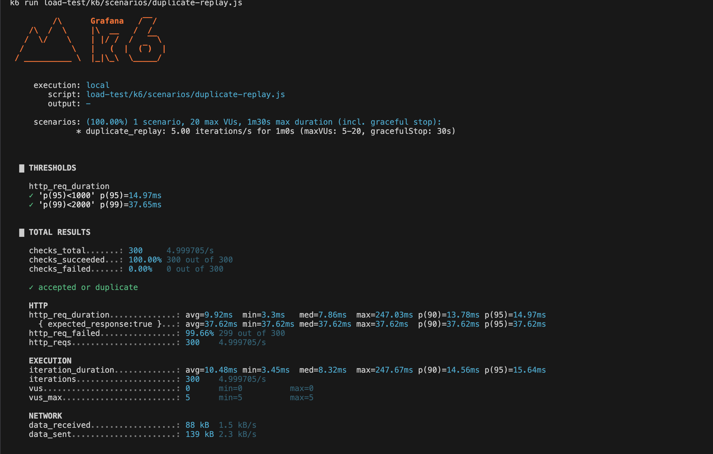

# k6 결과를 좋게 보이게 쓰지 않기

## p95와 실패율만 보면 오해가 생긴다

부하 테스트 결과는 쉽게 보기 좋은 숫자로 바뀐다. RPS와 p95만 남기면 API 접수 성능과 Consumer 처리 성능이 섞이고, 장애 상황에서 중복 결과가 생겼는지, Redis rule이 skipped 되었는지, DLT가 늘었는지 알기 어렵다. 그래서 k6 결과는 성능 홍보가 아니라 한계를 드러내는 evidence로 다뤘다.

## 시나리오를 나눠서 봐야 했던 이유

k6 시나리오는 normal load, peak load, duplicate storm, Redis down, hot partition을 나눠 둔다. 목표는 좋은 숫자를 만드는 것이 아니라 어떤 신호를 함께 봐야 하는지 고정하는 것이다.

## duplicate replay에서 http_req_failed가 높아 보이는 이유

duplicate storm에서는 API가 같은 eventId를 여러 번 받아도 최종 `FraudResult`가 하나인지 확인해야 한다. 이때 duplicate가 `409 CONFLICT`로 응답되면 k6의 기본 `http_req_failed`만 봤을 때 실패율이 높아 보일 수 있다. 하지만 프로젝트 정책상 허용된 duplicate response라면 최종 판단은 DB consistency와 함께 해야 한다.

duplicate replay 시나리오에서는 같은 이벤트가 반복 요청되기 때문에 `http_req_failed`가 높게 보일 수 있다. 그래서 이 테스트는 HTTP failure rate만으로 실패 여부를 판단하지 않고, `accepted or duplicate` check가 통과했는지와 중복 결과가 추가 생성되지 않았는지를 함께 확인했다.

Redis down에서는 error rate만 보면 부족하다. Redis 의존 rule이 skipped 되었는지, degraded result가 남았는지, Consumer가 계속 진행했는지를 같이 봐야 한다.

또한 API latency와 Consumer latency를 한 표에 섞으면 해석이 흐려진다. API가 빠른 것과 탐지가 빠른 것은 다르다.

k6 summary는 클라이언트 관점의 p95/p99, request failure, check 결과를 보여준다. Grafana dashboard는 같은 시간대에 서버가 어떤 status와 degraded metric을 기록했는지 확인하는 보조 evidence로 사용한다.

## k6 summary와 Grafana dashboard를 같이 보는 방식

`load-test/k6/README.md`, `docs/22-load-test-results.md`, `docs/23-load-test-results.md`에 시나리오와 결과 기록 양식을 둔다. 측정값은 실제 evidence가 있을 때만 쓴다. 이 글에서는 새 수치를 만들지 않고 측정 항목과 해석 기준만 정리한다.

## Redis down에서 error rate보다 degraded count가 중요한 이유

duplicate replay에서는 2xx만 성공으로 보지 않는다. API response policy상 허용되는 duplicate/conflict bucket과 `fraud_detection_results.event_id` unique constraint 결과를 함께 본다. Redis down에서는 `fraud_redis_window_degraded_total`, `fraud_detection_degraded_total`, `fraud_rule_skipped_total` 같은 지표가 error rate만큼 중요하다.

초기에는 Consumer Lag metric이 dashboard evidence로 완전히 연결되지 않았기 때문에 Kafka UI, processing log, fraud result 조회를 함께 보는 임시 해석 경로를 남겼다. 이후 observability evidence에서는 `kafka_consumergroup_lag` 기반 Grafana panel을 추가해 Consumer backlog를 dashboard에서 확인할 수 있게 보강했다.

## 시나리오별로 봐야 하는 지표

각 시나리오별로 봐야 할 지표를 분리했다.

| Scenario | Primary Signals | Consistency Signals |
|---|---|---|
| normal load | API latency, publish success, detection latency | missing event count |
| peak load | Consumer Lag max, lag recovery time | DLT count |
| duplicate storm | duplicate skip count | `FraudResult` count per `eventId` |
| Redis down | degraded count, skipped rule count | Consumer continuation |
| hot partition | partition lag skew | user-level ordering impact |

이미지로는 k6 terminal summary와 Grafana panel이 가장 유용하다. 다만 실제 캡처가 없으면 본문에 링크를 넣지 않고 `blog/image-plan.md`의 capture candidate로만 둔다.

이미지와 실제 측정값을 추가하는 시점에는 아래 형식으로 결과를 요약한다. 수치가 없으면 표를 채우지 않는다.

| Scenario | p95 | p99 | Error/Conflict 해석 | Consistency Result | 남은 한계 |
|---|---:|---:|---|---|---|
| duplicate storm | measured only | measured only | duplicate conflict는 허용 bucket | `FraudResult` 중복 여부 확인 | DB 조회 기반 수동 확인 여부 기록 |
| Redis down | measured only | measured only | Redis rule skipped | degraded result 기록 여부 확인 | 탐지 품질 저하와 alert 한계 기록 |

## 측정값을 남길 때 필요한 맥락

`make k6-smoke`, `make k6-normal`, `make k6-peak`, `make k6-duplicate-check`, `make k6-redis-down` 같은 명령은 문서에 기록되어 있다. 실제 실행 환경, duration, VU, event count, p50/p95/p99, bottleneck은 결과 문서에 evidence로 남겨야 한다.

## 로컬 부하 테스트를 production capacity로 쓰지 않은 이유

이 테스트는 production capacity planning이 아니다. 로컬 Docker Compose, 개발 장비, synthetic workload에서 얻은 증거는 병목을 찾고 설계를 검증하는 데 쓰며, 운영 규모의 처리량 보장으로 해석하지 않는다.
