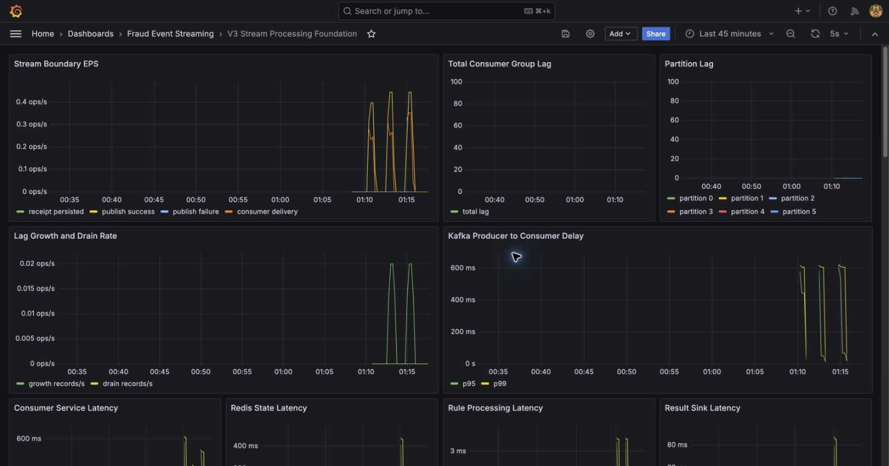

# 중복 row가 없다고 Redis 상태도 안전한 것은 아니다

Kafka Consumer는 적어도 한 번 전달될 수 있다. DB 저장 뒤 ack 전에 프로세스가 죽으면 같은 record가 다시 온다. `fraud_detection_results.event_id` unique constraint로 중복 row를 막았다고 문제가 끝날까?

상태 기반 탐지에서는 한 단계가 더 남는다.

> 같은 이벤트가 Redis window에 두 번 반영되어 다음 이벤트의 판단을 바꾸지 않는가?

## 실패 지점을 세 군데로 잘랐다

listener의 실제 처리 순서는 processing log → duplicate result precheck → Redis → rule → result sink → ack다. Phase 4는 local-only injector로 세 지점에 한 번씩 실패를 만들었다.

```text
A. BEFORE_REDIS_UPDATE
B. AFTER_REDIS_UPDATE_BEFORE_RESULT
C. AFTER_RESULT_SAVE_BEFORE_ACK
```

각 지점은 복구 조건이 다르다.

| 실패 지점 | 첫 delivery에 남는 것 | redelivery에서 확인할 것 |
|---|---|---|
| Redis 전 | processing log 가능 | Redis에 target이 한 번만 들어가는가 |
| Redis 후, result 전 | Redis state | 같은 eventId가 state count를 늘리는가 |
| result 후, ack 전 | Redis + result | duplicate precheck가 뒤 단계를 건너뛰는가 |

## 왜 E3와 E4를 골랐나

20건을 1 EPS로 보내고 E3에서 실패를 주입했다. 다음 이벤트 E4는 rule threshold 바로 위에 놓였다.

```text
E0~E4 amount = 각 100,000
E4 window count = 5
E4 amount sum = 500,000
RAPID_TRANSACTION_COUNT matched
risk score = 30
risk level = MEDIUM
decision = REVIEW
```

threshold에서 멀리 떨어진 E1을 검사하면 state가 하나 늘어도 decision이 우연히 같을 수 있다. E4는 duplicate contamination이 생기면 count와 rule 결과에서 드러나도록 선택했다.

## A: Redis 전에 죽었다

pause 시점 snapshot에서 ZSET은 E0~E2 세 개뿐이었고 E3 hash는 없었다. 실패 주입 전에 Redis mutation이 일어나지 않았다는 것을 직접 확인했다.

redelivery 뒤 final ZCARD는 20이었다.

## B: Redis 뒤에 죽었다

첫 delivery가 E3를 ZSET에 넣은 뒤 예외가 발생했다. redelivery가 같은 `eventId`를 다시 `ZADD`했다.

ZSET member가 `eventId`이므로 동일 member의 score를 갱신할 뿐 cardinality는 증가하지 않았다. final ZCARD는 21이 아니라 20이었다.

이 case가 stateful idempotency의 핵심 증거다.

## C: result 저장 뒤 ack 전에 죽었다

재전달 시 listener는 `existsResultForEventId`를 먼저 확인한다. 이미 result가 있으면 Redis, rule, sink를 다시 실행하지 않고 ack한다.

DB unique constraint는 race condition의 최종 방어선이고, precheck는 이미 완료된 이벤트가 expensive state path를 다시 밟지 않게 하는 fast path다. 둘 중 하나만으로는 같은 역할을 하지 않는다.

## 세 경로의 다음 이벤트는 같았다

| Failure point | E4 count | E4 amount | Rule | Score / Level / Decision |
|---|---:|---:|---|---|
| Redis 전 | 5 | 500,000 | RAPID_TRANSACTION_COUNT | 30 / MEDIUM / REVIEW |
| Redis 후 | 5 | 500,000 | RAPID_TRANSACTION_COUNT | 30 / MEDIUM / REVIEW |
| result 후 | 5 | 500,000 | RAPID_TRANSACTION_COUNT | 30 / MEDIUM / REVIEW |

모든 accepted run의 final receipt/result/processing-log count가 맞았고 Lag은 0으로 drain되었다.



이 화면의 일시 Lag은 재전달 drill이 실제로 offset 진행을 멈췄다가 복구한 맥락을 보여준다. failure 직전 상태를 캡처하기 위해 사용한 pause 시간이 포함되므로 latency benchmark로 해석하지 않는다.

## manual ack의 정확한 역할

Consumer 설정은 `enable-auto-commit=false`, ack mode는 `MANUAL_IMMEDIATE`다. listener는 required processing 뒤에 ack한다.

manual ack는 중복 전달을 제거하지 않는다. 처리 완료 전에 offset이 앞으로 가서 이벤트가 조용히 사라지는 위험을 줄인다. DB 저장 뒤 ack 전 실패가 생기면 오히려 재전달을 허용하며, application state와 DB constraint가 그 재전달을 안전하게 받아야 한다.

그래서 이 시스템을 business exactly-once라고 부르지 않는다.

## 테스트를 위해 넣은 injector의 경계

failure injector는 기본 비활성화이며 eventId와 failure point를 명시해야 동작한다. `fail-once`와 pause option은 local drill evidence를 위한 것이다. 운영 복구 로직으로 사용하지 않는다.

pause 동안 측정된 latency도 성능 수치에서 제외했다. 의도적으로 멈춘 시간을 Consumer 성능 저하로 해석하면 실험 목적이 섞인다.

## 남은 원자성 한계

PostgreSQL result와 Kafka offset은 하나의 atomic transaction이 아니다. DLT DB 상태와 Kafka publish도 완전한 원자성을 갖지 않는다. 현재 설계는 재전달, unique constraint, 상태 전이, audit으로 각 중간 상태를 설명한다.

필요하다면 outbox나 Kafka transaction을 검토할 수 있지만, 현재 증거가 보장하는 범위를 넘어 exactly-once를 주장하지 않는 것이 먼저다.
