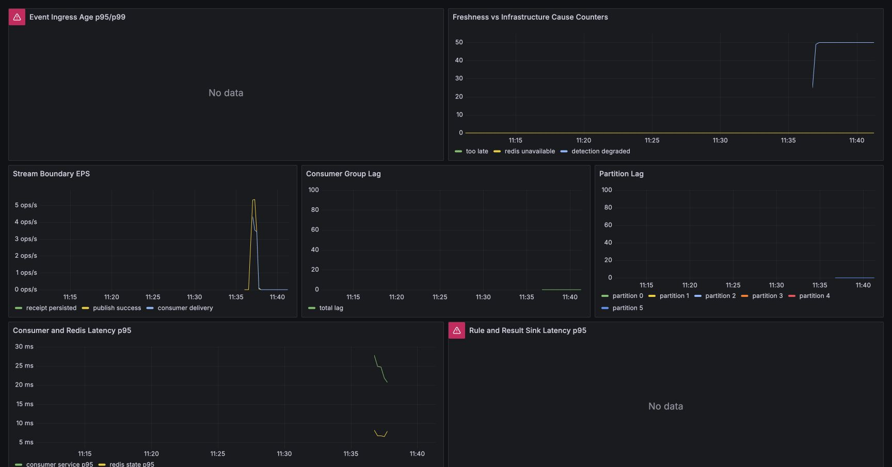

# 4분 59초는 받고 10분은 상태에서 제외했다

Kafka partition은 들어온 순서를 보존한다. 그러나 들어온 순서가 이벤트 발생 순서와 같다는 보장은 없다. 네트워크 지연이나 upstream batch 때문에 나중에 발생한 이벤트가 먼저 도착할 수 있다.

Redis sliding window가 arrival time만 보면 오래된 거래가 현재 상태를 왜곡한다. 반대로 늦은 이벤트를 모두 버리면 감사 결과가 사라진다. Phase 5는 두 요구를 분리했다.

## 정책 한 줄

live stream에서 `receivedAt - eventTime`이 allowed lateness 5분을 초과하면:

- Redis live window에는 넣지 않는다.
- Redis 의존 rule은 skipped 처리한다.
- non-stateful rule은 계속 실행한다.
- fraud result는 `degraded=true`와 reason을 포함해 PostgreSQL에 저장한다.
- `too_late_total`을 증가시킨다.

즉 too-late는 event drop이 아니라 state update exclusion이다.

## 여섯 개의 시간 bucket

30초 동안 10 EPS, 총 300건을 보냈다.

| Bucket | 건수 | 기대 동작 |
|---|---:|---|
| on time | 50 | state 반영 |
| 30초 late | 50 | state 반영 |
| 2분 late | 50 | state 반영 |
| 4분 59초 late | 50 | 경계 안, state 반영 |
| 10분 late | 50 | too-late, state 제외 |
| 1분 late out-of-order return | 50 | eventTime score로 state 반영 |

runtime HTTP 경로에서 정확히 5분 equality를 만들면 전송과 API 접수 시간이 추가되어 경계 밖으로 흔들릴 수 있다. 그래서 runtime은 4분 59초를 사용하고, 정확한 equality는 deterministic unit test로 검증했다.

## ZSET score가 arrival order를 다시 정렬한다

Redis ZSET score는 `eventTime` epoch millis다. 늦게 도착한 이벤트도 허용 범위 안이면 발생 시각 위치에 들어간다.

조회 범위도 현재 message의 `eventTime - window`부터 `eventTime`까지다. 이것은 처리 시각 기준 fixed counter보다 event-time sliding window 의미에 가깝다.

다만 완전한 stream-processing watermark 구현은 아니다. per-key watermark, retraction, 과거 result 재계산은 제공하지 않는다. 현재 정책은 live detection state를 제한된 lateness 안에서만 갱신하는 수준이다.

## 10분 late event도 결과는 남았다

대표 too-late event의 결과는 다음 의미를 가졌다.

```text
matched: NIGHT_TIME_TRANSACTION
skipped: RAPID_TRANSACTION_COUNT, WINDOW_AMOUNT_SUM
risk score: 20
risk level: LOW
decision: APPROVE
degraded: true
reason: freshness policy skip
```

Redis를 쓰지 않는 야간 rule은 실행됐고, stateful rule 두 개만 빠졌다. “Redis 장애 때문에 degraded”와 “시간 정책 때문에 degraded”를 reason과 metric으로 나눴다.

실행 뒤 counter도 이 구분을 확인했다.

```text
fraud_redis_window_too_late_total = 50
fraud_detection_degraded_total = 50
fraud_redis_window_degraded_total = 증가 없음
```



오른쪽 위 counter에서 detection degraded와 too-late가 50까지 함께 증가하고 Redis unavailable은 증가하지 않는다. 일부 histogram panel은 이 짧은 correctness run의 bucket 범위에서 `No data`였기 때문에, 이 이미지는 latency 근거가 아니라 원인별 counter 분리 근거로만 사용한다.

## freshness와 correctness를 한 단어로 묶지 않기

too-late event를 live state에서 제외하면 현재 사용자 window를 과거 데이터로 오염시키지 않는다. 그러나 그 이벤트를 포함했을 때 과거 시점의 risk가 달라졌는지는 재계산하지 않는다.

따라서 결과의 의미는 다음과 같다.

- durable audit: 이벤트가 도착했고 어떤 rule이 실행·생략됐는지 남는다.
- live-state correctness: 설정한 lateness 정책 안에서만 최근 상태를 갱신한다.
- historical correction: 구현하지 않았다.

이 셋을 구분하지 않으면 degraded result를 정상 완전 탐지처럼 보거나, 반대로 처리 실패로 잘못 센다.

## replay에서는 왜 같은 정책을 쓰지 않는가

24시간 historical replay의 모든 이벤트에 live 5분 lateness를 적용하면 대부분 stateful rule이 skipped된다. replay mode에서는 live freshness rejection을 bypass하고 별도 replay namespace에서 상태를 만든다.

이것은 오래된 replay 이벤트를 live window에 넣어도 된다는 뜻이 아니다. topic, group, Redis namespace를 분리했기 때문에 가능한 정책이다. 다음 두 글에서 catch-up과 historical replay의 차이를 이어서 다룬다.

## 실험 결과

300건 중 기대한 250건이 stateful accepted 경로, 50건이 too-late 경로를 탔다. HTTP failure와 dropped iteration은 0이었고 final DB count가 모두 맞았으며 Lag은 0으로 돌아왔다.

이 실험은 throughput benchmark가 아니다. 시간 정책의 경계와 durable-result 의미를 확인한 correctness run이다.
