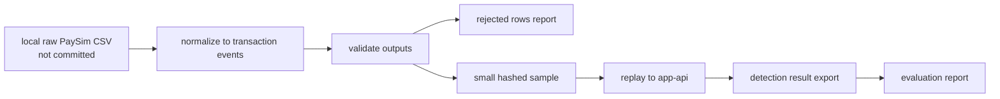

# raw PaySim을 커밋하지 않고 재현성을 남기기

## raw data를 커밋하면 재현은 쉽지만 위험하다

PaySim raw CSV를 저장소에 넣으면 재현은 쉬워진다. 하지만 대용량 파일, 라이선스/출처 관리, 계정처럼 보이는 identifier 노출 문제가 따라온다. 반대로 raw data를 모두 제외하면 어떤 mapping과 validation 기준으로 replay했는지 알기 어렵다. 이 글의 핵심은 raw data를 커밋하지 않으면서도 재현성의 흔적을 남기는 trade-off다.

## 커밋 가능한 sample과 커밋하면 안 되는 raw data의 경계

raw PaySim CSV는 `data/raw`에 로컬로만 둔다. full processed output은 `data/processed`에 로컬로만 만든다. 커밋 가능한 것은 정책을 통과한 작은 sample과 manifest뿐이다.

## 아무것도 커밋하지 않으면 검증이 불가능하다

raw data를 커밋하면 재현은 쉬워진다. 하지만 데이터 정책, repository size, identifier 노출 문제가 생긴다. 반대로 아무것도 남기지 않으면 다른 사람이 어떤 mapping과 validation 기준으로 replay했는지 알 수 없다.

hash/salt 정책도 필요했다. default-local salt로 만든 output을 공유하면 재현성은 생기지만 보안 경계가 약하다. 그래서 manifest에는 salt 값이 아니라 `hashSaltSource`, algorithm, prefix length 같은 provenance만 남기도록 했다.

preprocessing이 성공처럼 보여도 rejected row 비율이 높으면 replay evidence로 쓰기 어렵다. 그래서 validation script는 rejected ratio를 계산하고, 기본 기준을 넘으면 실패하도록 했다.

## HMAC hash identifier를 사용한 이유

CI에서 Kaggle download나 full preprocessing을 실행하지 않는다. 인증, 네트워크, 대용량 파일 때문에 CI가 불안정해질 수 있기 때문이다. 대신 raw data 없이 실행 가능한 fixture test와 data policy check를 CI-safe guardrail로 둔다.

sample도 아무 파일이나 허용하지 않는다. 100~1,000건 이하, raw `nameOrig`/`nameDest` 미포함, hashed identifier 사용, 1MB 이하라는 조건을 둔다. CSV sample은 raw column을 실수로 보존할 수 있어 제외한다.

## data workflow에 남긴 provenance

`scripts/data/README.md`는 KaggleHub helper, preprocessing, validation, sample generation, data policy check를 설명한다. `docs/24-kaggle-paysim-data-provenance.md`와 `docs/25-paysim-normalization-mapping.md`는 dataset 출처와 mapping 기준을 기록한다.

## CI-safe 검증과 local/manual replay를 나눈 이유

Python script는 Java runtime을 대체하지 않고 PaySim data workflow helper로만 둔다. raw/full data는 Git에서 제외하고, `make data-policy-check`로 실수 커밋을 막는다. identifier는 HMAC-SHA256 기반 짧은 hash prefix로 replay 가능한 ID로 변환한다.

## raw data 없이 확인할 수 있는 guardrail

CI-safe 검증은 raw data 없이 실행되는 fixture test와 policy check로 제한한다. full PaySim replay와 evaluation은 로컬 raw data와 local app-api가 필요하므로 local/manual evidence로 분리한다.

## 이 방식의 재현성 한계

full data evidence는 저장소만으로 재현되지 않는다. raw dataset 다운로드, local preprocessing, local infrastructure가 필요하다. 이 한계는 숨기지 않고 `scripts/data/README.md`와 V2 final evidence 문서에 분리해 둔다.
