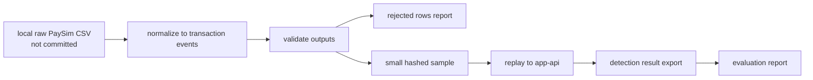

# PaySim 데이터를 replay 가능한 이벤트로 바꾸기

## 문제

PaySim은 이상거래 평가에 쓸 수 있는 synthetic dataset이지만, raw CSV를 그대로 저장소에 넣으면 용량과 정책 문제가 생긴다. 또한 `nameOrig`, `nameDest`처럼 계정처럼 보이는 identifier를 그대로 쓰면 재현성과 개인정보 경계가 약해진다.

## 초기 설계

raw PaySim CSV는 `data/raw`에 로컬로만 둔다. full processed output은 `data/processed`에 로컬로만 만든다. 커밋 가능한 것은 정책을 통과한 작은 sample과 manifest뿐이다.

## 실제로 막힌 지점

raw data를 커밋하면 재현은 쉬워진다. 하지만 데이터 정책, repository size, identifier 노출 문제가 생긴다. 반대로 아무것도 남기지 않으면 다른 사람이 어떤 mapping과 validation 기준으로 replay했는지 알 수 없다.

hash/salt 정책도 필요했다. default-local salt로 만든 output을 공유하면 재현성은 생기지만 보안 경계가 약하다. 그래서 manifest에는 salt 값이 아니라 `hashSaltSource`, algorithm, prefix length 같은 provenance만 남기도록 했다.

## 확인한 증거

`scripts/data/README.md`는 KaggleHub helper, preprocessing, validation, sample generation, data policy check를 설명한다. `docs/24-kaggle-paysim-data-provenance.md`와 `docs/25-paysim-normalization-mapping.md`는 dataset 출처와 mapping 기준을 기록한다.

## 바꾼 설계

Python script는 Java runtime을 대체하지 않고 PaySim data workflow helper로만 둔다. raw/full data는 Git에서 제외하고, `make data-policy-check`로 실수 커밋을 막는다. identifier는 HMAC-SHA256 기반 짧은 hash prefix로 replay 가능한 ID로 변환한다.

## 검증

CI-safe 검증은 raw data 없이 실행되는 fixture test와 policy check로 제한한다. full PaySim replay와 evaluation은 로컬 raw data와 local app-api가 필요하므로 local/manual evidence로 분리한다.

## 남은 한계

full data evidence는 저장소만으로 재현되지 않는다. raw dataset 다운로드, local preprocessing, local infrastructure가 필요하다. 이 한계는 숨기지 않고 `scripts/data/README.md`와 V2 final evidence 문서에 분리해 둔다.
