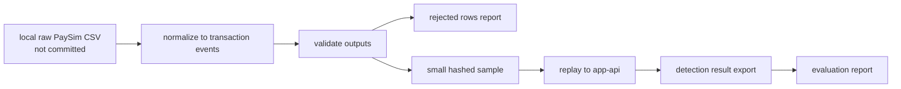

# raw PaySim을 커밋하지 않고 재현성을 남기기

## raw data를 커밋하면 재현은 쉽지만 위험하다

PaySim raw CSV를 저장소에 넣으면 재현은 쉬워진다. 하지만 대용량 파일, 라이선스/출처 관리, 계정처럼 보이는 identifier 노출 문제가 따라온다. 반대로 raw data를 모두 제외하면 어떤 mapping과 validation 기준으로 replay했는지 알기 어렵다. 이 글의 핵심은 raw data를 커밋하지 않으면서도 재현성의 흔적을 남기는 trade-off다.

raw CSV를 Git에 넣으면 파일 하나를 올리는 것으로 끝나지 않는다. 대용량 파일은 clone과 diff를 무겁게 만들고, 나중에 삭제해도 Git history에는 흔적이 남을 수 있다. 또한 PaySim이 synthetic dataset이더라도 `nameOrig`, `nameDest`처럼 계정처럼 보이는 identifier를 저장소와 블로그 evidence에 그대로 남기는 습관은 실제 프로젝트로 이어졌을 때 위험하다.

출처와 라이선스, 재배포 조건도 고려해야 한다. 그래서 이 프로젝트에서는 raw data 자체를 커밋하는 대신, 어떤 기준으로 raw row를 시스템 이벤트로 변환했고 어떤 validation을 통과했는지 남기는 쪽을 선택했다.

## 커밋 가능한 sample과 커밋하면 안 되는 raw data의 경계

raw PaySim CSV는 `data/raw`에 로컬로만 둔다. full processed output은 `data/processed`에 로컬로만 만든다. 커밋 가능한 것은 정책을 통과한 작은 sample과 manifest뿐이다.

여기서 replayable event는 raw CSV row와 다르다. raw row는 PaySim 데이터셋의 원본 행이고, replayable event는 이 프로젝트의 Kafka event schema에 맞게 변환된 입력이다. Consumer가 처리할 수 있으려면 `eventId`, `traceId`, `userId`, `eventTime`, `amount`, `type`, `schemaVersion`처럼 시스템이 해석할 수 있는 필드가 필요하다.

따라서 replay 가능하다는 말은 단순히 CSV를 다시 읽을 수 있다는 뜻이 아니다. 같은 raw row를 같은 mapping 기준으로 변환했을 때 동일한 도메인 이벤트를 다시 만들 수 있고, 그 이벤트를 Kafka/Consumer 흐름에 다시 넣어 같은 기준으로 검증할 수 있다는 뜻이다.

```mermaid
flowchart LR
    Raw[local raw PaySim CSV<br/>not committed] --> Normalize[normalize to transaction events]
    Normalize --> Validate[validate outputs]
    Validate --> Rejected[rejected rows report]
    Validate --> Sample[small hashed sample]
    Sample --> Replay[replay to app-api]
    Replay --> Results[detection result export]
    Results --> Evaluation[evaluation report]
```

## 아무것도 커밋하지 않으면 검증이 불가능하다

raw data를 커밋하면 재현은 쉬워진다. 하지만 데이터 정책, repository size, identifier 노출 문제가 생긴다. 반대로 아무것도 남기지 않으면 다른 사람이 어떤 mapping과 validation 기준으로 replay했는지 알 수 없다.

예를 들어 PaySim row의 `amount`는 거래 금액으로, `type`은 거래 유형 또는 rule input으로 변환할 수 있다. `nameOrig`, `nameDest`는 계정처럼 보이는 raw identifier이므로 그대로 `userId`나 `accountId`로 노출하지 않고 hash identifier 또는 내부 식별자로 변환한다. `step`은 이벤트 시간 또는 replay 순서를 만드는 기준으로 사용할 수 있다.

중요한 점은 `isFraud`를 Consumer가 운영 중에 알고 있는 값처럼 쓰지 않는 것이다. `isFraud`는 replay 이후 rule 결과를 평가할 때 사용하는 label이지, 실제 탐지 처리 과정에서 입력으로 사용하면 안 된다.

hash/salt 정책도 필요했다. default-local salt로 만든 output을 공유하면 재현성은 생기지만 보안 경계가 약하다. 그래서 manifest에는 salt 값이 아니라 `hashSaltSource`, algorithm, prefix length 같은 provenance만 남기도록 했다.

preprocessing이 성공처럼 보여도 rejected row 비율이 높으면 replay evidence로 쓰기 어렵다. 그래서 validation script는 rejected ratio를 계산하고, 기본 기준을 넘으면 실패하도록 했다.

raw row가 모두 replayable event가 되는 것은 아니다. 필수 필드가 비어 있거나, 지원하지 않는 거래 유형이거나, 금액 파싱에 실패하거나, identifier 변환 기준을 통과하지 못하면 rejected row가 될 수 있다.

이 row들을 조용히 제외하면 이후 evaluation에서 분모가 왜 달라졌는지 설명하기 어렵다. 그래서 accepted count, rejected count, reject reason 같은 metadata를 남겨야 한다. 이 기준은 다음 글에서 precision/recall을 계산하기 전에 denominator를 고정해야 했던 이유와도 연결된다.

## HMAC hash identifier를 사용한 이유

CI에서 Kaggle download나 full preprocessing을 실행하지 않는다. 인증, 네트워크, 대용량 파일 때문에 CI가 불안정해질 수 있기 때문이다. 대신 raw data 없이 실행 가능한 fixture test와 data policy check를 CI-safe guardrail로 둔다.

sample도 아무 파일이나 허용하지 않는다. 100~1,000건 이하, raw `nameOrig`/`nameDest` 미포함, hashed identifier 사용, 1MB 이하라는 조건을 둔다. CSV sample은 raw column을 실수로 보존할 수 있어 제외한다.

`nameOrig`, `nameDest`는 synthetic dataset의 값이지만 계정처럼 보이는 identifier다. 이 값을 그대로 저장소, 로그, metric, 블로그 evidence에 남기지 않는 것이 기본 기준이었다. hash identifier를 사용하면 같은 원본 값이 같은 내부 식별자로 변환되므로 replay와 결과 비교에 필요한 동일성은 유지할 수 있다.

다만 hash 처리만으로 모든 개인정보 보호 문제가 해결되는 것은 아니다. 실제 운영에서는 salt/key 관리, 재식별 위험, 접근 통제, 보존 기간을 별도로 다뤄야 한다. 이번 프로젝트에서는 완전한 개인정보 보호 체계가 아니라 raw identifier 노출을 줄이는 guardrail로 hash 기준을 사용했다.

## data workflow에 남긴 provenance

`scripts/data/README.md`는 KaggleHub helper, preprocessing, validation, sample generation, data policy check를 설명한다. `docs/24-kaggle-paysim-data-provenance.md`와 `docs/25-paysim-normalization-mapping.md`는 dataset 출처와 mapping 기준을 기록한다.

raw data를 커밋하지 않는 대신 재현성을 위해 남겨야 하는 것은 변환 기준이다. 최소한 input source와 provenance, PaySim row에서 event schema로 가는 mapping spec, schema version, validation rule, accepted/rejected summary, replay command가 있어야 한다.

또한 raw data는 `data/raw`처럼 보호 대상 경로로 분리하고 `.gitignore` 기준을 둔다. 저장소에는 raw CSV가 아니라 재현 가능한 절차와 작은 fixture, 검증 report, mapping contract를 남기는 것이 이번 범위에 더 맞았다.

## CI-safe 검증과 local/manual replay를 나눈 이유

Python script는 Java runtime을 대체하지 않고 PaySim data workflow helper로만 둔다. raw/full data는 Git에서 제외하고, `make data-policy-check`로 실수 커밋을 막는다. identifier는 HMAC-SHA256 기반 짧은 hash prefix로 replay 가능한 ID로 변환한다.

## raw data 없이 확인할 수 있는 guardrail

CI-safe 검증은 raw data 없이 실행되는 fixture test와 policy check로 제한한다. full PaySim replay와 evaluation은 로컬 raw data와 local app-api가 필요하므로 local/manual evidence로 분리한다.

이 글의 범위는 PaySim row를 replay 가능한 이벤트로 바꾸는 데 있다. replay가 가능하다는 말이 곧 탐지 성능이 좋다는 뜻은 아니다. replay는 같은 기준으로 Consumer에 입력할 수 있는 이벤트를 만드는 단계이고, 그 결과를 precision/recall로 어떻게 해석할지는 별도의 denominator 기준이 필요하다.

그래서 8편에서는 raw data를 커밋하지 않고도 replay 입력을 재현하는 기준을 다루고, 9편에서는 그 replay 결과를 평가할 때 분모와 제외 기준을 어떻게 고정했는지 다룬다.

## 이 방식의 재현성 한계

full data evidence는 저장소만으로 재현되지 않는다. raw dataset 다운로드, local preprocessing, local infrastructure가 필요하다. 이 한계는 숨기지 않고 `scripts/data/README.md`와 V2 final evidence 문서에 분리해 둔다.

raw data를 커밋하지 않았다고 해서 데이터 거버넌스가 완성되는 것은 아니다. 실제 운영 환경이라면 object storage 접근 권한, retention, checksum, lineage, data catalog 같은 기준이 추가로 필요하다.

이번 프로젝트에서는 그 범위까지 구현했다고 주장하지 않는다. 대신 raw data를 저장소에 노출하지 않고, mapping 기준과 validation summary, replay 절차를 남겨 나중에 같은 입력을 설명할 수 있도록 하는 데 집중했다. PaySim은 실제 금융사 거래 데이터가 아니므로 이 replay 구조를 운영 탐지 성능 주장으로 연결하지 않는다.
