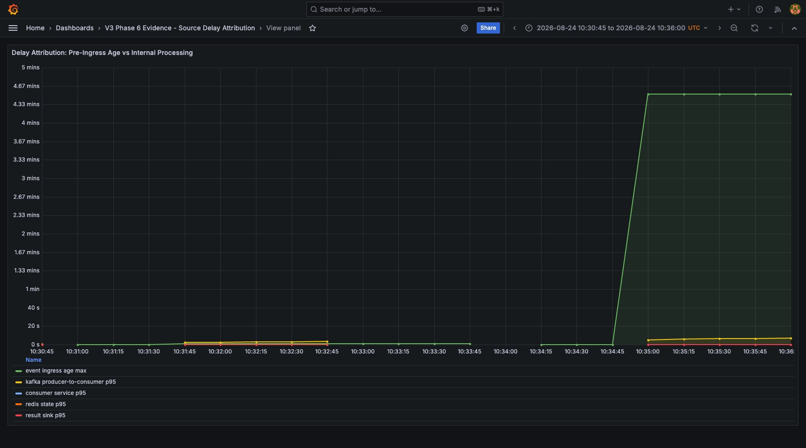

# 같은 300 EPS라도 270초 묵은 이벤트는 다른 사고다

대시보드에서 갑자기 초당 300건이 들어왔다. 이것만으로 신규 거래가 급증했다고 말할 수 있을까?

두 가지 상황이 같은 ingress graph를 만들 수 있다.

- Organic burst: 지금 발생한 이벤트가 지금 도착했다.
- Catch-up burst: upstream에 쌓여 있던 과거 이벤트가 지금 몰려왔다.

운영 대응은 다르지만 arrival rate만 보면 둘을 구분할 수 없다.

## 짝을 이룬 두 workload

Phase 6은 runtime shape를 같게 하고 event age만 바꿨다.

| 조건 | Organic | Catch-up |
|---|---:|---:|
| target EPS | 300 | 300 |
| emitted | 9,000 | 9,000 |
| event age 설정 | 0 s | 270 s |
| HTTP failure | 0 | 0 |
| dropped iteration | 0 | 0 |
| final Lag | 0 | 0 |

Catch-up의 270초는 live allowed lateness 5분 안쪽이다. 오래됐지만 too-late로 제외되지 않는 경계를 의도했다.

## 첫 번째 시계: 시스템에 들어오기 전에 늦었는가

권위 있는 값은 PostgreSQL에 저장된 `receivedAt - eventTime` quantile로 계산했다.

| Event-to-ingress age | Organic | Catch-up |
|---|---:|---:|
| p50 | 0.002309 s | 270.002635 s |
| p95 | 0.239387 s | 270.127421 s |
| p99 | 0.645115 s | 270.471195 s |
| max | 1.182201 s | 271.095674 s |

두 workload는 비슷한 속도로 API에 도착했지만 Catch-up event는 시스템 진입 순간부터 약 270초 오래되어 있었다.

## 두 번째 시계: 시스템 안에서 얼마나 기다렸는가

pre-ingress age를 downstream latency와 합치지 않았다.

| Downstream signal | Organic | Catch-up |
|---|---:|---:|
| producer-to-consumer p95 | 2.880065 s | 6.500886 s |
| Consumer service p95 | 32.839 ms | 45.766 ms |
| Redis state p95 | 16.052 ms | 21.152 ms |
| rule p95 | 0.951 ms | 0.951 ms |
| result sink p95 | 7.784 ms | 9.828 ms |

Catch-up run에서 Kafka 전달과 일부 downstream 지표가 Organic보다 높았다. 따라서 “event age만 다르고 내부 동작은 완전히 같았다”고 쓰지 않았다.

분명한 것은 270초가 내부 처리에서 만들어진 값이 아니라 시스템 진입 전에 이미 존재했다는 점이다. downstream 차이는 별도의 local observation으로 남겼다.



왼쪽 Organic 구간에서는 event age가 내부 지연과 같은 축의 아래쪽에 머문다. 오른쪽 Catch-up 구간에서는 event age가 약 4.5분으로 뛰지만 Consumer·Redis·sink 시간은 별도 선으로 남는다. 큰 초록색 영역을 내부 처리 시간으로 합산하지 않는 것이 이 시각화의 핵심이다.

## source delay라고 부를 수 없는 이유

현재 schema는 `sourceSentAt`을 Kafka payload에 넣지 않고 app-api도 저장하지 않는다. 알 수 있는 것은 event occurrence와 API receipt의 차이다.

```text
알 수 있음: receivedAt - eventTime
알 수 없음: source processing time vs source network transport time
```

그래서 문서에는 “persisted pre-ingress event age”라고 썼다. external/source-side delay candidate를 보일 수는 있지만 어느 upstream hop에서 270초가 생겼는지는 증명하지 못한다.

정교한 이름은 과도한 root-cause claim을 막는 안전장치다.

## histogram이 큰 값을 놓쳤다

기존 Prometheus histogram bucket은 millisecond~작은 second latency를 보도록 설계되어 270초 p95를 표현하기에 적합하지 않았다. Grafana에서는 max signal로 catch-up step을 시각화하고, 정확한 p50/p95/p99는 DB timestamp를 기준으로 삼았다.

dashboard에 숫자가 있다고 무조건 그 숫자가 authoritative한 것은 아니다. bucket 설계와 측정 범위를 같이 봐야 한다.

## too-late와 catch-up의 경계

두 실행 모두 too-late count는 0이었다. 270초는 5분 allowed lateness 안에 있기 때문이다. 따라서 Phase 6의 catch-up은 Phase 5의 10분 late rejection과 의미가 다르다.

- 270초 Catch-up: live state에 반영되는 오래된 이벤트
- 10분 late: durable result는 남지만 live Redis state에서는 제외되는 이벤트
- 24시간 Replay: live path가 아니라 격리된 replay stream에서 처리하는 이벤트

시간 차이만이 아니라 처리 경로가 달라진다.

## incident를 읽는 방식이 달라졌다

입력 burst를 보면 이제 다음 순서로 질문할 수 있다.

1. ingress EPS가 올랐는가?
2. event-to-ingress age도 함께 올랐는가?
3. total/partition Lag은 어디서 증가했는가?
4. Consumer·Redis·sink latency 중 함께 움직인 경계는 무엇인가?
5. allowed lateness를 넘은 이벤트가 있는가?

Organic과 Catch-up은 같은 그래프 모양에서 시작하지만, 첫 두 질문으로 서로 다른 사건이 된다.

## 이 실험이 남긴 결론

같은 300 EPS, 9,000건 workload에서도 event age를 분리하면 “새 이벤트의 폭증”과 “upstream backlog의 유입”을 구분할 수 있었다. 다만 source transport 자체를 측정하지 않았고, Catch-up run의 더 높은 transient Kafka delay 원인을 하나로 확정하지 않았다.
