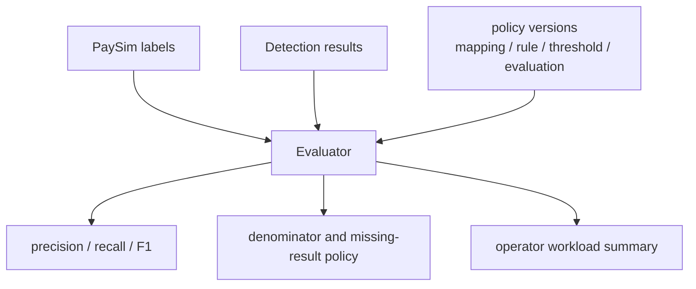

# PaySim replay evaluation을 evidence로 만들기

## 문제

precision과 recall은 강한 숫자처럼 보이지만, denominator와 제외 기준이 불명확하면 쉽게 과장된다. missing result를 true negative처럼 세거나, replay rejected row를 조용히 빼면 실제보다 좋아 보이는 report가 된다.

## 초기 설계

evaluation report에는 metric만 쓰지 않고 해석에 필요한 계약을 함께 넣는다. `evaluationPolicyVersion`, `mappingPolicyVersion`, `ruleVersion`, `thresholdVersion`, denominator, missing result, unsupported type, replay rejected count를 분리한다.

## 실제로 막힌 지점

threshold를 낮추면 recall이 좋아질 수 있지만 false positive와 운영 workload가 늘어난다. F1만 보면 이 부담이 잘 보이지 않는다. PaySim native type도 production transaction type처럼 해석하면 안 된다. 지원하지 않는 type은 default LOW로 처리하지 않고 명시적으로 excluded로 남겨야 했다.

## 확인한 증거

`docs/31-v2-replay-evaluation-evidence.md`, `docs/32-v2-paysim-native-replay-contract.md`, `docs/33-v2-rule-threshold-regression-evidence.md`에 report contract와 해석 기준을 기록했다. `make verify-paysim-evaluation-report-contract`, `make verify-paysim-native-replay-contract`, `make verify-paysim-rule-threshold-regression`은 fixture 기반 CI-safe 검증이다.

## 바꾼 설계

evaluation report는 성능 주장보다 evidence contract가 중심이다. missing result, replay rejected, unsupported type, threshold fallback, workload summary를 report에 남겨 숫자의 분모와 제외 범위를 확인할 수 있게 했다.

## 검증

fixture verifier는 예상 field와 count가 빠지면 실패한다. full replay evaluation은 raw data와 local runtime에 의존하므로 local/manual로 분리한다. 실제 report screenshot이 필요하면 민감 정보와 대용량 row를 제거한 요약만 image candidate로 다룬다.

## 남은 한계

PaySim은 synthetic dataset이고, 이 evaluation은 production fraud model performance가 아니다. 이 결과는 rule baseline과 evidence discipline을 검증하는 데 쓰며, 실제 금융 탐지 품질을 보장하지 않는다.
