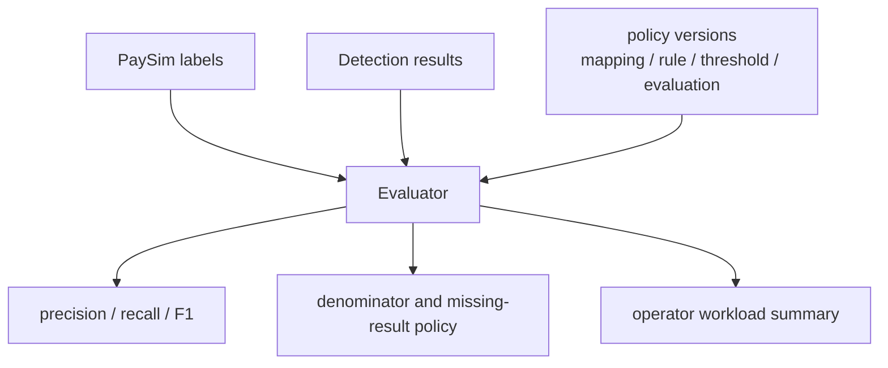

# precision/recall을 믿기 전에 분모부터 고정했다

## 문제

precision과 recall은 숫자로 보이기 때문에 설득력이 강하다. 하지만 missing result를 어떻게 처리했는지, unsupported type을 제외했는지, replay rejected row를 분모에 넣었는지에 따라 같은 rule output도 전혀 다른 성능처럼 보일 수 있다. 그래서 PaySim evaluation의 목표는 높은 점수를 만드는 것이 아니라 점수의 분모와 제외 기준을 숨기지 않는 것이었다.

PaySim은 실제 금융사 거래 데이터가 아니므로 이 평가는 운영 탐지 정확도를 주장하기 위한 것이 아니다. rule baseline 변경을 재현 가능하게 비교하기 위한 장치로 제한했다.

## 초기 설계

evaluation report에는 metric만 쓰지 않고 해석에 필요한 계약을 함께 넣는다. `evaluationPolicyVersion`, `mappingPolicyVersion`, `ruleVersion`, `thresholdVersion`, denominator, missing result, unsupported type, replay rejected count를 분리한다.

## 실제로 막힌 지점

threshold를 낮추면 recall이 좋아질 수 있지만 false positive와 운영 workload가 늘어난다. F1만 보면 이 부담이 잘 보이지 않는다. PaySim native type도 production transaction type처럼 해석하면 안 된다. 지원하지 않는 type은 default LOW로 처리하지 않고 명시적으로 excluded로 남겨야 했다.

missing result 처리도 여러 번 조정된 지점이다. missing result를 모두 denominator에 넣으면 Consumer lag이나 export 누락까지 탐지 성능처럼 읽힐 수 있다. 반대로 제외하면 전체 label을 평가한 것처럼 과장될 수 있다. 그래서 report에는 `missingResultTreatment`, missing count, warning을 남기고, 어떤 정책으로 계산했는지 명시한다.

## 트러블슈팅에서 남긴 판단

`DEBIT` 같은 unsupported native type은 낮은 위험으로 떨어뜨리지 않는다. `UNSUPPORTED_NATIVE_TYPE` 또는 current API unsupported type으로 명시적으로 제외하고, report에는 `excludedByType`, `unsupportedEventTypes`, type distribution을 남긴다.

duplicate label/result eventId는 strict 여부와 무관하게 실패시킨다. duplicate가 있으면 denominator와 riskLevel 선택이 모호해지기 때문이다. `ruleVersion`, `thresholdVersion`, `mappingPolicyVersion`, `evaluationPolicyVersion`도 함께 남겨 metric 변화 원인을 분리한다.

## 확인한 증거

`docs/31-v2-replay-evaluation-evidence.md`, `docs/32-v2-paysim-native-replay-contract.md`, `docs/33-v2-rule-threshold-regression-evidence.md`에 report contract와 해석 기준을 기록했다. `make verify-paysim-evaluation-report-contract`, `make verify-paysim-native-replay-contract`, `make verify-paysim-rule-threshold-regression`은 fixture 기반 CI-safe 검증이다.

## 바꾼 설계

evaluation report는 성능 주장보다 evidence contract가 중심이다. missing result, replay rejected, unsupported type, threshold fallback, workload summary를 report에 남겨 숫자의 분모와 제외 범위를 확인할 수 있게 했다.

| Report Field | Why It Exists |
|---|---|
| denominator policy | 어떤 event가 metric 계산에 들어갔는지 설명 |
| missing results | Consumer lag, export 누락, 평가 제외 가능성을 숨기지 않음 |
| excluded by type | unsupported native type을 LOW risk로 오해하지 않게 함 |
| workload summary | threshold 변경이 운영 부담을 얼마나 늘리는지 확인 |
| rule/threshold version | rule logic 변경과 threshold 변경을 분리 |

## 검증

fixture verifier는 예상 field와 count가 빠지면 실패한다. full replay evaluation은 raw data와 local runtime에 의존하므로 local/manual로 분리한다. 실제 report screenshot이 필요하면 민감 정보와 대용량 row를 제거한 요약만 image candidate로 다룬다.

## 남은 한계

PaySim은 synthetic dataset이고, 이 evaluation은 production fraud model performance가 아니다. 이 결과는 rule baseline과 evidence discipline을 검증하는 데 쓰며, 실제 금융 탐지 품질을 보장하지 않는다.
