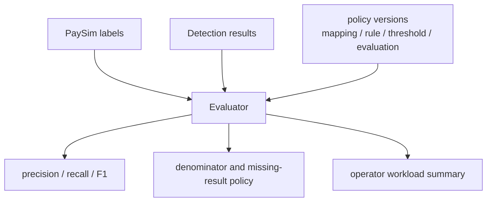
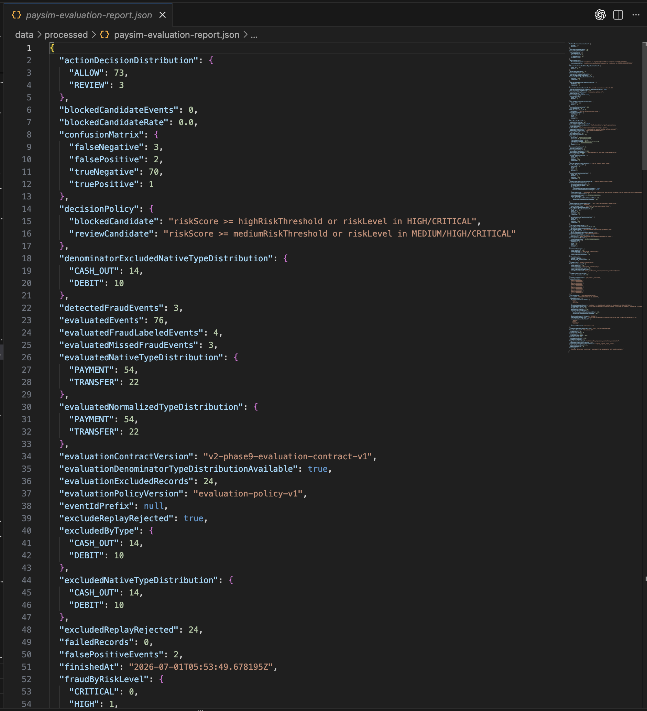

# precision/recall을 믿기 전에 분모부터 고정했다

## precision/recall은 분모 없이는 의미가 없다

precision과 recall은 숫자로 보이기 때문에 설득력이 강하다. 하지만 missing result를 어떻게 처리했는지, unsupported type을 제외했는지, replay rejected row를 분모에 넣었는지에 따라 같은 rule output도 전혀 다른 성능처럼 보일 수 있다. 그래서 PaySim evaluation의 목표는 높은 점수를 만드는 것이 아니라 점수의 분모와 제외 기준을 숨기지 않는 것이었다.

PaySim은 실제 금융사 거래 데이터가 아니므로 이 평가는 운영 탐지 정확도를 주장하기 위한 것이 아니다. rule baseline 변경을 재현 가능하게 비교하기 위한 장치로 제한했다.

같은 rule output이라도 평가 대상 row를 어떻게 정하느냐에 따라 precision/recall 해석은 달라진다. replay에 실패했거나 결과가 생성되지 않은 row를 조용히 제외하면 점수는 좋아 보일 수 있다. 반대로 전처리 단계에서 rejected된 row를 모두 탐지 실패로 넣으면 schema mapping 문제와 rule 판단 문제를 섞게 된다.

그래서 점수를 계산하기 전에 먼저 denominator를 고정해야 했다. 이 row는 평가 대상인지, replay rejected인지, unsupported type인지, missing result인지 분리해야 precision/recall이 어떤 범위에서 나온 숫자인지 설명할 수 있다.

## evaluation report에 반드시 남긴 필드

evaluation report에는 metric만 쓰지 않고 해석에 필요한 계약을 함께 넣는다. `evaluationPolicyVersion`, `mappingPolicyVersion`, `ruleVersion`, `thresholdVersion`, denominator, missing result, unsupported type, replay rejected count를 분리한다.

replay 대상과 evaluation 대상은 같지 않을 수 있다. replay 대상은 PaySim row를 이 시스템의 이벤트 schema로 변환해 Consumer 흐름에 넣을 수 있는 입력이다. evaluation 대상은 그 replay 결과가 생성되었고, rule baseline과 label을 비교할 수 있는 row다.

예를 들어 replay는 시도했지만 지원하지 않는 거래 유형이거나, 결과가 생성되지 않았거나, label 비교 기준 밖에 있는 row라면 evaluation denominator에서 어떻게 다룰지 별도로 정해야 한다. 이 구분이 없으면 “몇 건을 replay했는지”와 “몇 건을 평가했는지”가 섞인다.

```mermaid
flowchart TD
    Labels[PaySim labels] --> Eval[Evaluator]
    Results[Detection results] --> Eval
    Contract[policy versions<br/>mapping / rule / threshold / evaluation] --> Eval
    Eval --> Metrics[precision / recall / F1]
    Eval --> Denominator[denominator and missing-result policy]
    Eval --> Workload[operator workload summary]
```

## threshold를 낮추면 좋아 보이는 숫자가 생긴다

threshold를 낮추면 recall이 좋아질 수 있지만 false positive와 운영 workload가 늘어난다. F1만 보면 이 부담이 잘 보이지 않는다. 그래서 F1만 보지 않고 `operatorWorkloadSummary`와 `actionDecisionDistribution`을 함께 기록했다.

## missing result를 성능 실패로 볼 것인가, export 누락으로 볼 것인가

missing result 처리도 여러 번 조정된 지점이다. missing result를 모두 denominator에 넣으면 Consumer lag이나 export 누락까지 탐지 성능처럼 읽힐 수 있다. 반대로 제외하면 전체 label을 평가한 것처럼 과장될 수 있다. 그래서 report에는 `missingResultTreatment`, missing count, warning을 남기고, 어떤 정책으로 계산했는지 명시한다.

missing result는 replay 입력은 있었지만 `fraud_detection_result`가 생성되지 않은 경우로 볼 수 있다. 이 row를 조용히 제외하면 시스템이 처리하지 못한 이벤트가 점수에서 사라질 수 있다.

다만 missing result를 모두 false negative로 볼지, processing failure로 볼지, evaluation excluded로 볼지는 프로젝트의 평가 목적에 따라 달라진다. 중요한 것은 어떤 선택을 하든 count와 reason을 남겨야 한다는 점이다. 그래야 precision/recall이 어떤 실패를 포함하고 어떤 실패를 제외했는지 설명할 수 있다.

## unsupported native type을 LOW risk로 처리하지 않은 이유

PaySim native type도 production transaction type처럼 해석하면 안 된다. 지원하지 않는 type은 default LOW로 처리하지 않고 명시적으로 excluded로 남겨야 했다. `DEBIT` 같은 unsupported native type은 낮은 위험으로 떨어뜨리지 않는다. `UNSUPPORTED_NATIVE_TYPE` 또는 current API unsupported type으로 명시적으로 제외하고, report에는 `excludedByType`, `unsupportedEventTypes`, type distribution을 남긴다.

unsupported type과 rejected row도 구분해야 한다. unsupported type은 현재 rule baseline이 평가 대상으로 삼지 않는 거래 유형일 수 있고, rejected row는 schema validation, 금액 파싱, identifier 변환 같은 전처리 단계에서 탈락한 row일 수 있다.

이 둘은 rule이 fraud 여부를 잘못 판단한 것과는 다르다. 그래서 평가에서 제외할 수는 있지만, 제외했다면 count와 reason을 남겨야 한다. denominator가 줄어든 이유를 설명하지 못하면 precision/recall은 좋은 숫자처럼 보일 뿐이다.

duplicate label/result eventId는 strict 여부와 무관하게 실패시킨다. duplicate가 있으면 denominator와 riskLevel 선택이 모호해지기 때문이다. `ruleVersion`, `thresholdVersion`, `mappingPolicyVersion`, `evaluationPolicyVersion`도 함께 남겨 metric 변화 원인을 분리한다.

PaySim의 `isFraud`는 replay 처리 과정에서 Consumer가 알고 있는 값처럼 쓰면 안 된다. 운영 시스템에서 정답 label을 미리 알고 탐지하는 것은 불가능하기 때문이다. 이 값은 Rule Engine 입력이 아니라, replay 이후 rule output을 비교하기 위한 evaluation label로만 사용해야 한다.

만약 `isFraud`가 전처리나 rule input에 섞이면 evaluation leakage가 된다. 또한 PaySim은 synthetic dataset이므로 이 label을 실제 금융사 운영 fraud label과 동일하게 해석해서도 안 된다.

## PaySim evaluation summary 이미지 해석

`docs/31-v2-replay-evaluation-evidence.md`, `docs/32-v2-paysim-native-replay-contract.md`, `docs/33-v2-rule-threshold-regression-evidence.md`에 report contract와 해석 기준을 기록했다. `make verify-paysim-evaluation-report-contract`, `make verify-paysim-native-replay-contract`, `make verify-paysim-rule-threshold-regression`은 fixture 기반 CI-safe 검증이다.

PaySim evaluation report는 precision/recall 숫자를 먼저 보여주기 위한 자료가 아니라, 어떤 row가 평가 분모에 포함됐고 어떤 row가 제외됐는지 설명하기 위한 evidence다. replay 단계에서 unsupported 또는 rejected 된 row는 evaluation denominator에서 제외했고, evaluation report에는 `evaluatedEvents`, `evaluationExcludedRecords`, `excludedByType`, `denominatorExcludedNativeTypeDistribution`을 함께 기록했다. 따라서 같은 precision/recall이라도 어떤 입력 범위에서 계산됐는지 추적할 수 있다.

`confusionMatrix`와 precision/recall은 denominator가 확정된 뒤에야 해석할 수 있다. 또한 `ruleVersion`, `thresholdVersion`, `evaluationContractVersion`, `evaluationPolicyVersion`을 함께 기록해야 이후 metric 변화가 rule 변경 때문인지, threshold 변경 때문인지, evaluation policy 변경 때문인지 구분할 수 있다. 이 evidence는 production fraud model 성능 주장이 아니라 PaySim replay/evaluation contract를 검증하기 위한 자료다.

이번 캡처에서는 `paysim-detection-results.jsonl`을 입력으로 사용해 `paysim-evaluation-report.json`을 생성했다. 개별 detection result 목록을 보여주는 대신, 블로그에는 평가 결과를 요약한 report를 evidence로 남겼다.

## metric 숫자보다 먼저 고정한 contract

evaluation report는 성능 주장보다 evidence contract가 중심이다. missing result, replay rejected, unsupported type, threshold fallback, workload summary를 report에 남겨 숫자의 분모와 제외 범위를 확인할 수 있게 했다.

이 evaluation은 운영 모델 성능을 자랑하기 위한 장치가 아니다. rule baseline을 바꿨을 때 같은 denominator 기준으로 이전 결과와 이후 결과를 비교하기 위한 장치에 가깝다.

denominator와 excluded reason이 고정되어 있어야 rule 변경으로 달라진 결과와 데이터 처리 실패로 빠진 결과를 구분할 수 있다. 그래서 이 글에서 중요한 것은 높은 precision/recall이 아니라, 같은 기준으로 다시 계산할 수 있는 비교 가능성이다.

| Report Field | Why It Exists |
|---|---|
| denominator policy | 어떤 event가 metric 계산에 들어갔는지 설명 |
| missing results | Consumer lag, export 누락, 평가 제외 가능성을 숨기지 않음 |
| excluded by type | unsupported native type을 LOW risk로 오해하지 않게 함 |
| workload summary | threshold 변경이 운영 부담을 얼마나 늘리는지 확인 |
| rule/threshold version | rule logic 변경과 threshold 변경을 분리 |

## fixture와 local/manual evidence를 나눈 이유

fixture verifier는 예상 field와 count가 빠지면 실패한다. full replay evaluation은 raw data와 local runtime에 의존하므로 local/manual로 분리한다. 실제 report screenshot은 raw PaySim row와 대용량 detection result 목록을 보여주지 않고, evaluation report의 denominator, excluded count, policy/version 필드 중심으로 제한해 첨부했다.

evaluation evidence에는 최종 점수만 남기면 부족하다. 최소한 input row count, accepted row count, rejected row count, evaluated row count, missing result count, unsupported/excluded count가 함께 있어야 한다. label 비교를 했다면 true positive, false positive, false negative, true negative count도 점수와 함께 남겨야 한다.

또한 어떤 ruleVersion 또는 baseline 기준으로 계산했는지, 언제 report를 생성했는지도 필요하다. 그래야 나중에 같은 precision/recall 숫자가 어떤 입력과 어떤 rule 기준에서 나온 것인지 다시 추적할 수 있다.

denominator를 고정해도 ruleVersion 기준이 섞이면 비교는 다시 흔들린다. 같은 evaluation set을 사용하더라도 어떤 rule로 생성된 stored result인지, 현재 Consumer의 active ruleVersion은 무엇인지, evaluator가 기대한 baseline version은 무엇인지가 다르면 결과 해석이 달라진다.

그래서 다음 글에서는 active, stored, evaluator ruleVersion을 같은 값처럼 다루지 않고 분리해 추적한 이유를 정리한다.

## 이 결과가 production fraud 성능 주장이 아닌 이유

PaySim은 synthetic dataset이고, 이 evaluation은 production fraud model performance가 아니다. 이 결과는 rule baseline과 evidence discipline을 검증하는 데 쓰며, 실제 금융 탐지 품질을 보장하지 않는다.

PaySim은 실제 금융사 운영 데이터가 아니며, 이 evaluation은 운영 탐지 정확도나 실시간 탐지 성능을 주장하기 위한 근거가 아니다. local/dev 환경에서 rule baseline을 재현 가능하게 비교하기 위한 제한된 평가다.

따라서 결과를 좋은 점수로 포장하기보다 denominator, excluded reason, missing result, ruleVersion 기준을 함께 남기는 것이 더 중요했다. 이번 글의 목표는 높은 precision/recall이 아니라, 평가 숫자가 어떤 조건에서 나온 것인지 설명 가능한 상태로 만드는 것이다.
