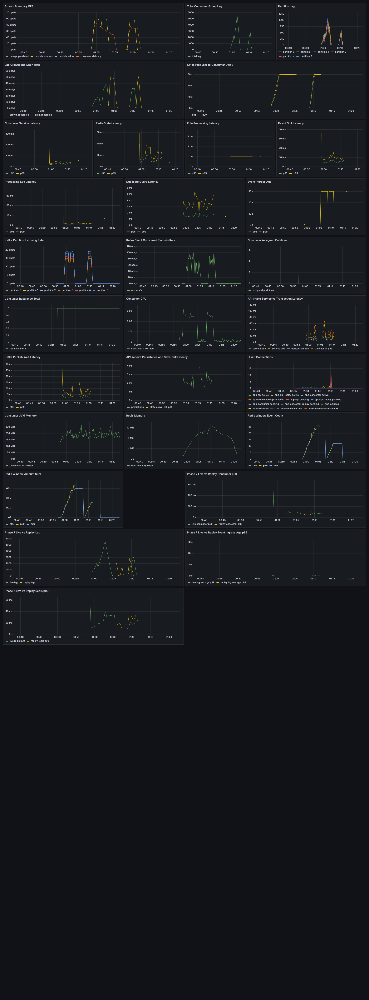

# 하루치 replay를 live Kafka topic에 넣지 않은 이유

과거 이벤트를 다시 흘리면 rule 회귀와 누락 결과를 점검할 수 있다. 그러나 24시간 전 이벤트를 현재 live topic에 그대로 넣는 순간 세 가지가 섞인다.

1. live Consumer Lag
2. live 사용자의 Redis recent window
3. 현재 이벤트 freshness metric

Phase 7의 질문은 replay가 가능한지가 아니라, live를 오염시키지 않고 가능한지였다.

## 격리 단위를 네 군데에 뒀다

| Boundary | Live | Replay |
|---|---|---|
| API port | 8080 | 8082 |
| Consumer port | 8081 | 8083 |
| Kafka topic | `transaction-events` | `transaction-events-replay` |
| Consumer group | `fraud-event-consumer` | `fraud-event-replay-consumer` |
| Redis namespace | `fraud:tx:live:*` | `fraud:tx:replay:*` |

app-api와 app-consumer는 `FRAUD_STREAM_MODE`에 따라 live/replay profile을 사용한다. startup validator는 mode와 topic/group/namespace의 잘못된 조합을 거부한다. 설정 실수로 replay Consumer가 live topic을 읽거나 live namespace를 쓰는 것을 실행 전에 막는다.

DLT 재처리도 source topic을 보존한다. replay에서 실패한 이벤트는 allowlist를 통과한 `transaction-events-replay`로 돌아가며 live topic으로 승격되지 않는다.

## replay에서 5분 lateness를 우회한 이유

24시간 historical event에 live의 5분 allowed-lateness를 적용하면 Redis stateful rule은 전부 skipped될 가능성이 높다. replay mode는 freshness rejection을 bypass한다.

이 우회가 안전하려면 replay state가 live Redis key와 만나지 않아야 한다. 그래서 mode 분기만으로 끝내지 않고 namespace를 분리했다.

```text
live event   -> fraud:tx:live:user:{userId}:events
replay event -> fraud:tx:replay:user:{userId}:events
```

## 세 장면으로 확인했다

### Live Only

100 EPS, 120초, 12,000건을 live path로 보냈다. HTTP failure 없이 receipt/result/log가 각각 12,000건이었고 final Lag은 0이었다.

### Replay Only

24시간 historical profile 4,500건을 150 EPS, 30초 동안 replay path로 보냈다. 세 DB count가 각각 4,500건이었고 replay Lag은 0으로 돌아왔다.

### Live + Replay

두 workload를 동시에 실행했다. live 12,000건과 replay 4,500건이 각각 완료되고 두 group의 final Lag이 0이 되었다.

## key를 직접 세어 오염을 확인했다

논리 설정만 보고 격리를 선언하지 않았다.

| Redis collision check | 결과 |
|---|---:|
| replay users in live namespace | 0 |
| replay users in replay namespace | 500 |
| live users in replay namespace | 0 |
| live users in live namespace | 1,000 |

event hash도 replay-plus 4,500개는 replay namespace에만, live-plus 12,000개는 live namespace에만 존재했다. replay-only에서 Redis-dependent skipped rule도 0이어서 replay state path가 실제로 실행됐음을 확인했다.

## 격리됐지만 경쟁은 남았다

topic, group, key namespace가 다르더라도 PostgreSQL과 Redis server는 같은 local Docker resource를 사용한다.

| Live metric | Live Only | Live + Replay |
|---|---:|---:|
| HTTP p95 | 11.024 ms | 12.801 ms |
| persisted ingress age p99 | 0.012039 s | 0.092850 s |

동시 실행에서 live latency가 높아졌다. shared-resource contention이 후보일 수 있지만 이 실험은 원인을 특정하지 않았다. 이 차이는 state contamination 증거도 아니다.



Phase 7 dashboard는 같은 시간축에서 live와 replay의 Lag·Consumer latency·event age를 별도 series로 보여준다. 두 group이 모두 drain되는 것과 replay event age가 live보다 큰 것을 동시에 확인하되, 공유 자원에서 발생한 latency 차이를 논리 상태 오염으로 단정하지 않는다.

여기서 논리 격리와 물리 격리를 구분했다.

- 논리 격리: topic, offset, Redis key space가 분리된다.
- 물리 격리: broker, Redis instance, DB, CPU까지 별도 자원을 쓴다.

Phase 7이 증명한 것은 전자다.

## 폐기한 run이 알려준 운영 순서

첫 replay-only run은 4,500건 중 4,479건만 발행되고 dropped iteration 22로 strict gate를 통과하지 못했다. 바로 다시 실행하지 않고 replay group Lag이 751인 것을 preflight에서 확인하고 0까지 drain된 뒤 rerun했다.

replay도 별도 group이라고 해서 이전 실패의 backlog가 자동으로 사라지는 것은 아니다. accepted evidence 전에는 topic/group Lag과 Redis clean state를 확인해야 한다.

## 이 구조가 해결하지 않은 것

- shared PostgreSQL과 Redis의 자원 경쟁
- replay rate limit과 live 우선순위 스케줄링
- historical result와 live result의 별도 DB tenancy
- production replay approval workflow
- replay 실행 중 자동 throttling

그래도 historical replay가 live state를 섞지 않는 최소 경계를 코드와 runtime evidence로 함께 남겼다.
