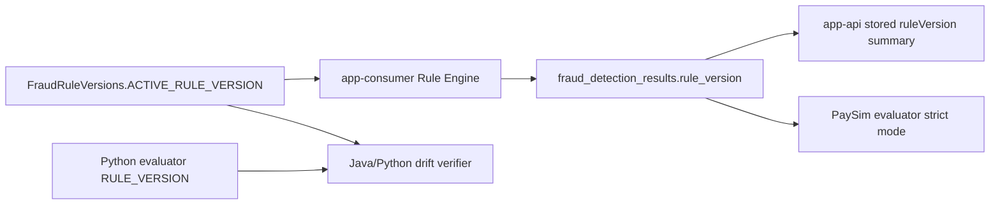

# active, stored, evaluator ruleVersion을 섞지 않기

## ruleVersion 하나로는 부족했다

Rule Engine이 바뀌면 세 가지 version이 동시에 보인다. 지금 실행 중인 Consumer의 active version, 과거 DB row에 저장된 stored version, PaySim evaluator가 기대하는 expected version이다. 이 셋을 같은 의미로 보면 배포 직후 old/new result가 섞이는 정상 상황도 장애처럼 보이고, 반대로 Java/Python drift는 늦게 발견된다.

## active version, stored version, evaluator expected version의 차이

`FraudRuleVersions.ACTIVE_RULE_VERSION`을 app-consumer Rule Engine baseline으로 둔다. Python evaluator도 같은 ruleVersion contract를 읽고, mismatch나 unsupported version을 fail-fast로 처리한다.

## 배포 직후 old/new result가 섞이는 것은 왜 정상일 수 있는가

처음에는 report-level `ruleVersion`만 있어도 충분해 보였다. 하지만 row별 result에 version이 없으면 어떤 detection result가 어떤 rule baseline으로 만들어졌는지 약하다. 또한 active runtime version과 stored historical version을 같은 의미로 보면 배포 직후 old/new version이 섞이는 정상 상황도 장애처럼 보일 수 있다.

예를 들어 app-consumer는 `2026.06-rules-v2`로 떠 있는데 admin summary에는 이전 version row가 남아 있을 수 있다. 이것은 historical result라면 정상이다. 하지만 신규 row에 예상하지 않은 version이 저장되거나 `ruleVersion`이 비어 있으면 조사 대상이다.

## Java/Python drift를 verifier로 막은 이유

Phase 11에서는 evaluator report의 `ruleVersion`이 Python 안에서만 관리되는 문제를 막기 위해 Java source constant와 Python evaluator policy를 비교했다. Phase 12에서는 report-level version만으로 row-level consistency를 말하지 않도록 per-result `ruleVersion`, coverage, distribution, strict mode를 추가했다.

Phase 13에서는 `ruleVersion` metric을 새로 늘리지 않았다. `ruleVersion`은 bounded 값이지만, 관측 요구가 생길 때마다 userId/eventId/traceId까지 metric tag로 붙이면 cardinality가 폭증할 수 있기 때문이다. active version은 Actuator info, stored version은 admin summary로 제한했다.

## active/stored/evaluator를 분리한 evidence

Phase 11은 Java/Python ruleVersion drift verifier를 추가했다. Phase 12는 per-result ruleVersion propagation과 evaluator strict mode를 정리했다. Phase 13은 app-consumer Actuator info와 app-api stored ruleVersion summary로 active/stored 의미를 분리했다.

## 세 층으로 나눈 ruleVersion 의미

ruleVersion은 세 층으로 나눴다.

| Layer | Meaning |
|---|---|
| active runtime ruleVersion | 현재 실행 중인 app-consumer Rule Engine baseline |
| stored result ruleVersion | 특정 detection result가 생성될 때 사용한 baseline |
| evaluator expected ruleVersion | replay evaluation이 기대하는 contract-level baseline |

## contract verifier가 확인하는 것

`make verify-paysim-rule-version-contract`는 Java source와 Python evaluator policy drift를 확인한다. `make verify-paysim-result-rule-version-contract`는 per-result ruleVersion coverage, mismatch fail, strict mode를 확인한다. `./gradlew test`와 `make final-check`는 Java runtime/admin 테스트와 대표 readiness gate를 포함한다.

## 아직 필요한 production 운영 장치

rule deployment changelog, unexpected ruleVersion alert, Grafana dashboard, time-bounded summary query는 future work다. ruleVersion 추적성은 탐지 품질 개선이 아니라 결과 해석과 변경 진단을 위한 근거다.
