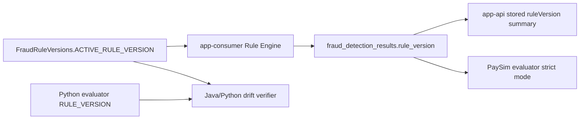

# ruleVersion 추적성 설계

## 문제

Rule Engine이 바뀌면 과거 결과와 새 결과를 같은 기준으로 비교하기 어렵다. Java Consumer의 active ruleVersion과 Python evaluator의 expected ruleVersion이 어긋나도 report 문자열만 보면 늦게 발견될 수 있다.

## 초기 설계

`FraudRuleVersions.ACTIVE_RULE_VERSION`을 app-consumer Rule Engine baseline으로 둔다. Python evaluator도 같은 ruleVersion contract를 읽고, mismatch나 unsupported version을 fail-fast로 처리한다.

## 실제로 막힌 지점

처음에는 report-level `ruleVersion`만 있어도 충분해 보였다. 하지만 row별 result에 version이 없으면 어떤 detection result가 어떤 rule baseline으로 만들어졌는지 약하다. 또한 active runtime version과 stored historical version을 같은 의미로 보면 배포 직후 old/new version이 섞이는 정상 상황도 장애처럼 보일 수 있다.

## 확인한 증거

Phase 11은 Java/Python ruleVersion drift verifier를 추가했다. Phase 12는 per-result ruleVersion propagation과 evaluator strict mode를 정리했다. Phase 13은 app-consumer Actuator info와 app-api stored ruleVersion summary로 active/stored 의미를 분리했다.

## 바꾼 설계

ruleVersion은 세 층으로 나눴다.

| Layer | Meaning |
|---|---|
| active runtime ruleVersion | 현재 실행 중인 app-consumer Rule Engine baseline |
| stored result ruleVersion | 특정 detection result가 생성될 때 사용한 baseline |
| evaluator expected ruleVersion | replay evaluation이 기대하는 contract-level baseline |

## 검증

`make verify-paysim-rule-version-contract`는 Java source와 Python evaluator policy drift를 확인한다. `make verify-paysim-result-rule-version-contract`는 per-result ruleVersion coverage, mismatch fail, strict mode를 확인한다. `./gradlew test`와 `make final-check`는 Java runtime/admin 테스트와 대표 readiness gate를 포함한다.

## 남은 한계

rule deployment changelog, unexpected ruleVersion alert, Grafana dashboard, time-bounded summary query는 future work다. ruleVersion 추적성은 탐지 품질 개선이 아니라 결과 해석과 변경 진단을 위한 근거다.
