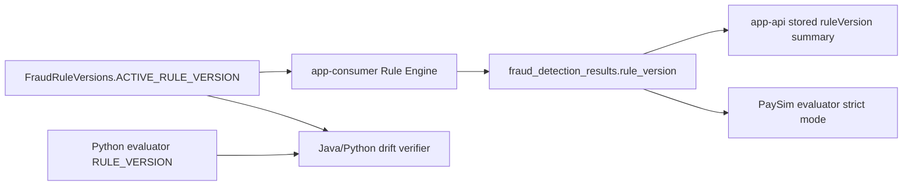

# active, stored, evaluator ruleVersion을 섞지 않기

## ruleVersion 하나로는 부족했다

Rule Engine이 바뀌면 세 가지 version이 동시에 보인다. 지금 실행 중인 Consumer의 active version, 과거 DB row에 저장된 stored version, PaySim evaluator가 기대하는 expected version이다. 이 셋을 같은 의미로 보면 배포 직후 old/new result가 섞이는 정상 상황도 장애처럼 보이고, 반대로 Java/Python drift는 늦게 발견된다.

`active ruleVersion`은 지금 실행 중인 Consumer가 새 이벤트를 처리할 때 사용하는 version이다. `stored ruleVersion`은 이미 PostgreSQL에 저장된 fraud result가 만들어질 당시의 version이다. `evaluator expected version`은 PaySim replay 결과를 비교할 때 evaluator가 기대하는 baseline version이다.

셋은 모두 ruleVersion이라는 이름을 갖지만 시점과 책임이 다르다. active는 현재 실행 기준이고, stored는 과거 결과의 생성 근거이며, evaluator expected는 비교 기준이다. 이 셋을 하나의 "현재 version"으로 합치면 배포, 저장 결과, 평가 기준을 구분하기 어려워진다.

## active version, stored version, evaluator expected version의 차이

`FraudRuleVersions.ACTIVE_RULE_VERSION`을 app-consumer Rule Engine baseline으로 둔다. Python evaluator도 같은 ruleVersion contract를 읽고, mismatch나 unsupported version을 fail-fast로 처리한다.

```mermaid
flowchart LR
    Java[FraudRuleVersions.ACTIVE_RULE_VERSION] --> Consumer[app-consumer Rule Engine]
    Java --> DriftCheck[Java/Python drift verifier]
    Py[Python evaluator RULE_VERSION] --> DriftCheck
    Consumer --> Result[fraud_detection_results.rule_version]
    Result --> Admin[app-api stored ruleVersion summary]
    Result --> Eval[PaySim evaluator strict mode]
```

## 배포 직후 old/new result가 섞이는 것은 왜 정상일 수 있는가

처음에는 report-level `ruleVersion`만 있어도 충분해 보였다. 하지만 row별 result에 version이 없으면 어떤 detection result가 어떤 rule baseline으로 만들어졌는지 약하다. 또한 active runtime version과 stored historical version을 같은 의미로 보면 배포 직후 old/new version이 섞이는 정상 상황도 장애처럼 보일 수 있다.

예를 들어 T0에는 Consumer가 `ruleVersion=v1`로 이벤트를 처리하고 있었다고 가정한다. T1에 `v2`가 배포되면 이후 들어오는 이벤트는 `v2` 기준으로 처리될 수 있다. 그러면 PostgreSQL에는 `v1`로 생성된 fraud result와 `v2`로 생성된 fraud result가 함께 존재한다.

이 혼재는 반드시 장애가 아니다. 배포 시점 전후의 이벤트가 서로 다른 rule 기준으로 처리된 결과일 수 있다. 하지만 stored ruleVersion이 row에 남아 있지 않으면, 이 결과가 정상적인 version 혼재인지 잘못된 rule drift인지 설명하기 어렵다.

예를 들어 app-consumer는 `2026.06-rules-v2`로 떠 있는데 admin summary에는 이전 version row가 남아 있을 수 있다. 이것은 historical result라면 정상이다. 하지만 신규 row에 예상하지 않은 version이 저장되거나 `ruleVersion`이 비어 있으면 조사 대상이다.

fraud result는 생성 직후에만 쓰이는 값이 아니다. 나중에 운영자가 특정 이벤트를 조사하거나, rule 변경 전후 결과를 비교하거나, DLT 재처리 결과를 확인할 때 다시 조회될 수 있다. 이때 현재 active ruleVersion만 알고 있으면 과거 row가 어떤 기준으로 생성됐는지 알 수 없다.

그래서 stored ruleVersion은 fraud result row의 생성 근거로 남겨야 한다. 이는 과거 row를 현재 version으로 덮어쓰기 위한 값이 아니라, 해당 결과가 만들어진 시점의 rule 기준을 보존하기 위한 값이다.

## Java/Python drift를 verifier로 막은 이유

Phase 11에서는 evaluator report의 `ruleVersion`이 Python 안에서만 관리되는 문제를 막기 위해 Java source constant와 Python evaluator policy를 비교했다. Phase 12에서는 report-level version만으로 row-level consistency를 말하지 않도록 per-result `ruleVersion`, coverage, distribution, strict mode를 추가했다.

evaluator는 운영 Consumer가 아니다. PaySim replay 결과를 특정 baseline 기준으로 비교하는 도구다. 따라서 evaluator가 기대하는 version과 Consumer가 실제 stored result에 남긴 version이 다를 수 있다.

이 차이를 숨기면 결과 차이가 rule 변경 때문인지, evaluator 기준이 오래됐기 때문인지, Java/Python 구현이 drift된 것인지 구분하기 어렵다. evaluator expected version은 이 평가가 어떤 baseline을 기준으로 계산됐는지 설명하기 위한 값이다.

drift는 거창한 모델 차이에서만 생기는 것이 아니다. Consumer Rule Engine은 Java/Spring 쪽에서 실행되고, PaySim evaluation report는 Python 쪽에서 계산될 수 있다. 이때 threshold, rounding, unsupported type 처리, missing result 처리 기준이 조금만 달라도 같은 rule이라고 생각한 결과가 달라질 수 있다.

따라서 ruleVersion 문자열이 같다는 사실만으로 충분하지 않다. 어떤 threshold와 제외 기준, unsupported type 처리 기준을 사용했는지도 함께 맞아야 한다. 이 글에서 ruleVersion을 추적하려는 이유도 version 문자열 하나가 아니라 결과 해석의 근거를 남기기 위해서다.

Phase 13에서는 `ruleVersion` metric을 새로 늘리지 않았다. `ruleVersion`은 bounded 값이지만, 관측 요구가 생길 때마다 userId/eventId/traceId까지 metric tag로 붙이면 cardinality가 폭증할 수 있기 때문이다. active version은 Actuator info, stored version은 admin summary로 제한했다.

## active/stored/evaluator를 분리한 evidence

Phase 11은 Java/Python ruleVersion drift verifier를 추가했다. Phase 12는 per-result ruleVersion propagation과 evaluator strict mode를 정리했다. Phase 13은 app-consumer Actuator info와 app-api stored ruleVersion summary로 active/stored 의미를 분리했다.

9편에서 먼저 고정한 것은 평가 대상의 범위였다. 어떤 row를 denominator에 넣고, 어떤 row를 excluded로 볼지 정하지 않으면 precision/recall이 흔들린다. 그런데 denominator를 고정해도 ruleVersion 기준이 섞이면 비교는 다시 흔들린다.

같은 evaluated row set이라도 v1 결과와 v2 결과가 섞이면 baseline 변경 효과를 설명하기 어렵다. 그래서 stored ruleVersion과 evaluator expected version을 남겨 "어떤 version으로 생성된 결과를 어떤 baseline과 비교했는지"를 추적해야 했다.

## 세 층으로 나눈 ruleVersion 의미

ruleVersion은 세 층으로 나눴다.

| Layer | Meaning |
|---|---|
| active runtime ruleVersion | 현재 실행 중인 app-consumer Rule Engine baseline |
| stored result ruleVersion | 특정 detection result가 생성될 때 사용한 baseline |
| evaluator expected ruleVersion | replay evaluation이 기대하는 contract-level baseline |

ruleVersion이 다르다고 해서 항상 장애는 아니다. active version과 stored version이 다른 것은 배포 전후 결과가 함께 존재하는 정상 상황일 수 있다. 반면 evaluator expected version과 stored version이 예상과 다르면 evaluation report가 잘못된 baseline과 비교하고 있을 수 있다.

active version이 기대와 다르면 배포나 설정 문제일 수 있고, stored version이 비어 있으면 과거 결과를 해석하기 어렵다. 그래서 중요한 것은 mismatch 자체가 아니라 어떤 문맥의 version이 어떤 기준과 다른지 구분하는 것이다.

## contract verifier가 확인하는 것

`make verify-paysim-rule-version-contract`는 Java source와 Python evaluator policy drift를 확인한다. `make verify-paysim-result-rule-version-contract`는 per-result ruleVersion coverage, mismatch fail, strict mode를 확인한다. `./gradlew test`와 `make final-check`는 Java runtime/admin 테스트와 대표 readiness gate를 포함한다.

ruleVersion traceability를 위해 report에는 점수만 남기면 부족하다. report 생성 시점의 active ruleVersion, stored result에 남아 있는 ruleVersion 분포, evaluator expected version, evaluated row count, excluded/missing count가 함께 있어야 한다.

가능하다면 version mismatch count나 sample도 남겨야 한다. 그래야 나중에 같은 report를 보더라도 어떤 version의 결과가 어떤 기준으로 평가됐는지 다시 추적할 수 있다. report 생성 시각도 같은 이유로 evidence에 포함되어야 한다.

## 아직 필요한 production 운영 장치

rule deployment changelog, ruleVersion-specific Grafana dashboard, unexpected ruleVersion alert, time-bounded summary query는 future work다. ruleVersion 추적성은 탐지 품질 개선이 아니라 결과 해석과 변경 진단을 위한 근거다.

ruleVersion을 남긴다고 해서 rule 변경 운영이 자동으로 안전해지는 것은 아니다. version은 결과를 설명하기 위한 근거이지, rollback 기준이나 hold 판단을 대신하지 않는다.

그래서 이 글에서는 active, stored, evaluator ruleVersion을 섞지 않는 추적 기준을 정리했다. 다음 글에서는 이 기준을 바탕으로 ruleVersion 변경 전후에 무엇을 확인하고, 언제 hold하거나 rollback readiness 상태로 봐야 하는지 runbook 관점에서 정리한다.
