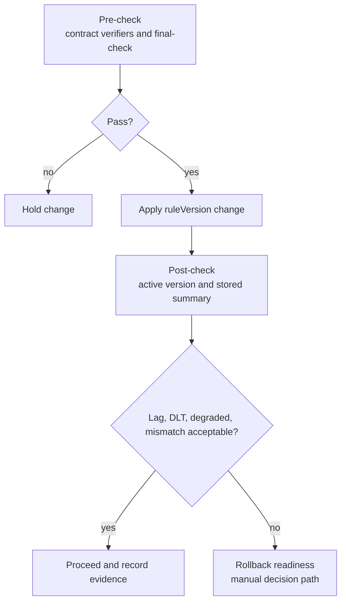

# ruleVersion 변경 runbook과 rollback readiness

## ruleVersion 변경은 코드 변경보다 운영 판단이 어렵다

ruleVersion을 추적할 수 있어도 변경 기준이 없으면 운영 판단이 주관적이 된다. 변경 전 무엇을 확인하고, 변경 후 어떤 신호를 보고, 언제 hold하거나 rollback 준비 상태로 전환할지 정해야 했다.

## 변경 전 pre-check

Phase 14에서는 automatic rollback을 구현하지 않고 rollback readiness를 문서화했다. 변경 전에는 Java/Python ruleVersion drift, per-result ruleVersion contract, final-check를 확인한다. 변경 후에는 app-consumer active ruleVersion, app-api stored summary, DLT/lag/degraded signal을 확인한다.

## 변경 후 post-check

runbook은 체크리스트만 있으면 충분해 보이지만, action 기준이 없으면 실제 장애 때 도움이 되지 않는다. 또 active/stored version mismatch를 무조건 장애로 보면 배포 직후 과거 결과가 남아 있는 정상 상황도 잘못 해석할 수 있다.

`make final-check`도 오해될 수 있다. 이 명령은 repository readiness guardrail이지 production 인증이나 full PaySim replay evidence가 아니다.

## hold criteria

ruleVersion 변경과 thresholdVersion 변경은 가능한 분리한다. 같은 PR에서 둘 다 바꾸면 metric 변화가 rule logic 때문인지 threshold boundary 때문인지 해석하기 어렵다. all-time stored summary는 production dashboard로 쓰지 않는다. 과거 row와 현재 active version이 섞이는 것은 정상일 수 있기 때문이다.

runtime curl check도 CI-safe로 쓰지 않는다. local app startup, admin token, local DB 상태가 필요하기 때문이다. 그래서 runbook에는 local/manual evidence로 남기고, `make final-check`에는 넣지 않는다.

## rollback readiness와 automatic rollback은 다르다

`docs/38-v2-rule-version-change-runbook.md`에는 pre-check, post-check, hold criteria, rollback readiness criteria, evidence template을 둔다. `docs/39-v2-final-evidence-closure.md`는 V2 Phase 7~14 evidence를 한 번에 연결하고 implemented, local/manual, future work를 분리한다.

## final-check가 보장하는 것과 보장하지 않는 것

all-time stored ruleVersion summary는 production dashboard로 쓰지 않는다고 명시했다. historical result와 current active version은 의미가 다르기 때문이다. automatic rollback, alert, changelog persistence는 구현된 것으로 쓰지 않고 future work로 남겼다.

## 구현한 것 / 수동 검증 / future work

| 구분 | 내용 |
|---|---|
| 구현한 것 | ruleVersion contract verifier, per-result ruleVersion propagation, active/stored 조회, final evidence map |
| 로컬/수동 검증 | actuator/admin curl, full PaySim replay/evaluation, runtime evidence capture |
| future work | automatic rollback, Grafana dashboard, alert, deployment changelog, time-bounded summary query |

## runtime evidence를 남기는 방식

대표 검증은 `make final-check`, `./gradlew test`, ruleVersion 관련 verifier다. local actuator/admin curl check와 full PaySim replay는 CI-safe 검증으로 쓰지 않는다. 실제 runtime evidence를 남기려면 실행 일시, command, output 요약, 한계를 함께 기록해야 한다.

## 아직 자동화하지 않은 운영 장치

automatic rollback은 구현하지 않았다. Grafana dashboard, alert, deployment changelog persistence, time-bounded summary query, `(rule_version, detected_at)` index도 future work다. 현재 단계의 목표는 변경 판단을 재현 가능한 문서와 contract check로 묶는 것이다.

이 글의 목표는 ruleVersion 변경을 자동화된 운영 배포로 포장하는 것이 아니라, 변경 전후에 어떤 근거를 확인해야 하는지 기준을 남기는 것이다. automatic rollback, alert, deployment changelog persistence는 아직 future work로 분리한다.
