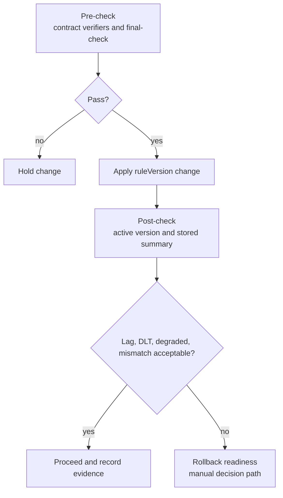

# ruleVersion 변경 runbook과 rollback readiness

## ruleVersion 변경은 코드 변경보다 운영 판단이 어렵다

ruleVersion을 추적할 수 있어도 변경 기준이 없으면 운영 판단이 주관적이 된다. 변경 전 무엇을 확인하고, 변경 후 어떤 신호를 보고, 언제 hold하거나 rollback 준비 상태로 전환할지 정해야 했다.

ruleVersion 변경은 단순히 새 코드가 배포됐는지 확인하는 문제가 아니다. rule 기준이 바뀌면 탐지 결과 분포가 달라질 수 있고, 배포 전후에는 old/new ruleVersion으로 생성된 result가 함께 존재할 수 있다.

이때 active ruleVersion, stored result ruleVersion, evaluator expected version이 연결되어 있지 않으면 정상적인 version 혼재인지, rule drift인지, evaluation 기준 오류인지 구분하기 어렵다. 그래서 변경 전/후 확인 기준이 없으면 운영 판단이 주관적으로 흐를 수 있다.

## 변경 전 pre-check

Phase 14에서는 automatic rollback을 구현하지 않고 rollback readiness를 문서화했다. 변경 전에는 Java/Python ruleVersion drift, per-result ruleVersion contract, final-check를 확인한다. 변경 후에는 app-consumer active ruleVersion, app-api stored summary, DLT/lag/degraded signal을 확인한다.

변경 전에는 먼저 어떤 ruleVersion으로 바꾸는지와 변경 목적을 확인해야 한다. 단순히 version 문자열만 바꾸는 것이 아니라, 어떤 rule 기준이 바뀌고 어떤 결과 변화를 예상하는지 기록해야 한다.

또한 변경 전 baseline으로 PaySim evaluation report, denominator, excluded reason, missing result count를 확인한다. 운영 신호 관점에서는 DLT count, Consumer Lag, Redis degraded 여부도 변경 전 상태로 남긴다. rollback이나 hold 판단에 사용할 기준도 배포 후가 아니라 변경 전에 정해두는 것이 좋다.

```mermaid
flowchart TD
    Pre[Pre-check<br/>contract verifiers and final-check] --> Decision{Pass?}
    Decision -->|no| Hold[Hold change]
    Decision -->|yes| Deploy[Apply ruleVersion change]
    Deploy --> Post[Post-check<br/>active version and stored summary]
    Post --> Signals{Lag, DLT, degraded, mismatch acceptable?}
    Signals -->|yes| Proceed[Proceed and record evidence]
    Signals -->|no| RollbackReady[Rollback readiness<br/>manual decision path]
```

## 변경 후 post-check

runbook은 체크리스트만 있으면 충분해 보이지만, action 기준이 없으면 실제 장애 때 도움이 되지 않는다. 또 active/stored version mismatch를 무조건 장애로 보면 배포 직후 과거 결과가 남아 있는 정상 상황도 잘못 해석할 수 있다.

변경 후에는 먼저 active ruleVersion이 기대한 값으로 올라왔는지 확인한다. 그다음 새로 생성되는 `fraud_detection_result`의 stored ruleVersion이 변경된 version으로 기록되는지 본다.

결과 해석에서는 riskLevel 분포, DLT count, retry count, Consumer Lag, Redis degraded count를 함께 확인해야 한다. 배포 직후에는 old/new result가 함께 존재할 수 있으므로 이를 곧바로 장애로 보지 않고 stored ruleVersion 기준으로 구분해야 한다. PaySim evaluation report도 evaluator expected version이 변경 기준과 맞는지 확인해야 한다.

`make final-check`도 오해될 수 있다. 이 명령은 repository readiness guardrail이지 production 인증이나 full PaySim replay evidence가 아니다.

## hold criteria

ruleVersion 변경과 thresholdVersion 변경은 가능한 분리한다. 같은 PR에서 둘 다 바꾸면 metric 변화가 rule logic 때문인지 threshold boundary 때문인지 해석하기 어렵다. all-time stored summary는 production dashboard로 쓰지 않는다. 과거 row와 현재 active version이 섞이는 것은 정상일 수 있기 때문이다.

hold와 rollback readiness, rollback은 같은 의미가 아니다. hold는 변경 결과가 애매하거나 추가 확인이 필요해 다음 변경이나 확대를 멈추는 상태다. rollback readiness는 문제가 명확해졌을 때 이전 version으로 되돌릴 수 있도록 이전 version, 확인 명령, 영향 범위, 복구 기준을 준비해 둔 상태다.

rollback은 실제로 이전 version으로 되돌리는 조치다. 모든 이상 신호가 즉시 rollback을 의미하지는 않지만, 기준 없이 "조금 더 지켜보자"로 버티는 것도 위험하다. 그래서 이 글에서는 rollback 실행보다 rollback readiness를 문서화하는 데 초점을 둔다.

runtime curl check도 CI-safe로 쓰지 않는다. local app startup, admin token, local DB 상태가 필요하기 때문이다. 그래서 runbook에는 local/manual evidence로 남기고, `make final-check`에는 넣지 않는다.

## rollback readiness와 automatic rollback은 다르다

`docs/38-v2-rule-version-change-runbook.md`에는 pre-check, post-check, hold criteria, rollback readiness criteria, evidence template을 둔다. `docs/39-v2-final-evidence-closure.md`는 V2 Phase 7~14 evidence를 한 번에 연결하고 implemented, local/manual, future work를 분리한다.

rollback readiness에는 최소한 이전 ruleVersion, 변경 ruleVersion, 변경 시각, 변경 목적이 있어야 한다. 또한 어떤 신호가 나오면 hold로 볼지, 어떤 신호가 나오면 rollback 검토 대상으로 볼지도 함께 적어야 한다.

확인 대상에는 active ruleVersion, stored ruleVersion 분포, DLT/retry count, Consumer Lag, Redis degraded count, evaluation report가 포함된다. 변경 이후 어떤 시간 구간의 result가 영향을 받았는지도 남겨야 나중에 재평가나 재처리 범위를 판단할 수 있다. 담당자 기능을 구현했다는 뜻은 아니지만, 운영 기록 기준으로 operator action도 함께 남기는 편이 좋다.

## final-check가 보장하는 것과 보장하지 않는 것

all-time stored ruleVersion summary는 production dashboard로 쓰지 않는다고 명시했다. historical result와 current active version은 의미가 다르기 때문이다. automatic rollback, alert, changelog persistence는 구현된 것으로 쓰지 않고 future work로 남겼다.

evidence closure는 "문제 없음"을 선언하는 문서가 아니다. 어떤 근거를 보고 이번 변경 검증을 종료했는지 남기는 기록이다. 따라서 변경 전 상태, 변경 후 상태, active/stored/evaluator ruleVersion, evaluation denominator, excluded reason, DLT/retry/degraded/lag 상태가 함께 있어야 한다.

또한 결과 분포가 어떻게 달라졌는지, hold 또는 rollback 판단이 필요했는지, 남은 한계가 무엇인지도 기록해야 한다. 그래야 나중에 같은 ruleVersion 변경을 다시 볼 때 당시 판단의 근거를 추적할 수 있다.

## 구현한 것 / 수동 검증 / future work

| 구분 | 내용 |
|---|---|
| 구현한 것 | ruleVersion contract verifier, per-result ruleVersion propagation, active/stored 조회, final evidence map |
| 로컬/수동 검증 | actuator/admin curl, full PaySim replay/evaluation, runtime evidence capture |
| future work | automatic rollback, production-grade ruleVersion dashboard, alert, deployment changelog, time-bounded summary query |

## runtime evidence를 남기는 방식

대표 검증은 `make final-check`, `./gradlew test`, ruleVersion 관련 verifier다. local actuator/admin curl check와 full PaySim replay는 CI-safe 검증으로 쓰지 않는다. 실제 runtime evidence를 남기려면 실행 일시, command, output 요약, 한계를 함께 기록해야 한다.

변경 직후 PostgreSQL에 old/new stored ruleVersion이 함께 존재하는 것은 정상일 수 있다. 중요한 것은 변경 이후 새로 생성되는 row가 기대한 ruleVersion으로 저장되는지 확인하는 것이다.

과거 row의 stored ruleVersion을 현재 version으로 덮어쓰면 audit 근거가 사라진다. 따라서 결과 비교는 time window와 stored ruleVersion 기준으로 나눠야 한다. 이 기준이 있어야 정상적인 배포 전후 혼재와 비정상적인 version drift를 구분할 수 있다.

## 아직 자동화하지 않은 운영 장치

automatic rollback은 구현하지 않았다. production-grade ruleVersion dashboard, alert, deployment changelog persistence, time-bounded summary query, `(rule_version, detected_at)` index도 future work다. 현재 단계의 목표는 변경 판단을 재현 가능한 문서와 contract check로 묶는 것이다.

이 글의 목표는 ruleVersion 변경을 자동화된 운영 배포로 포장하는 것이 아니라, 변경 전후에 어떤 근거를 확인해야 하는지 기준을 남기는 것이다. automatic rollback, alert, deployment changelog persistence는 아직 future work로 분리한다.

이 runbook은 완전한 자동 rollback 시스템이 아니다. canary, feature flag, blue-green 배포, alert 기반 자동 rollback을 구현했다는 의미도 아니다. 이번 범위에서는 ruleVersion 변경 전후에 어떤 evidence를 보고 어떤 판단을 할지 기준을 세우는 데 집중했다.

실제 운영 환경으로 확장하려면 변경 승인, alert 연동, rollback automation, change history 관리가 추가로 필요하다. 이 글에서는 그 전 단계로, 주관적인 변경 판단을 줄이기 위한 최소한의 확인 항목을 남겼다.

ruleVersion 변경 runbook은 프로젝트의 마지막 안정성 장치가 아니다. 다만 변경 이후 결과를 어떤 근거로 해석했고, 언제 hold나 rollback readiness를 판단했는지 설명할 수 있게 해주는 장치다.

이 프로젝트에서 반복해서 남기려 했던 것은 특정 기술 자체보다 변경과 장애 이후에도 설명 가능한 기준이었다. 다음 회고에서는 Kafka, Redis, PaySim보다 중요했던 이 기준들이 프로젝트 전체에서 어떻게 정리됐는지 돌아본다.
