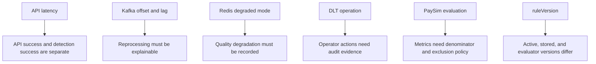

# 회고: Kafka, Redis, PaySim보다 중요했던 것은 설명 가능한 기준이었다

## 처음에 세운 문제

처음 문제는 대량 거래 이벤트를 빠르게 받아 이상거래를 탐지하는 것이었다. 하지만 구현이 진행될수록 더 중요한 질문은 “빠르게 처리했는가”가 아니라 “처리 결과를 장애와 재처리 이후에도 설명할 수 있는가”로 바뀌었다.

API가 성공했다는 사실만으로 탐지가 끝났다고 말할 수 없고, Kafka에 publish했다는 사실만으로 fraud result가 저장됐다고 말할 수 없다. Redis rule이 실행되지 않았는데 정상 탐지처럼 저장해도 안 되고, PaySim evaluation 숫자가 좋아 보여도 어떤 denominator로 계산했는지 모르면 근거가 약하다.

## 개발하면서 기준이 바뀐 지점

초기에는 Kafka, Redis, DLT, PaySim 같은 구성요소를 붙이는 일이 중심처럼 보였다. 실제로는 각 구성요소가 실패했을 때 무엇을 기록하고, 어디까지 말할 수 있으며, 어디부터는 future work로 남겨야 하는지 정하는 일이 더 중요했다.

## 가장 크게 배운 점 1: API 성공과 탐지 성공은 다르다

API가 거래 이벤트를 받았다고 해서 이상거래 탐지가 끝난 것은 아니다. 그래서 API latency와 detection latency를 분리했다. Kafka를 쓴 사실보다 offset commit 시점과 idempotency를 설명하는 것이 더 중요했다.

Consumer가 DB 저장 전에 ack하면 처리되지 않은 이벤트가 사라진 것처럼 보일 수 있다. 반대로 DB 저장은 성공했지만 ack 직전에 Consumer가 종료되면 같은 offset이 다시 들어올 수 있다. 이 프로젝트는 그 가능성을 정상적인 재소비 상황으로 보고, 같은 `eventId`와 source offset이 다시 들어와도 결과가 중복 생성되지 않는지를 기준으로 검증했다.

## 가장 크게 배운 점 2: Redis는 정합성 기준이 아니라 품질 저하를 기록해야 하는 컴포넌트다

Redis는 사용자별 최근 거래 패턴을 계산하는 데 유용하지만, 최종 정합성 기준으로 둘 수는 없다. Redis가 내려갔을 때 전체 탐지를 실패시키면 Consumer backlog가 커지고, 실패를 무시하면 어떤 rule이 실행되지 않았는지 설명할 수 없다.

그래서 Redis 장애는 `degraded=true`와 skipped rule로 남겼다. Redis를 붙였다는 사실보다 Redis 장애 시 어떤 rule이 skipped/degraded 되었는지 남기는 것이 더 중요했다.

## 가장 크게 배운 점 3: DLT 재처리는 복구 기능이면서 운영자 조작 위험이다

DLT 재처리는 실패 메시지를 다시 넣는 기능처럼 보이지만, 실제로는 운영자 조작을 동반한다. 같은 이벤트를 반복 재처리하면 Kafka 부하와 중복 처리 위험이 생기고, 폐기 사유가 남지 않으면 왜 이벤트를 포기했는지 설명할 수 없다.

그래서 DLT에는 status transition, audit log, max reprocess attempts가 필요했다. 자동 discard도 바로 넣지 않았다. 반복 재처리를 막는 것과 운영자가 폐기 사유를 남기는 것은 다른 문제이기 때문이다.

## 가장 크게 배운 점 4: precision/recall보다 분모와 제외 기준이 먼저다

PaySim evaluation은 실제 금융 fraud model 정확도를 주장하기 위한 것이 아니다. rule baseline 변경을 재현 가능하게 비교하기 위한 장치다.

precision/recall 숫자보다 denominator, missing result, unsupported type, rejected row, `ruleVersion`, `thresholdVersion`을 함께 남기는 것이 더 중요했다. unsupported type을 조용히 LOW risk로 처리하거나 missing result를 임의로 제외하면 같은 결과도 다르게 보일 수 있다.

## 가장 크게 배운 점 5: 구현한 것과 future work를 분리해야 한다

`make final-check`는 production certification이 아니라 repository readiness guardrail이다. Gradle build, Docker Compose config, script syntax, fixture 기반 data/evaluation verifier를 확인하지만 production fraud model accuracy나 production capacity를 보장하지 않는다.

automatic rollback, alert, deployment changelog persistence, production-grade Grafana dashboard hardening, full PaySim evidence automation은 future work다. 구현하지 않은 것을 구현했다고 쓰지 않는 것이 이 프로젝트의 중요한 기준이 됐다.

## 아쉬웠던 점

Consumer Lag과 detection latency는 대표 dashboard evidence로 확인했지만, 모든 장애 시나리오에서 evidence capture를 자동화한 것은 아니다. Redis down, duplicate storm, DLT reprocess 같은 흐름도 local/manual evidence와 fixture verifier가 섞여 있어, 실행 환경이 바뀌면 다시 증거를 모아야 한다.

PaySim full replay/evaluation도 raw data와 local infrastructure가 필요하다. CI-safe fixture는 contract를 검증하지만 full dataset evidence를 대체하지 않는다.

## 다음에 보완한다면

먼저 production-grade Grafana dashboard와 alert를 더 단단하게 만들고 싶다. Consumer Lag, detection latency, DLT count, degraded count를 장애 시나리오별 threshold와 recovery 기준으로 해석할 수 있어야 한다.

다음으로 rule deployment changelog와 rollback automation을 분리해서 추가할 수 있다. 다만 automatic rollback을 넣기 전에 hold criteria, rollback readiness, operator approval, audit evidence가 먼저 정리되어야 한다.

PaySim 쪽은 full replay/evaluation evidence automation을 보강하고, local/manual 결과와 CI-safe verifier의 경계를 더 선명하게 만들 수 있다.

## 외부에 설명한다면

이 프로젝트의 강점은 “좋은 결과를 주장하는 것”보다 “말할 수 있는 것과 말하면 안 되는 것을 분리한 것”이다.

| 구분 | 말할 수 있는 것 | 말하면 안 되는 것 |
|---|---|---|
| Kafka | Consumer Lag, DLT, replay 기준으로 비동기 탐지 지연을 설명했다 | production 규모 처리량을 보장했다 |
| Redis | 장애 시 degraded result와 skipped rule로 남겼다 | Redis 장애에도 탐지 품질이 동일하다 |
| PaySim | rule baseline evaluation contract를 만들었다 | 실제 금융 fraud model 성능을 검증했다 |
| Runbook | hold/rollback readiness 기준을 문서화했다 | automatic rollback을 구현했다 |

마지막까지 남긴 기준은 단순하다. 성공처럼 보이는 결과보다 다시 확인 가능한 근거가 더 중요하다. 이 기준이 있으면 다음 기능을 추가할 때도 무엇을 구현했고, 무엇을 검증했고, 무엇을 아직 말하면 안 되는지 분리할 수 있다.
