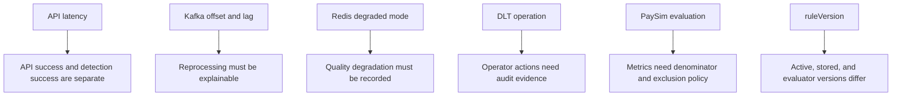

# 회고: Kafka, Redis, PaySim보다 중요했던 것은 설명 가능한 기준이었다

## 처음에 세운 문제

처음 문제는 대량 거래 이벤트를 빠르게 받아 이상거래를 탐지하는 것이었다. 하지만 구현이 진행될수록 더 중요한 질문은 “빠르게 처리했는가”가 아니라 “처리 결과를 장애와 재처리 이후에도 설명할 수 있는가”로 바뀌었다.

API가 성공했다는 사실만으로 탐지가 끝났다고 말할 수 없고, Kafka에 publish했다는 사실만으로 fraud result가 저장됐다고 말할 수 없다. Redis rule이 실행되지 않았는데 정상 탐지처럼 저장해도 안 되고, PaySim evaluation 숫자가 좋아 보여도 어떤 denominator로 계산했는지 모르면 근거가 약하다.

처음에는 Kafka를 이용해 API와 Consumer를 분리하고, 거래 이벤트를 빠르게 받아 이상거래 탐지를 수행하는 구조를 만드는 것이 중심이었다. 하지만 구현하면서 API 응답, Kafka publish, Consumer 처리, PostgreSQL 저장, DLT 분리, PaySim evaluation은 각각 다른 완료 기준을 가진다는 점이 드러났다.

그래서 프로젝트의 중심은 "빠르게 처리하는 구조"에서 "각 단계가 어디까지 완료됐는지 설명할 수 있는 구조"로 이동했다. 이 변화가 이후 Kafka offset, manual ack, Redis degraded, DLT audit, evaluation denominator, ruleVersion traceability를 남긴 이유가 되었다.

## 개발하면서 기준이 바뀐 지점

초기에는 Kafka, Redis, DLT, PaySim 같은 구성요소를 붙이는 일이 중심처럼 보였다. 실제로는 각 구성요소가 실패했을 때 무엇을 기록하고, 어디까지 말할 수 있으며, 어디부터는 future work로 남겨야 하는지 정하는 일이 더 중요했다.

이 프로젝트에서 말한 설명 가능한 기준은 단순히 로그를 많이 남긴다는 뜻이 아니었다. API 성공과 탐지 완료를 분리하고, Kafka offset과 Consumer Lag으로 backlog를 설명하며, PostgreSQL unique constraint와 audit log로 중복 결과를 확인하는 기준이었다.

Redis 장애는 정상 성공처럼 숨기지 않고 degraded와 skipped rule로 남겼고, DLT reprocess/discard는 운영자 action으로 감사해야 한다고 보았다. PaySim evaluation은 denominator와 excluded reason을 먼저 고정하고, ruleVersion 변경은 active/stored/evaluator 기준을 분리해 해석했다. 결국 각 기술은 "무엇을 설명하기 위한 기준인가"로 역할이 정리됐다.

```mermaid
flowchart TD
    API[API latency] --> Criterion1[API success and detection success are separate]
    Kafka[Kafka offset and lag] --> Criterion2[Reprocessing must be explainable]
    Redis[Redis degraded mode] --> Criterion3[Quality degradation must be recorded]
    DLT[DLT operation] --> Criterion4[Operator actions need audit evidence]
    PaySim[PaySim evaluation] --> Criterion5[Metrics need denominator and exclusion policy]
    RuleVersion[ruleVersion] --> Criterion6[Active, stored, and evaluator versions differ]
```

기술에 대한 이해도 구현 과정에서 바뀌었다. Kafka는 단순히 빠른 Queue가 아니라, 장애 후에도 어느 offset부터 밀렸는지 설명할 수 있는 replay 가능한 log로 보았다. PostgreSQL은 fraud result와 audit log의 최종 기준이 되었고, Redis는 정합성 저장소가 아니라 최근 거래 window를 빠르게 계산하기 위한 보조 상태로 제한했다.

DLT는 실패 메시지 보관함이 아니라 운영자 판단과 감사가 필요한 영역이었다. PaySim은 운영 탐지 정확도를 증명하는 데이터가 아니라 rule baseline을 반복 비교하기 위한 replay 입력이었다. ruleVersion은 코드 버전 표시가 아니라 결과 해석과 변경 판단을 연결하는 기준이었다.

## 가장 크게 배운 점 1: API 성공과 탐지 성공은 다르다

API가 거래 이벤트를 받았다고 해서 이상거래 탐지가 끝난 것은 아니다. 그래서 API latency와 detection latency를 분리했다. Kafka를 쓴 사실보다 offset commit 시점과 idempotency를 설명하는 것이 더 중요했다.

Consumer가 DB 저장 전에 ack하면 처리되지 않은 이벤트가 사라진 것처럼 보일 수 있다. 반대로 DB 저장은 성공했지만 ack 직전에 Consumer가 종료되면 같은 offset이 다시 들어올 수 있다. 이 프로젝트는 그 가능성을 정상적인 재소비 상황으로 보고, 같은 `eventId`와 source offset이 다시 들어와도 결과가 중복 생성되지 않는지를 기준으로 검증했다.

가장 크게 배운 점은 기능을 구현하는 것보다 완료 기준을 정의하는 일이 더 어렵다는 것이다. 비동기 시스템에서는 API 성공, Kafka publish 성공, Consumer 처리 성공, DB 저장 성공, evaluation 성공이 모두 다른 의미를 가진다. 이 기준을 섞으면 시스템이 정상인지 아닌지 설명하기 어렵다.

장애를 완전히 없애는 것보다 장애 이후 어떤 이벤트가 어디까지 처리됐고, 어떤 결과가 어떤 기준으로 저장됐는지 설명 가능하게 만드는 것이 더 중요했다. 포트폴리오 관점에서도 기술을 많이 나열하는 것보다, 왜 그런 구조를 선택했고 어떤 trade-off를 감수했는지 남기는 것이 더 의미 있었다.

## 가장 크게 배운 점 2: Redis는 정합성 기준이 아니라 품질 저하를 기록해야 하는 컴포넌트다

Redis는 사용자별 최근 거래 패턴을 계산하는 데 유용하지만, 최종 정합성 기준으로 둘 수는 없다. Redis가 내려갔을 때 전체 탐지를 실패시키면 Consumer backlog가 커지고, 실패를 무시하면 어떤 rule이 실행되지 않았는지 설명할 수 없다.

그래서 Redis 장애는 `degraded=true`와 skipped rule로 남겼다. Redis를 붙였다는 사실보다 Redis 장애 시 어떤 rule이 skipped/degraded 되었는지 남기는 것이 더 중요했다.

## 가장 크게 배운 점 3: DLT 재처리는 복구 기능이면서 운영자 조작 위험이다

DLT 재처리는 실패 메시지를 다시 넣는 기능처럼 보이지만, 실제로는 운영자 조작을 동반한다. 같은 이벤트를 반복 재처리하면 Kafka 부하와 중복 처리 위험이 생기고, 폐기 사유가 남지 않으면 왜 이벤트를 포기했는지 설명할 수 없다.

그래서 DLT에는 status transition, audit log, max reprocess attempts가 필요했다. 자동 discard도 바로 넣지 않았다. 반복 재처리를 막는 것과 운영자가 폐기 사유를 남기는 것은 다른 문제이기 때문이다.

## 가장 크게 배운 점 4: precision/recall보다 분모와 제외 기준이 먼저다

PaySim evaluation은 실제 금융 fraud model 정확도를 주장하기 위한 것이 아니다. rule baseline 변경을 재현 가능하게 비교하기 위한 장치다.

precision/recall 숫자보다 denominator, missing result, unsupported type, rejected row, `ruleVersion`, `thresholdVersion`을 함께 남기는 것이 더 중요했다. unsupported type을 조용히 LOW risk로 처리하거나 missing result를 임의로 제외하면 같은 결과도 다르게 보일 수 있다.

## 가장 크게 배운 점 5: 구현한 것과 future work를 분리해야 한다

`make final-check`는 production certification이 아니라 repository readiness guardrail이다. Gradle build, Docker Compose config, script syntax, fixture 기반 data/evaluation verifier를 확인하지만 production fraud model accuracy나 production capacity를 보장하지 않는다.

automatic rollback, alert, deployment changelog persistence, production-grade Grafana dashboard hardening, full PaySim evidence automation은 future work다. 구현하지 않은 것을 구현했다고 쓰지 않는 것이 이 프로젝트의 중요한 기준이 됐다.

## AI를 활용하면서 확인한 것

AI는 설계 대안 정리와 문서 초안, 체크리스트 작성에는 도움이 됐다. 예를 들어 Kafka를 Queue로만 볼 때 생길 수 있는 문제, Redis 장애 시 degraded로 남겨야 하는 이유, metric label에 고유 ID를 넣지 말아야 하는 이유를 검토할 때 관점을 넓히는 데 사용할 수 있었다.

하지만 AI가 만든 설명이나 구조를 그대로 사용하지는 않았다. Kafka가 exactly-once를 보장한다는 식의 오해, Redis를 최종 정합성 기준으로 두는 설계, PaySim evaluation을 운영 정확도처럼 과장하는 표현, ruleVersion 추적만으로 운영 변경 안전성이 완성된다는 표현은 반드시 걸러야 했다.

최종 판단은 코드, 테스트, DB constraint, 로그, evidence로 확인한 범위 안에서만 남겼다. AI는 생산성 도구였고, 설계 판단의 책임은 사람에게 있었다.

## 아쉬웠던 점

Consumer Lag과 detection latency는 대표 dashboard evidence로 확인했지만, 모든 장애 시나리오에서 evidence capture를 자동화한 것은 아니다. Redis down, duplicate storm, DLT reprocess 같은 흐름도 local/manual evidence와 fixture verifier가 섞여 있어, 실행 환경이 바뀌면 다시 증거를 모아야 한다.

PaySim full replay/evaluation도 raw data와 local infrastructure가 필요하다. CI-safe fixture는 contract를 검증하지만 full dataset evidence를 대체하지 않는다.

한계도 명확하다. 이 프로젝트의 검증은 로컬/개발 환경과 제한된 시나리오를 중심으로 진행했다. multi-node Kafka, 장기 soak test, 실제 운영 트래픽, 실제 금융사 fraud pattern을 검증한 것은 아니다.

Redis degraded, DLT reprocess, ruleVersion runbook도 완성된 운영 자동화가 아니라 판단 기준을 문서화한 수준이다. PaySim은 synthetic dataset이므로 운영 탐지 정확도를 주장할 수 없다. 보안과 개인정보 측면에서도 raw data 미커밋과 identifier hash guardrail을 두었지만, 실제 운영 수준의 접근 통제, key rotation, retention, 감사 체계까지 구현한 것은 아니다.

## 다음에 보완한다면

먼저 production-grade Grafana dashboard와 alert를 더 단단하게 만들고 싶다. Consumer Lag, detection latency, DLT count, degraded count를 장애 시나리오별 threshold와 recovery 기준으로 해석할 수 있어야 한다.

다음으로 rule deployment changelog와 rollback automation을 분리해서 추가할 수 있다. 다만 automatic rollback을 넣기 전에 hold criteria, rollback readiness, operator approval, audit evidence가 먼저 정리되어야 한다.

PaySim 쪽은 full replay/evaluation evidence automation을 보강하고, local/manual 결과와 CI-safe verifier의 경계를 더 선명하게 만들 수 있다.

다음 보완 방향은 더 구체적으로 남아 있다. 장기 부하와 soak test를 통해 Consumer Lag과 detection latency가 시간이 지날수록 어떻게 변하는지 확인해야 한다. Consumer scale-out과 partition 전략도 hot partition 관점에서 더 검증할 필요가 있다.

운영 측면에서는 alert rule, DLT admin action 권한과 감사, ruleVersion 변경 승인과 rollback 자동화 후보를 보강할 수 있다. 데이터 측면에서는 provenance, checksum, lineage를 더 명확히 남기고, 보안 측면에서는 접근 통제, 로그 마스킹, key 관리 기준을 강화해야 한다. 이번 프로젝트는 그 모든 것을 완성한 것이 아니라, 어디를 보완해야 하는지 드러낸 출발점에 가깝다.

## 외부에 설명한다면

이 프로젝트의 강점은 “좋은 결과를 주장하는 것”보다 “말할 수 있는 것과 말하면 안 되는 것을 분리한 것”이다.

| 구분 | 말할 수 있는 것 | 말하면 안 되는 것 |
|---|---|---|
| Kafka | Consumer Lag, DLT, replay 기준으로 비동기 탐지 지연을 설명했다 | production 규모 처리량을 보장했다 |
| Redis | 장애 시 degraded result와 skipped rule로 남겼다 | Redis 장애에도 탐지 품질이 동일하다 |
| PaySim | rule baseline evaluation contract를 만들었다 | 실제 금융 fraud model 성능을 검증했다 |
| Runbook | hold/rollback readiness 기준을 문서화했다 | automatic rollback을 구현했다 |

포트폴리오 관점에서 이 프로젝트의 의미는 기능 수가 아니라 문제 정의에 있다. 단순히 이상거래 탐지 API를 만든 것이 아니라, 재시도와 장애, Consumer 지연, Redis 장애, DLT 재처리, rule 변경 이후에도 결과를 설명할 수 있는가를 문제로 잡았다.

이를 통해 백엔드 설계, 데이터 정합성, 장애 대응, 성능 지표 해석, DevOps 문서화가 하나의 흐름으로 연결됐다. 면접에서 "왜 Kafka를 썼는가", "Redis 장애를 어떻게 봤는가", "성능은 어떻게 해석했는가", "AI 결과는 어떻게 검증했는가"를 단순 기술명이 아니라 trade-off와 evidence 기준으로 설명할 수 있는 자료가 되었다.

마지막까지 남긴 기준은 단순하다. 성공처럼 보이는 결과보다 다시 확인 가능한 근거가 더 중요하다. 이 기준이 있으면 다음 기능을 추가할 때도 무엇을 구현했고, 무엇을 검증했고, 무엇을 아직 말하면 안 되는지 분리할 수 있다.

결국 이 프로젝트에서 중요했던 것은 Kafka, Redis, PaySim을 사용했다는 사실 자체가 아니었다. 중요한 것은 각 기술을 통해 어떤 상태를 설명하고, 어떤 실패를 드러내고, 어떤 변경을 추적할 수 있었는지였다.

다음 프로젝트에서는 이 기준을 더 실제 운영에 가까운 alert, 자동화, 장기 검증, 접근 통제까지 확장해보고 싶다.
