# V2 Result Evidence Plan

## 1. Purpose

V2는 PaySim synthetic 거래 데이터를 Kafka로 replay하고, Rule 기반 탐지와 action workflow를 통해 결과 evidence를 남기는 것을 목표로 합니다.

이 문서는 V2 구현 후 어떤 결과를 어떻게 기록할지 정의합니다.

## 2. V2 Processing Flow

```text
PaySim CSV
-> prepare_paysim_dataset.py
-> normalized JSONL
-> replay_paysim_to_api.py
-> app-api
-> Kafka transaction-events
-> app-consumer
-> Rule Engine V2
-> fraud_detection_results
-> Fraud Action Decision
-> Fraud Case
-> Admin Review
-> Audit Log
```

Mermaid draft:

```mermaid
flowchart LR
    A[PaySim CSV] --> B[Normalize JSONL]
    B --> C[Replay to app-api]
    C --> D[Kafka transaction-events]
    D --> E[app-consumer]
    E --> F[Rule Engine V2]
    F --> G[FraudResult]
    G --> H[ActionDecision]
    H --> I[FraudCase]
    I --> J[Admin Review]
    J --> K[AuditLog]
```



## 3. Evidence Tables

### Dataset Summary

| Metric | Value | Notes |
|---|---:|---|
| raw row count | TBD | PaySim CSV row count |
| normalized row count | TBD | after validation |
| rejected row count | TBD | invalid input rows |
| fraud label count | TBD | `isFraud=1` |
| sample row count | TBD | committed sample only |

### Replay Summary

| Metric | Value | Notes |
|---|---:|---|
| replayed events | TBD | API accepted count |
| API non-2xx count | TBD | validation/duplicate/failure |
| Kafka published count | TBD | app-api producer metric |
| Consumer processed count | TBD | processing log/fraud result |
| DLT count | TBD | unrecoverable failures |

### Detection Summary

| Metric | Value | Notes |
|---|---:|---|
| LOW | TBD | risk level distribution |
| MEDIUM | TBD | risk level distribution |
| HIGH | TBD | risk level distribution |
| CRITICAL | TBD | risk level distribution |
| matched labeled fraud | TBD | label-based evaluation |
| missed labeled fraud | TBD | label-based evaluation |
| false positive candidates | TBD | review examples |

### Action Summary

| Action Type | Count | Notes |
|---|---:|---|
| NO_ACTION | TBD | LOW |
| CREATE_REVIEW_CASE | TBD | MEDIUM |
| HOLD_TRANSACTION | TBD | HIGH |
| BLOCK_TRANSACTION_CANDIDATE | TBD | CRITICAL |
| ACCOUNT_RISK_FLAG | TBD | CRITICAL |

### Case Summary

| Case Status | Count | Notes |
|---|---:|---|
| OPEN | TBD | created cases |
| IN_REVIEW | TBD | assigned/reviewing |
| RESOLVED_APPROVED | TBD | false positive or acceptable |
| RESOLVED_BLOCKED | TBD | confirmed suspicious |
| DISMISSED | TBD | dismissed |

## 4. Required Commands

V2 implementation should provide commands similar to:

```bash
make prepare-paysim
make sample-paysim
make replay-paysim-sample
make v2-evidence-summary
```

Minimum verification:

```bash
make ci-check
make k6-smoke
make replay-paysim-sample
```

## 5. Metrics to Capture

API:

- request count
- API p95/p99 latency
- Kafka publish success/failure

Consumer:

- consumed count
- processing latency
- detection latency
- Consumer Lag
- Redis degraded count
- DLT count

V2:

- rule matched count by rule code
- risk level distribution
- action decision count by action type/status
- fraud case count by status

Metric tags must not include `eventId`, `userId`, `accountId`, `destinationAccountId`, or raw PaySim identifiers.

## 6. Result Interpretation Rules

Do not claim production fraud model performance.

Allowed claims:

- Rule-based detection was replayed over PaySim synthetic events.
- Kafka async processing and PostgreSQL idempotency were verified.
- PaySim fraud labels were used to analyze which fraud-like patterns rules caught or missed.
- CRITICAL events created block candidates and account risk flags, not automatic account freezes.

Disallowed claims:

- The system prevents real financial fraud.
- The rules are production-grade.
- PaySim represents real customer data.
- The project performs real account blocking.

## 7. Final V2 Questions

V2 completion should answer:

1. 데이터는 어떻게 만들었나요?
2. 어떤 rule로 탐지했나요?
3. 대량 이벤트는 Kafka에서 어떻게 처리됐나요?
4. 탐지 후 어떤 action decision과 fraud case가 만들어졌나요?
5. 개인정보와 보안은 어떻게 처리했나요?

## 8. Follow-up

V2 이후 후보:

- JWT/OAuth2/RBAC admin actor model
- audit log search API
- outbox/reprocess command log for action decision publish consistency
- dashboard screenshot evidence
- broader load test with Consumer Lag recovery measurement
