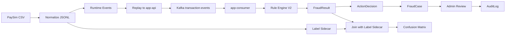

# V2 Result Evidence Plan

## 1. Purpose

V2는 PaySim synthetic 거래 데이터를 Kafka로 replay하고, Rule 기반 탐지와 action workflow를 통해 결과 evidence를 남기는 것을 목표로 합니다.

이 문서는 V2 구현 후 어떤 결과를 어떻게 기록할지 정의합니다.

## 2. V2 Processing Flow

```text
PaySim CSV
-> prepare_paysim_dataset.py
-> paysim-events.jsonl + paysim-labels.jsonl
-> replay_paysim_events.py
-> app-api
-> Kafka transaction-events
-> app-consumer
-> Rule Engine V2
-> fraud_detection_results
-> Fraud Action Decision
-> Fraud Case
-> Admin Review
-> Audit Log
```

Mermaid draft:



## 2.1 Offline Evaluation and Online Replay Evaluation

V2 evidence는 두 종류로 분리합니다.

### Offline Evaluation

목적:

- Rule coverage를 빠르게 분석합니다.
- Kafka replay 전체를 매번 돌리지 않고 rule logic과 PaySim label sidecar를 비교합니다.
- online Consumer와 같은 Java Rule Engine을 사용해 rule drift를 줄입니다.

입력:

- `data/processed/paysim-events.jsonl`
- `data/processed/paysim-labels.jsonl`

출력:

- confusion matrix
- precision/recall/f1
- missed fraud examples
- false positive examples
- ruleVersion과 rule config snapshot

구현 기준:

- `make evaluate-paysim-rules`는 app-consumer의 Java Rule Engine 또는 같은 Java module의 CLI/test fixture를 호출합니다.
- Python으로 rule logic을 다시 구현하지 않습니다.
- offline report에는 `ruleVersion`과 threshold/score snapshot을 저장합니다.

Rule config snapshot 예시:

```json
{
  "ruleVersion": "v2-rule-001",
  "rules": {
    "BALANCE_DRAIN": {
      "threshold": "0.8",
      "score": 40
    },
    "ZERO_BALANCE_AFTER_TRANSFER": {
      "score": 35
    },
    "TRANSFER_CASHOUT_PATTERN": {
      "minimumAmount": "TBD",
      "score": 25
    }
  }
}
```

### Online Replay Evaluation

목적:

- 실제 운영 경로를 검증합니다.
- app-api, Kafka, app-consumer, PostgreSQL, Redis degraded behavior, DLT, ActionDecision, FraudCase를 함께 확인합니다.

입력:

- `data/processed/paysim-events.jsonl`
- `data/samples/paysim-events-sample.jsonl` for small local smoke replay

사용하지 않는 입력:

- `data/processed/paysim-labels.jsonl`
- `data/samples/paysim-labels-sample.jsonl`

Label sidecar는 replay payload가 아니라 replay 이후 result evaluation join 용도입니다.

출력:

- `data/processed/paysim-replay-report.json`
- API latency
- Kafka publish count
- Consumer processed count
- DLT count
- fraud result count
- action decision count
- fraud case count

## 2.2 Phase 5 Replay Evidence

V2 Phase 5 replay evidence는 `scripts/data/replay_paysim_events.py`의 report를 기준으로 남깁니다.

Report fields:

```json
{
  "scriptVersion": "v2-phase-5",
  "inputPath": "data/samples/paysim-events-sample.jsonl",
  "endpoint": "http://localhost:8080/api/v1/transactions/events",
  "dryRun": true,
  "idempotencyMode": "preserve",
  "eventIdPrefix": null,
  "eventTypePolicy": "current-api",
  "maxEvents": 100,
  "ratePerSecond": 10,
  "timeoutSeconds": 3,
  "totalRead": 100,
  "payloadAccepted": 76,
  "payloadRejected": 24,
  "httpSuccess": 0,
  "httpDuplicateOrConflict": 0,
  "httpClientError": 0,
  "httpServerError": 0,
  "timeout": 0,
  "connectionError": 0,
  "retryAttempts": 0,
  "retryTimeoutAttempts": 0,
  "retryServerErrorAttempts": 0,
  "retryConnectionErrorAttempts": 0,
  "droppedFields": {
    "balanceFeatures": 76,
    "destinationAccountId": 76,
    "schemaVersion": 76,
    "source": 76
  },
  "unsupportedEventTypes": {
    "CASH_OUT": 14,
    "DEBIT": 10
  }
}
```

집계 기준:

- `2xx`: `httpSuccess`
- `409`: `httpDuplicateOrConflict`
- other `4xx`: `httpClientError`
- `5xx`: `httpServerError`
- timeout: `timeout`
- connection refused or app-api down: `connectionError`
- invalid JSONL parse failure: script-level input corruption failure, not row-level `payloadRejected`

Retry 해석:

- Final outcome counters are event-level.
- Retry attempt details are tracked separately.
- Timeout and 5xx are retry candidates when `--retry-count` is set.
- Connection errors are not retried unless `--retry-connection-error` is set.

Evidence 구분:

- Dry-run report: app-api 없이 payload validation과 DTO mapping만 확인합니다.
- Actual replay report: local app-api, Kafka, PostgreSQL이 실행 중일 때 API/Kafka 경로를 확인합니다.
- app-api 미기동 expected failure: actual replay를 실행하면 `connectionError`가 증가해야 하며, script는 request body나 token을 report에 저장하지 않아야 합니다.
- preserve replay: 같은 eventId를 반복 replay해 duplicate/idempotency behavior와 `409` 집계를 확인합니다.
- prefix replay: `--idempotency-mode prefix --event-id-prefix <prefix>`로 collision 없이 새 eventId를 만드는지 확인합니다.
- current-api event type dry-run: Phase 5에서는 current app-api enum에 없는 PaySim native types를 `UNSUPPORTED_EVENT_TYPE_FOR_CURRENT_API`로 rejected 처리하고 `unsupportedEventTypes`에 집계합니다.
- preserve event type replay: native type을 HTTP 전송 전 rejected로 집계하지 않습니다. Current app-api가 거부하면 `unsupportedEventTypes`가 아니라 HTTP 4xx/client error evidence로 해석합니다.

## 3. Evidence Tables

### Dataset Summary

| Metric | Value | Notes |
|---|---:|---|
| raw row count | TBD | PaySim CSV row count |
| runtime event row count | TBD | `paysim-events.jsonl` |
| label sidecar row count | TBD | `paysim-labels.jsonl` |
| rejected row count | TBD | invalid input rows |
| fraud label count | TBD | `isFraud=1` |
| sample row count | TBD | committed sample only |
| input sha256 | TBD | validation report |
| script version | TBD | validation report |
| rule version | TBD | offline evaluation report |

### Replay Summary

| Metric | Value | Notes |
|---|---:|---|
| replayed events | TBD | API accepted count |
| API non-2xx count | TBD | validation/duplicate/failure |
| Kafka published count | TBD | app-api producer metric |
| Consumer processed count | TBD | processing log/fraud result |
| DLT count | TBD | unrecoverable failures |

### Detection Summary

| Metric | Value | Notes |
|---|---:|---|
| LOW | TBD | risk level distribution |
| MEDIUM | TBD | risk level distribution |
| HIGH | TBD | risk level distribution |
| CRITICAL | TBD | risk level distribution |
| matched labeled fraud | TBD | label-based evaluation |
| missed labeled fraud | TBD | label-based evaluation |
| false positive candidates | TBD | review examples |

### Rule Label Confusion Matrix

Positive prediction 기준:

```text
riskLevel in (HIGH, CRITICAL)
```

Actual positive 기준:

```text
isFraud == true
```

|  | Predicted Fraud | Predicted Normal |
|---|---:|---:|
| Actual Fraud | TP | FN |
| Actual Normal | FP | TN |

| Metric | Formula | Value |
|---|---|---:|
| precision | `TP / (TP + FP)` | TBD |
| recall | `TP / (TP + FN)` | TBD |
| f1 | `2 * precision * recall / (precision + recall)` | TBD |

주의:

V2의 precision/recall은 production ML model 성능이 아니라, PaySim synthetic label에 대한 Rule coverage 분석 지표입니다.

### Action Summary

| Action Type | Count | Notes |
|---|---:|---|
| NO_ACTION | TBD | LOW |
| REVIEW_CANDIDATE | TBD | MEDIUM |
| HOLD_TRANSACTION_CANDIDATE | TBD | HIGH |
| BLOCK_TRANSACTION_CANDIDATE | TBD | CRITICAL |
| ACCOUNT_RISK_FLAG | TBD | CRITICAL |

### Case Summary

| Case Status | Count | Notes |
|---|---:|---|
| OPEN | TBD | created cases |
| IN_REVIEW | TBD | assigned/reviewing |
| RESOLVED_APPROVED | TBD | false positive or acceptable |
| RESOLVED_BLOCKED | TBD | confirmed suspicious |
| DISMISSED | TBD | dismissed |

## 4. Required Commands

V2 implementation should provide commands similar to:

```bash
make prepare-paysim
make generate-paysim-sample
make replay-paysim-sample-dry-run
make replay-paysim-sample
make evaluate-paysim-rules
make v2-evidence-summary
make v2-charts
```

`make v2-evidence-summary`는 후속 구현에서 `scripts/evidence/build_v2_evidence_summary.py`를 호출해 `data/processed/v2-evidence-summary.json`을 생성합니다. `make v2-charts`는 이 summary JSON을 입력으로 사용합니다.

Minimum verification:

```bash
make ci-check
make k6-smoke
make replay-paysim-sample-dry-run
make replay-paysim-sample
make evaluate-paysim-rules
```

## 5. Metrics to Capture

API:

- request count
- API p95/p99 latency
- Kafka publish success/failure

Consumer:

- consumed count
- processing latency
- detection latency
- Consumer Lag
- Redis degraded count
- DLT count

V2:

- rule matched count by rule code
- risk level distribution
- action decision count by action type/status
- fraud case count by status
- confusion matrix image/table

Metric tags must not include `eventId`, `userId`, `accountId`, `destinationAccountId`, or raw PaySim identifiers.

## 6. Result Interpretation Rules

Do not claim production fraud model performance.

Allowed claims:

- Rule-based detection was replayed over PaySim synthetic events.
- Kafka async processing and PostgreSQL idempotency were verified.
- PaySim fraud labels were kept in a sidecar file and used to analyze which fraud-like patterns rules caught or missed.
- CRITICAL events created block candidates and account risk flags, not automatic account freezes.

Disallowed claims:

- The system prevents real financial fraud.
- The rules are production-grade.
- PaySim represents real customer data.
- The project performs real account blocking.
- Runtime Kafka events include the answer label.

## 7. Visualization Artifacts

후속 V2 evidence 작업에서 생성할 후보:

```text
docs/images/v2-risk-level-distribution.png
docs/images/v2-rule-match-distribution.png
docs/images/v2-action-decision-distribution.png
docs/images/v2-rule-label-confusion-matrix.png
```

## 8. Final V2 Questions

V2 completion should answer:

1. 데이터는 어떻게 만들었나요?
2. 어떤 rule로 탐지했나요?
3. 대량 이벤트는 Kafka에서 어떻게 처리됐나요?
4. 탐지 후 어떤 action decision과 fraud case가 만들어졌나요?
5. 개인정보와 보안은 어떻게 처리했나요?

## 9. Follow-up

V2 이후 후보:

- JWT/OAuth2/RBAC admin actor model
- audit log search API
- outbox/reprocess command log for action decision publish consistency
- dashboard screenshot evidence
- broader load test with Consumer Lag recovery measurement
