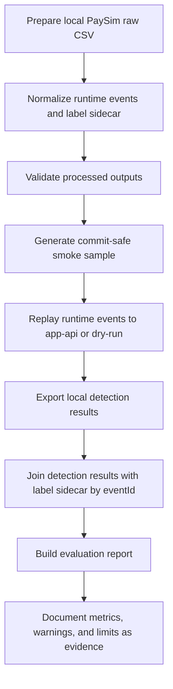
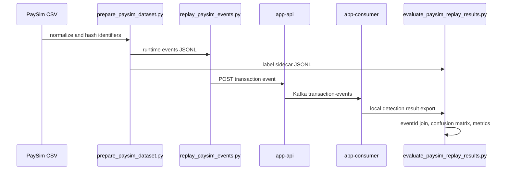

# V2 Replay Evaluation Evidence

## 1. Purpose

V2 Phase 7 turns the PaySim replay evaluation baseline into reproducible evidence.

The goal is not to claim that the current rules are good fraud models. The goal is to prove that a reviewer can see which input was used, which command produced the report, which metrics were calculated, how to interpret the result, and where the limits are.

This phase demonstrates:

- dataset-based evaluation design
- rule-based fraud detection limitation awareness
- reproducible evaluation commands
- result interpretation without overclaiming
- operational evidence that can support rule changes and release review
- false positive, false negative, and threshold trade-off reasoning

## 2. Input Data Boundary

Raw PaySim CSV is not committed to the repository. Full processed output is not committed either.

Allowed committed data is limited to small, validated samples:

- `data/samples/paysim-events-sample.jsonl`
- `data/samples/paysim-labels-sample.jsonl`
- `data/samples/paysim-sample-manifest.json`

The source and privacy policy are documented in `docs/24-kaggle-paysim-data-provenance.md`.

PaySim is synthetic, so this repository does not use real customer records or a real ledger. Even so, the original CSV contains account-like identifiers, amounts, balances, and transaction flows. The project treats raw and full processed outputs as sensitive operational data: keep them local, hash identifiers before replay/sample generation, and never commit raw/full processed files.

## 3. Replay Evaluation Flow



Sequence view:



## 4. Commands

CI-safe checks:

```bash
make test-data-scripts
make data-policy-check
make verify-v2-phase7
make verify-v2-phase8
```

Local evaluation after `data/processed/paysim-detection-results.jsonl` exists:

```bash
make evaluate-paysim-replay
```

Manual full local flow:

```bash
make data-env
make validate-paysim
make replay-paysim-sample-dry-run
make replay-paysim-sample
make evaluate-paysim-replay
```

`make evaluate-paysim-replay` evaluates existing PaySim labels and a local detection result export. It does not execute app-api replay by itself. It expects:

- labels: `data/samples/paysim-labels-sample.jsonl`
- detection results: `data/processed/paysim-detection-results.jsonl`
- replay report: `data/processed/paysim-replay-report.json`
- output: `data/processed/paysim-evaluation-report.json`

`data/processed/*` remains local evidence and is intentionally ignored by Git.

`make verify-v2-phase7` is CI-safe because it uses fixture data for report contract validation. It verifies that a report can be generated, required fields exist, expected fixture counts match, sensitive fields are absent, and missing results are excluded from denominator metrics by default.

`make verify-v2-phase8` extends the CI-safe check with PaySim native type mapping contract verification. It does not require raw PaySim, a local DB export, or actual app-api replay.

## 5. Current Report Metrics

`scripts/data/evaluate_paysim_replay_results.py` currently produces these evaluation metrics:

| Metric | Source | Meaning |
|---|---|---|
| `totalFraudLabels` | label sidecar | all `isFraud=true` rows in the label sidecar |
| `evaluatedFraudLabeledEvents` | evaluation denominator | fraud-labeled rows included after replay-rejected and missing-result policy |
| `missingFraudLabels` | label/result join | fraud-labeled rows missing from the detection result export |
| `missingNonFraudLabels` | label/result join | non-fraud rows missing from the detection result export |
| `totalEvents` | evaluation report | events included in the evaluation denominator |
| `fraudLabeledEvents` | compatibility alias | same as `evaluatedFraudLabeledEvents`; not total sidecar fraud count |
| `detectedFraudEvents` | detection results + threshold | predicted positive events |
| `missedFraudEvents` | compatibility alias | same as `evaluatedMissedFraudEvents`; calculated inside the denominator |
| `evaluatedMissedFraudEvents` | confusion matrix | denominator-included fraud rows predicted negative |
| `falsePositiveEvents` | confusion matrix | non-fraud labels predicted positive |
| `truePositiveEvents` | confusion matrix | fraud labels predicted positive |
| `trueNegativeEvents` | confusion matrix | non-fraud labels predicted negative |
| `metrics.precision` | confusion matrix | `TP / (TP + FP)` |
| `metrics.recall` | confusion matrix | `TP / (TP + FN)` |
| `metrics.f1Score` | precision/recall | harmonic mean of precision and recall |
| `riskLevelCounts` | detection results | risk distribution |
| `ruleCodeCounts` | detection results | rule hit distribution |
| `misclassifiedEvents` | confusion matrix | `FP + FN` |
| `unmatchedResultEvents` | join sanity signal | result rows that did not join to a label |
| `evaluationExcludedRecords` | replay exclusion signal | replay-rejected events excluded from evaluation |
| `failedRecords` | pipeline failure signal | reserved for parse/schema/report failures; not rule mismatch |
| `invalidRecords` | invalid input signal | reserved for malformed input records; not unsupported PaySim event type |

Missing detection results are excluded from denominator metrics by default. `--include-missing-results` is available only for explicit sensitivity checks because counting missing non-fraud rows as true negatives can inflate accuracy on sparse-fraud datasets.

`missedFraudEvents` is calculated within the evaluation denominator. When missing results are excluded by default, missing fraud labels are counted in `missingFraudLabels` and `missingResults`, not in `missedFraudEvents`.

`failedRecords` and `invalidRecords` are reserved for future non-fatal pipeline/schema error aggregation. In Phase 7, invalid input fails fast before report generation, so successful reports keep these fields at 0 and include `recordFailurePolicy=fail_fast_before_report_generation`.

The replay report separately provides:

- `durationSeconds`
- `eventsPerSecond`
- `payloadRejected`
- `httpClientError`
- `httpServerError`
- `timeout`
- `connectionError`
- `mappingPolicyVersion`
- `inputNativeTypeDistribution`
- `acceptedNormalizedTypeDistribution`
- `rejectedNativeTypeDistribution`
- `excludedByType`

Phase 8 adds the native type contract fields above. The evaluation report also separates `replayNativeTypeDistribution` from `evaluatedNativeTypeDistribution`, so replay input composition is not confused with the denominator used for precision/recall. Evaluation metrics should be compared only when `mappingPolicyVersion`, denominator policy, rule version, and threshold version are compatible.

## 6. Future Metrics

These are intentionally documented as future or adjacent metrics, not implemented Phase 7 evaluation report fields:

| Metric | Status | Notes |
|---|---|---|
| `action_decision_distribution` | Future V2 action workflow | Requires `fraud_action_decisions` implementation |
| `replay_duration_ms` | Derivable from replay report | Current replay report stores `durationSeconds` |
| Consumer Lag during replay | Operational metric | Requires app-consumer/Prometheus evidence |
| p95/p99 API latency during replay | Operational metric | Separate from detection quality metrics |
| Redis degraded count during replay | Operational metric | Separate from label-based evaluation quality |

## 7. Result Interpretation

High precision means most events predicted as fraud-like were labeled fraud in PaySim. Low precision means the rules create more false positives, which can increase operator review workload.

High recall means the rules catch more PaySim-labeled fraud. Low recall means more false negatives, which is risky in fraud detection because suspicious events can pass without review.

Fraud detection cannot optimize recall alone. Lowering thresholds can increase detected fraud events, but it can also raise false positives and produce too many `REVIEW` or `HOLD` candidates for operators.

Phase 7 is therefore not a model performance claim. It is the baseline for explaining how rule threshold changes affect precision, recall, false positives, false negatives, and workload.

## 8. Operational Use

Replay evaluation evidence can support:

- rule change review before merge
- local release smoke checks
- post-incident analysis when a rule missed a known pattern
- regression comparison after threshold changes
- evidence that label sidecar data did not leak into runtime replay payloads

Gate candidates:

- evaluation script exits successfully
- report file is created
- required report fields exist
- strict label/result contract validation passes
- `misclassifiedEvents`, `unmatchedResultEvents`, and replay rejected counts are reviewed
- `failedRecords=0` and `invalidRecords=0` for fixture-based report contract checks
- raw/full processed PaySim files remain out of Git

Not gate candidates yet:

- absolute precision/recall threshold
- production fraud detection performance
- production operator workload limits
- Consumer Lag or p95 latency guarantees from the evaluation report alone

Detection quality metrics and streaming operation metrics must be interpreted separately. Precision/recall explain label agreement; Consumer Lag, detection latency, DLQ count, and Redis degraded count explain runtime operation.

## 9. Limitations

PaySim is synthetic and does not fully represent real financial fraud patterns.

Rule-based detection is sensitive to selected features and thresholds. A threshold change can improve recall while increasing false positives and operator workload.

Replay evaluation does not replace online streaming failure tests. It does not fully cover Consumer Lag recovery, broker outage behavior, Redis degraded mode, DLQ reprocessing, or production traffic skew.

The Phase 7 report uses local detection result export as input. It does not yet automate DB/API export from the running app.

Committed samples are smoke evidence, not representative PaySim-wide performance evidence.

## 10. Next Steps

- threshold tuning with before/after evaluation reports
- rule versioning and report rule config snapshots
- evaluation regression tests in CI using fixture exports
- Grafana dashboard linkage for runtime replay metrics
- DLQ/replay failure summary linkage in evaluation evidence
- model-based baseline comparison after the rule-based baseline is stable

## 11. Verification Record

Commands run for this Phase 7 branch are recorded in `docs/13-development-roadmap.md` after execution.
